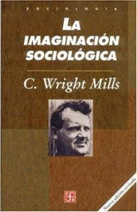
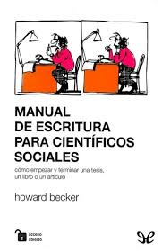
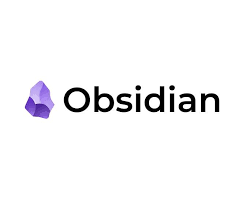
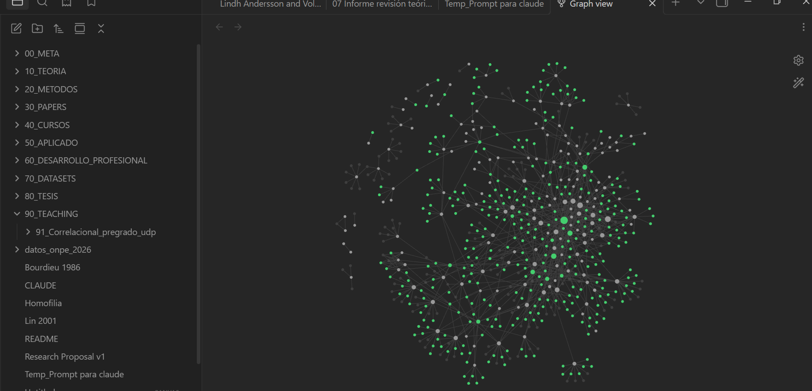

## {.portada}

::: {.regla-gruesa}
:::

::: {.titulo}
Sobre artesan[IA]{.ia} intelectual[]{.cursor}
:::

::: {.subtitulo}
Un flujo de trabajo para la investigación social en tiempos de IA
:::

::: {.regla-fina}
:::

::: {.pie}
[Alejandro Plaza Reveco]{.nombre}
Instituto MIDE UC · Pontificia Universidad Católica de Chile\
Taller para ayudantes de investigación · Septiembre 2026
:::

::: {.notes}
El título es una cita: es el apéndice de Mills. Decirlo en voz alta acá.
:::

# Acto 0 --- El oficio {.divisoria}

::: {.bajada}
Antes de hablar de herramientas: ¿qué significa hoy saber investigar?
:::

## Si la IA puede hacer todo esto... ¿qué queda del investigador?

::: {.cajas style="margin-bottom:.35em"}
[Buscar literatura]{.caja} [Resumir papers]{.caja} [Escribir código]{.caja} [Generar hipótesis]{.caja}
:::

::: {.cajas style="margin-bottom:1em"}
[Producir figuras]{.caja} [Revisar textos]{.caja} [Escribir un primer borrador]{.caja}
:::

. . .

::: {.alerta}
[La provocación]{.t}
Muchas de estas tareas son hoy [más rápidas, más baratas y parcialmente automatizables]{.hlr}.
**Entonces, ¿qué significa saber investigar?**
:::

::: {.nota}
Vamos a responderla mirando qué parte del proceso requiere criterio científico y responsabilidad intelectual.
:::

## Dos libros sobre algo más importante que las herramientas

::: {.cols2}
::: {}
::: {.cols-img}
{width="100%" style="border-radius:3px"}

::: {}
**C. Wright Mills (1959)**\
*La imaginación sociológica*, apéndice

- El [fichero]{.hl}: un archivo donde conviven experiencia personal, lecturas y trabajo en curso. [Reordenarlo produce preguntas nuevas.]{.hld}
- "Que cada quien sea su propio metodólogo": el método se construye junto con el problema.
:::
:::
:::

::: {}
::: {.cols-img}
{width="100%" style="border-radius:3px"}

::: {}
**Howard S. Becker (1986)**\
*Manual de escritura para científicos sociales*

- [Escribir es pensar]{.hl}: el primer borrador sirve para descubrir qué quieres decir. [La claridad aparece al reescribir.]{.hld}
- La prosa académica defensiva nace del miedo a ser juzgado. Se cura escribiendo simple.
:::
:::
:::
:::

. . .

::: {.destacado}
**El punto de encuentro:** los dos ponen en el centro los mismos dos artefactos —
[el archivo]{.hlr} y [el borrador]{.hlr} — que son, justamente, los dos que la IA toca primero.
:::

::: {.notes}
Acá va el chiste del título: "Sobre artesanía intelectual" le roba el nombre al apéndice de
Mills, que escribe justamente contra el fetichismo del método. La tensión con lo que sigue es
deliberada.
:::

## La investigación es un oficio

::: {.diagrama}
```{=html}
<svg viewBox="0 0 1200 195" role="img" aria-label="Cadena del oficio con flecha de retorno">
  <defs>
    <marker id="fl" markerWidth="9" markerHeight="9" refX="8" refY="4.5" orient="auto">
      <path d="M0,0 L9,4.5 L0,9 Z" fill="#8FA3C0"/>
    </marker>
    <marker id="flo" markerWidth="10" markerHeight="10" refX="9" refY="5" orient="auto">
      <path d="M0,0 L10,5 L0,10 Z" fill="#D9BC66"/>
    </marker>
  </defs>
  <g font-family="Inter, sans-serif" font-size="21" font-weight="600" text-anchor="middle">
    <rect x="10"   y="18" width="150" height="62" rx="6" fill="#17243C" stroke="#3E5578" stroke-width="1.5"/>
    <text x="85"   y="56" fill="#E8E3D9">Curiosidad</text>
    <rect x="180"  y="18" width="150" height="62" rx="6" fill="#17243C" stroke="#3E5578" stroke-width="1.5"/>
    <text x="255"  y="56" fill="#E8E3D9">Problema</text>
    <rect x="350"  y="18" width="150" height="62" rx="6" fill="#17243C" stroke="#3E5578" stroke-width="1.5"/>
    <text x="425"  y="56" fill="#E8E3D9">Lectura</text>
    <rect x="520"  y="18" width="150" height="62" rx="6" fill="#2A2416" stroke="#C9A84C" stroke-width="1.8"/>
    <text x="595"  y="56" fill="#F0D588">Argumento</text>
    <rect x="690"  y="18" width="150" height="62" rx="6" fill="#17243C" stroke="#3E5578" stroke-width="1.5"/>
    <text x="765"  y="56" fill="#E8E3D9">Diseño</text>
    <rect x="860"  y="18" width="150" height="62" rx="6" fill="#17243C" stroke="#3E5578" stroke-width="1.5"/>
    <text x="935"  y="56" fill="#E8E3D9">Evidencia</text>
    <rect x="1030" y="18" width="150" height="62" rx="6" fill="#2A2416" stroke="#C9A84C" stroke-width="1.8"/>
    <text x="1105" y="56" fill="#F0D588">Escritura</text>
  </g>
  <g stroke="#8FA3C0" stroke-width="2" marker-end="url(#fl)">
    <line x1="160" y1="49" x2="172" y2="49"/>
    <line x1="330" y1="49" x2="342" y2="49"/>
    <line x1="500" y1="49" x2="512" y2="49"/>
    <line x1="670" y1="49" x2="682" y2="49"/>
    <line x1="840" y1="49" x2="852" y2="49"/>
    <line x1="1010" y1="49" x2="1022" y2="49"/>
  </g>
  <path d="M1105,80 C1105,180 255,180 255,80" fill="none" stroke="#D9BC66"
        stroke-width="2" marker-end="url(#flo)"/>
  <rect x="466" y="140" width="428" height="30" fill="#0F1A2E"/>
  <text x="680" y="160" text-anchor="middle" font-family="Inter, sans-serif"
        font-size="19" fill="#D9BC66">revisión, anomalías, nuevas preguntas</text>
</svg>
```
:::

::: {.cols2}
::: {.bloque}
[Mills]{.t}
Las buenas preguntas aparecen al [conectar]{.hl} elementos que al inicio estaban separados:
biografía ↔ historia ↔ estructura
:::

::: {.bloque}
[Becker]{.t}
Las ideas se terminan mientras se escriben:
borrador → revisión → mejor argumento. [Escribir también es investigar.]{.hl}
:::
:::

::: {.destacado}
Ejecutar una técnica es una **habilidad**.
Saber [cuándo usarla, por qué usarla y qué significa el resultado]{.hlr} es oficio.
:::

## La IA desplaza el cuello de botella

::: {.cols2}
::: {.bloque}
[Antes: operaciones costosas]{.t}
Encontrar literatura · resumir decenas de papers · escribir y depurar código · producir un primer borrador · explorar muchas alternativas
:::

::: {.ejemplo}
[Ahora: producción abundante]{.t}
Podemos encontrar [más]{.hl} · resumir [más]{.hl} · programar [más]{.hl} · escribir [más]{.hl} · generar [más ideas]{.hl}
:::
:::

. . .

<div style="text-align:center; font-size:.86em; color:#F0D588; font-weight:650; margin:.7em 0 .3em">
Entonces, ¿qué se vuelve escaso?
</div>

::: {.cajas}
[CRITERIO]{.caja} [SELECCIÓN]{.caja .acento} [EVALUACIÓN]{.caja} [INTEGRACIÓN]{.caja .acento} [RESPONSABILIDAD]{.caja}
:::

::: {.nota}
Producir información se vuelve barato. Lo que gana peso es decidir qué merece atención, qué es creíble y qué podemos afirmar a partir de la evidencia.
:::

## Entonces necesitamos un sistema

::: {.diagrama}
```{=html}
<svg viewBox="0 0 1200 250" role="img" aria-label="La IA como asistencia transversal a todas las etapas">
  <defs>
    <marker id="fl2" markerWidth="9" markerHeight="9" refX="8" refY="4.5" orient="auto">
      <path d="M0,0 L9,4.5 L0,9 Z" fill="#8FA3C0"/>
    </marker>
  </defs>
  <g font-family="Inter, sans-serif" font-size="20" font-weight="600" text-anchor="middle">
    <rect x="14"   y="16" width="145" height="58" rx="6" fill="#17243C" stroke="#3E5578" stroke-width="1.5"/>
    <text x="86"   y="52" fill="#E8E3D9">Idea</text>
    <rect x="182"  y="16" width="145" height="58" rx="6" fill="#17243C" stroke="#3E5578" stroke-width="1.5"/>
    <text x="254"  y="52" fill="#E8E3D9">Literatura</text>
    <rect x="350"  y="16" width="145" height="58" rx="6" fill="#2A2416" stroke="#C9A84C" stroke-width="1.8"/>
    <text x="422"  y="52" fill="#F0D588">Archivo</text>
    <rect x="518"  y="16" width="145" height="58" rx="6" fill="#17243C" stroke="#3E5578" stroke-width="1.5"/>
    <text x="590"  y="52" fill="#E8E3D9">Diseño</text>
    <rect x="686"  y="16" width="145" height="58" rx="6" fill="#17243C" stroke="#3E5578" stroke-width="1.5"/>
    <text x="758"  y="52" fill="#E8E3D9">Análisis</text>
    <rect x="854"  y="16" width="145" height="58" rx="6" fill="#2A2416" stroke="#C9A84C" stroke-width="1.8"/>
    <text x="926"  y="52" fill="#F0D588">Escritura</text>
    <rect x="1022" y="16" width="145" height="58" rx="6" fill="#17243C" stroke="#3E5578" stroke-width="1.5"/>
    <text x="1094" y="52" fill="#E8E3D9">Paper</text>
  </g>
  <g stroke="#8FA3C0" stroke-width="2" marker-end="url(#fl2)">
    <line x1="159" y1="45" x2="172" y2="45"/><line x1="327" y1="45" x2="340" y2="45"/>
    <line x1="495" y1="45" x2="508" y2="45"/><line x1="663" y1="45" x2="676" y2="45"/>
    <line x1="831" y1="45" x2="844" y2="45"/><line x1="999" y1="45" x2="1012" y2="45"/>
  </g>
  <g stroke="#D9BC66" stroke-width="1.4" opacity=".55">
    <line x1="86" y1="74" x2="86" y2="170"/><line x1="254" y1="74" x2="254" y2="170"/>
    <line x1="422" y1="74" x2="422" y2="170"/><line x1="590" y1="74" x2="590" y2="170"/>
    <line x1="758" y1="74" x2="758" y2="170"/><line x1="926" y1="74" x2="926" y2="170"/>
    <line x1="1094" y1="74" x2="1094" y2="170"/>
  </g>
  <rect x="14" y="170" width="1153" height="60" rx="6" fill="#2A2416" stroke="#C9A84C" stroke-width="1.8"/>
  <text x="590" y="207" text-anchor="middle" font-family="Inter, sans-serif" font-size="22"
        font-weight="600" fill="#F0D588">IA como asistencia transversal</text>
</svg>
```
:::

. . .

::: {.alerta}
[El principio]{.t}
La IA puede [asistir]{.hlr} todas las etapas. El **juicio** que conecta una etapa con la siguiente se queda con nosotros.
:::

::: {.destacado}
[Si producir información se vuelve barato, necesitamos un workflow que preserve el criterio.]{.grande}
:::

## Cómo leer este taller: tres preguntas en cada estación

"Criterio" se vuelve operativo cuando se traduce en preguntas concretas. En cada estación van a ver la misma franja al pie de la slide, con tres campos:

<div style="margin:1.1em 0">
::: {.franja style="position:relative; bottom:auto"}
::: {.d}
**Delego**
Lo que la IA hace mejor, más rápido o más barato que yo, *y que puedo revisar*.
:::
::: {.nd}
**No delego**
Lo que, si lo entrego, deja de ser investigación mía. Casi siempre: el juicio.
:::
::: {.v}
**Cómo verifico**
La prueba concreta que me dice si lo delegado está bien.
:::
:::
</div>

. . .

::: {.destacado}
**La regla que ordena todo el taller**

[Delego lo que puedo verificar.]{.grande}

La tercera columna manda sobre las otras dos.
:::

## Las formas de verificación, de la más barata a la más cara

| Tipo | Costo | Ejemplo concreto |
|:--|:--|:--|
| [Automática]{.hld} | segundos | Corro `00`–`03` y la Tabla 2 se regenera idéntica |
| [De existencia]{.hld} | un clic | El DOI resuelve y el paper existe, con esos autores y ese año |
| [De consistencia]{.hlr} | un minuto | El *N* del output coincide con el *N* declarado en el PAP |
| [De contenido]{.hlr} | minutos | Abro el PDF en la página citada y dice lo que la ficha dice |
| [De juicio]{.hlx} | horas | Leo el paper completo y decido si el argumento se sostiene |

. . .

::: {.ejemplo}
[Cómo se usa esta tabla]{.t}
Mientras más arriba esté la verificación disponible, [más se puede delegar]{.hl} esa tarea.
Las tres primeras filas habilitan el trabajo asistido a escala; la última se queda con nosotros y es la que define el oficio.
:::

## El flujo completo, de un vistazo (versión de ascensor)

El proceso tiene [estaciones claras]{.hl}, donde cada herramienta hace una cosa y donde el criterio sigue siendo tuyo.

::: {.diagrama}
```{=html}
<svg viewBox="0 0 1200 330" role="img" aria-label="Mapa del flujo en siete estaciones">
  <defs>
    <marker id="fl3" markerWidth="9" markerHeight="9" refX="8" refY="4.5" orient="auto">
      <path d="M0,0 L9,4.5 L0,9 Z" fill="#8FA3C0"/>
    </marker>
  </defs>
  <g font-family="Inter, sans-serif" font-size="21" font-weight="600" text-anchor="middle">
    <rect x="30"  y="20" width="230" height="80" rx="7" fill="#17243C" stroke="#3E5578" stroke-width="1.5"/>
    <text x="145" y="67" fill="#E8E3D9">1. Ideación</text>
    <rect x="330" y="20" width="230" height="80" rx="7" fill="#17243C" stroke="#3E5578" stroke-width="1.5"/>
    <text x="445" y="55" fill="#E8E3D9">2. Mapeo de</text><text x="445" y="82" fill="#E8E3D9">literatura</text>
    <rect x="630" y="20" width="230" height="80" rx="7" fill="#2A2416" stroke="#C9A84C" stroke-width="1.8"/>
    <text x="745" y="55" fill="#F0D588">3. Fichado</text><text x="745" y="82" fill="#F0D588">(2.º cerebro)</text>
    <rect x="930" y="20" width="230" height="80" rx="7" fill="#17243C" stroke="#3E5578" stroke-width="1.5"/>
    <text x="1045" y="55" fill="#E8E3D9">4. ¿Flota</text><text x="1045" y="82" fill="#E8E3D9">la idea?</text>

    <rect x="930" y="215" width="230" height="80" rx="7" fill="#2A2416" stroke="#C9A84C" stroke-width="1.8"/>
    <text x="1045" y="262" fill="#F0D588">5. PAP</text>
    <rect x="630" y="215" width="230" height="80" rx="7" fill="#17243C" stroke="#3E5578" stroke-width="1.5"/>
    <text x="745" y="250" fill="#E8E3D9">6. Código</text><text x="745" y="277" fill="#E8E3D9">(OSF)</text>
    <rect x="330" y="215" width="230" height="80" rx="7" fill="#17243C" stroke="#3E5578" stroke-width="1.5"/>
    <text x="445" y="262" fill="#E8E3D9">7. Escritura</text>
  </g>
  <g stroke="#8FA3C0" stroke-width="2.2" marker-end="url(#fl3)">
    <line x1="260" y1="60"  x2="318" y2="60"/>
    <line x1="560" y1="60"  x2="618" y2="60"/>
    <line x1="860" y1="60"  x2="918" y2="60"/>
    <line x1="1045" y1="100" x2="1045" y2="205"/>
    <line x1="930" y1="255" x2="872" y2="255"/>
    <line x1="630" y1="255" x2="572" y2="255"/>
  </g>
</svg>
```
:::

::: {.nota}
En [dorado]{.hl}: los dos anclajes del proceso — el segundo cerebro y el PAP. Todo lo demás gira en torno a ellos. Esta es la versión que cabe en un ascensor. La siguiente es la real.
:::

## El mismo flujo, como ocurre de verdad

Hay retornos, ramas muertas y trabajo en paralelo.

::: {.diagrama}
```{=html}
<svg viewBox="0 0 1200 320" role="img" aria-label="El flujo real, con retornos y rama de abandono">
  <defs>
    <marker id="fl4" markerWidth="9" markerHeight="9" refX="8" refY="4.5" orient="auto">
      <path d="M0,0 L9,4.5 L0,9 Z" fill="#8FA3C0"/>
    </marker>
    <marker id="flo4" markerWidth="10" markerHeight="10" refX="9" refY="5" orient="auto">
      <path d="M0,0 L10,5 L0,10 Z" fill="#D9BC66"/>
    </marker>
    <marker id="flr4" markerWidth="10" markerHeight="10" refX="9" refY="5" orient="auto">
      <path d="M0,0 L10,5 L0,10 Z" fill="#E08C81"/>
    </marker>
  </defs>
  <g font-family="Inter, sans-serif" font-size="19" font-weight="600" text-anchor="middle">
    <rect x="10"   y="90" width="142" height="62" rx="6" fill="#17243C" stroke="#3E5578" stroke-width="1.5"/>
    <text x="81"   y="128" fill="#E8E3D9">1. Idea</text>
    <rect x="178"  y="90" width="142" height="62" rx="6" fill="#17243C" stroke="#3E5578" stroke-width="1.5"/>
    <text x="249"  y="128" fill="#E8E3D9">2. Mapeo</text>
    <rect x="346"  y="90" width="142" height="62" rx="6" fill="#2A2416" stroke="#C9A84C" stroke-width="1.8"/>
    <text x="417"  y="128" fill="#F0D588">3. Fichado</text>
    <rect x="514"  y="90" width="142" height="62" rx="20" fill="#132A44" stroke="#4E7FB0" stroke-width="2"/>
    <text x="585"  y="128" fill="#BFD8F0">4. ¿Flota?</text>
    <rect x="682"  y="90" width="142" height="62" rx="6" fill="#2A2416" stroke="#C9A84C" stroke-width="1.8"/>
    <text x="753"  y="128" fill="#F0D588">5. PAP</text>
    <rect x="850"  y="90" width="142" height="62" rx="6" fill="#17243C" stroke="#3E5578" stroke-width="1.5"/>
    <text x="921"  y="128" fill="#E8E3D9">6. Código</text>
    <rect x="1018" y="90" width="142" height="62" rx="6" fill="#2A2416" stroke="#C9A84C" stroke-width="1.8"/>
    <text x="1089" y="128" fill="#F0D588">7. Escritura</text>
  </g>
  <g stroke="#8FA3C0" stroke-width="2" marker-end="url(#fl4)">
    <line x1="152" y1="121" x2="166" y2="121"/><line x1="320" y1="121" x2="334" y2="121"/>
    <line x1="488" y1="121" x2="502" y2="121"/><line x1="824" y1="121" x2="838" y2="121"/>
    <line x1="992" y1="121" x2="1006" y2="121"/>
  </g>
  <line x1="656" y1="121" x2="670" y2="121" stroke="#A3BE86" stroke-width="2.4" marker-end="url(#fl4)"/>
  <text x="663" y="82" text-anchor="middle" font-family="Inter, sans-serif" font-size="16" fill="#A3BE86">sí</text>

  <path d="M1089,90 C1089,18 249,18 249,90" fill="none" stroke="#D9BC66" stroke-width="2"
        marker-end="url(#flo4)"/>
  <rect x="418" y="14" width="504" height="28" fill="#0F1A2E"/>
  <text x="670" y="34" text-anchor="middle" font-family="Inter, sans-serif" font-size="18"
        fill="#D9BC66">escribir revela el agujero: se vuelve a leer y a estimar</text>

  <line x1="585" y1="152" x2="585" y2="206" stroke="#E08C81" stroke-width="2.2" marker-end="url(#flr4)"/>
  <text x="606" y="180" font-family="Inter, sans-serif" font-size="16" fill="#E08C81">no</text>
  <rect x="435" y="212" width="300" height="66" rx="6" fill="#2A1614" stroke="#E08C81" stroke-width="1.8"/>
  <text x="585" y="240" text-anchor="middle" font-family="Inter, sans-serif" font-size="19"
        font-weight="600" fill="#E08C81">Se archiva</text>
  <text x="585" y="263" text-anchor="middle" font-family="Inter, sans-serif" font-size="15"
        fill="#EBB3AC">el PAP queda como registro</text>

  <path d="M690,168 v10 h470 v-10" fill="none" stroke="#D9BC66" stroke-width="1.8"/>
  <text x="925" y="200" text-anchor="middle" font-family="Inter, sans-serif" font-size="17"
        fill="#D9BC66">teoría y empírico avanzan en paralelo</text>
</svg>
```
:::

. . .

::: {.alerta}
[El mapa y el territorio]{.t}
Una ruta dibujada y un viaje son dos cosas distintas. El mapa sirve para saber [dónde estás y qué falta]{.hlr}. El viaje lo haces tú, con los desvíos que aparezcan. Cuando el mapa estorba, se dobla y se guarda.
:::

# Acto I --- Descubrimiento {.divisoria}

::: {.bajada}
Estaciones 1 a 3: de una intuición a un corpus fichado
:::

## Estación 1 --- Ideación: pensar en voz alta

El punto de partida es un [tema que me genera curiosidad]{.hl}. El objetivo de esta estación es llegar a una [versión pequeña]{.hld} del problema: qué es, cómo funciona, por qué podría importar.

- Uso un modelo conversacional como [interlocutor]{.hl} para explorar el tema y sus tensiones
- Busco [delimitar]{.hl} de qué estoy hablando y con qué vocabulario
- Salida esperada: un par de párrafos que capturen la intuición

. . .

::: {.ejemplo}
[Ejemplo: el que vamos a seguir todo el taller]{.t}
"Las instituciones formales cambian la vida de la gente. ¿Cambian también la *estructura* de sus relaciones? ¿Qué pasa con una red de apoyo cuando llega un banco?"
:::

::: {.franja}
::: {.d}
**Delego**
Reformular, buscar contraejemplos, nombrar tensiones, traducir la intuición al vocabulario del campo.
:::
::: {.nd}
**No delego**
Elegir qué me importa. La curiosidad se queda conmigo.
:::
::: {.v}
**Cómo verifico**
Nada formal todavía: esta estación no produce material citable, y por eso se puede explorar libre.
:::
:::

## Estación 2 --- El caso que vamos a seguir

::: {.bloque}
[La pregunta]{.t}
Cómo las instituciones formales modifican la [estructura de las redes interpersonales]{.hl}.
Caso empírico motivante: la expansión del microcrédito formal en la India rural.
:::

. . .

::: {.alerta}
[La insuficiencia que quiero postular]{.t}
La literatura discute *crowding in* contra *crowding out* midiendo cantidades agregadas: confianza, participación, tamaño y densidad de la red. Mi sospecha es que una misma intervención puede [sacar unas funciones relacionales y meter otras al mismo tiempo]{.hlr}: quitar el préstamo informal y dejar intacto el apoyo emocional, o eliminar los lazos que cruzan castas y crear otros dentro del mismo grupo.
:::

. . .

::: {.ejemplo}
[El concepto propio]{.t}
[Institutional rewiring]{.hld}: el proceso por el cual un cambio en la provisión institucional formal altera los mecanismos que gobiernan la formación, mantención, disolución y composición social de las relaciones interpersonales.
:::

::: {.nota}
Retengan esa definición: es la pieza que hace funcionar todo el prompt.
:::

## Estación 2 --- Anatomía del prompt: lo que define el objeto

Un buen prompt de revisión tiene partes identificables. Estas cuatro definen *qué* se busca.

::: {.pasos}
1. [Tu concepto, definido en una oración.]{.hl}
   [«Institutional rewiring: el proceso por el cual…» Sin esto, el motor devuelve el campo entero.]{.glosa}

2. [El caso motivante, con su límite explícito.]{.hl}
   [«El caso es el microcrédito en India rural, pero la revisión no debe restringirse a microfinanzas, economía, India ni países de bajos ingresos.»]{.glosa}

3. [La insuficiencia teórica que estás postulando.]{.hl}
   [«Quiero investigar si el marco crowding in/out es incompleto porque la misma intervención puede…»]{.glosa}

4. [Las dimensiones con las que quieres el material ordenado.]{.hl}
   [Función relacional · fronteras sociales · posición estructural. Son las carpetas en las que quieres recibir los papers.]{.glosa}
:::

::: {.nota}
El punto 4 es el que más rinde y el que casi nadie escribe: define la forma del output antes de que el motor busque.
:::

## Estación 2 --- Anatomía del prompt: lo que controla la búsqueda

Estas tres partes controlan *dónde* busca y *qué* descarta.

::: {.pasos}
5. [Los mecanismos, nombrados.]{.hl}
   [Sustitución funcional · complementariedad institucional · emancipación relacional · colapso multiplex · vulnerabilidad de los puentes · encuentros producidos institucionalmente. Le entregas el vocabulario con el que quieres que te devuelva el material.]{.glosa}

6. [Seed papers y autores.]{.hl}
   [Banerjee et al. · Binzel et al. · Dupas et al. · Valente · Jackson; y las tradiciones: Simmel, Blau, Granovetter, Burt, Lin, Small. **Esto es lo que habilita el snowballing.**]{.glosa}

7. [Criterios de inclusión y de exclusión.]{.hl}
   [Los de *exclusión* filtran más: «excluir estudios donde las redes aparecen sólo como canales fijos de difusión, o donde capital social se mide con un único ítem de confianza generalizada».]{.glosa}
:::

. . .

::: {.ejemplo}
[Una línea que vale por sí sola]{.t}
"No asumas que todos estos autores sostienen la misma posición teórica. Úsalos para [identificar marcos en competencia]{.hl}."
:::

## Estación 2 --- Qué le pido de vuelta (el formato del output)

Pedir "un resumen de la literatura" devuelve prosa. Pedir [columnas por nombre]{.hl} devuelve algo con lo que se puede trabajar.

::: {.cols2}
::: {.bloque}
[Matriz de evidencia]{.t}
Una fila por paper, con columnas nombradas: cita, disciplina, país, intervención · diseño, tipo de red, ¿longitudinal? · resultado relacional y estructural · mecanismo propuesto · [fuerza causal]{.hld} · [limitación para mi proyecto]{.hld}
:::

::: {.bloque}
[Los otros entregables]{.t}
Mapa conceptual de tradiciones teóricas · comparación de mecanismos con evidencia a favor *y en contra* · modelos teóricos rivales con predicciones distintas · strings booleanos para lo que quedó sin buscar
:::
:::

. . .

::: {.alerta}
[La mejor pregunta de todo el prompt]{.t}
"Evalúa la novedad de esta contribución: qué ya está establecido, qué se estudió por separado, qué es genuinamente nuevo, y [qué afirmación de novedad sería indefendible]{.hlr}."
:::

## Estación 2 --- Las reglas de control de calidad van dentro del prompt

::: {.cols2}
::: {.bloque}
[Reglas que escribo en el prompt]{.t}

- No inventes papers, hallazgos, citas ni DOIs. [Verifica que cada paper exista]{.hl}
- Marca claramente working papers y borradores
- Distingue lo que el paper afirma de tu propia inferencia
- [Reporta evidencia contradictoria]{.hl} en lugar de forzar consenso
- Distingue tamaño de red, densidad, frecuencia, transferencias, confianza y capital social: son cosas diferentes
:::

::: {.bloque}
[Lo que reviso al recibir el output]{.t}

- Tomo [10 referencias al azar]{.hl} y compruebo que los DOI resuelvan
- ¿La matriz separa diseño causal de correlacional, o mezcla todo?
- ¿Apareció el paper que [amenaza mi novedad]{.hld}? (en mi caso, Binzel et al.)
- ¿Qué idiomas, regiones y décadas quedaron fuera?
- ¿Distinguió afirmación de inferencia, como se lo pedí?
:::
:::

. . .

::: {.destacado}
El output cumple una función precisa: ordenar el terreno y nombrar a los candidatos. Después viene la lectura.
:::

## Estación 2 --- Cómo se llama esto que estamos haciendo

::: {.alerta}
[Precisión terminológica]{.t}
Esto es una [búsqueda semántica asistida]{.hl}, y funciona muy bien para lo que hace. Una *revisión sistemática* exige además protocolo registrado, criterios preespecificados, exhaustividad demostrable y reproducibilidad del proceso. Son dos cosas distintas, y un revisor distingue la diferencia.
:::

. . .

::: {.cols2}
::: {.ejemplo}
[Nómbrenlo así en un paper]{.t}
"mapeo de literatura" · "búsqueda exploratoria estructurada" · "revisión narrativa asistida"
:::

::: {.bloque}
[Y si quieren la palabra completa]{.t}
Agreguen las tres piezas que faltan: protocolo escrito *antes* de buscar, criterios de inclusión y exclusión declarados, y [registro de búsqueda]{.hl} reproducible. Las dos primeras ya las tienen en el prompt; la tercera viene en dos slides.
:::
:::

## Estación 2 --- Tres motores, y lo que cada uno hace bien

::: {.cols3}
::: {.bloque}
[Elicit]{.t}
Extracción estructurada de hallazgos por paper. Bueno para [comparar]{.hl} diseños y muestras.
:::

::: {.bloque}
[SciSpace]{.t}
Lectura y explicación de papers; síntesis temática larga. Bueno para [entrar]{.hl} a una literatura ajena.
:::

::: {.bloque}
[Consensus]{.t}
Qué dice la evidencia agregada sobre una pregunta. Bueno para [calibrar]{.hl} si hay consenso.
:::
:::

. . .

::: {.alerta}
[La regla de oro]{.t}
Lo que le pido a las plataformas es que me devuelvan los [papers más importantes]{.hlr} y me digan cómo se ordena el campo. **La lectura sigo haciéndola yo.**
:::

::: {.franja}
::: {.d}
**Delego**
Recuperar candidatos, extraer diseño, datos y muestra, mapear el vocabulario del campo.
:::
::: {.nd}
**No delego**
Decidir qué es importante. El ranking del motor mide relevancia semántica, no calidad.
:::
::: {.v}
**Cómo verifico**
Todo paper que cito lo abrí. Los que no abrí quedan en el registro de búsqueda, no en el paper.
:::
:::

## Estación 2 --- El paso que falta en casi todos los flujos: el snowballing

Los motores semánticos optimizan [relevancia respecto a tu fraseo]{.hl}. La centralidad de un paper en su campo es otra cosa, y por eso los clásicos aparecen poco: usan palabras distintas a las tuyas.

::: {.diagrama}
```{=html}
<svg viewBox="0 0 1200 240" role="img" aria-label="Snowballing hacia atrás y hacia adelante">
  <defs>
    <marker id="fl5" markerWidth="9" markerHeight="9" refX="8" refY="4.5" orient="auto">
      <path d="M0,0 L9,4.5 L0,9 Z" fill="#8FA3C0"/>
    </marker>
  </defs>
  <g font-family="Inter, sans-serif" text-anchor="middle">
    <rect x="20"  y="85" width="215" height="70" rx="6" fill="#17243C" stroke="#3E5578" stroke-width="1.5"/>
    <text x="127" y="115" font-size="20" font-weight="600" fill="#E8E3D9">Motor</text>
    <text x="127" y="140" font-size="20" font-weight="600" fill="#E8E3D9">semántico</text>

    <rect x="315" y="85" width="215" height="70" rx="6" fill="#2A2416" stroke="#C9A84C" stroke-width="1.8"/>
    <text x="422" y="127" font-size="20" font-weight="600" fill="#F0D588">5--8 semillas</text>

    <rect x="610" y="10" width="290" height="80" rx="6" fill="#17243C" stroke="#3E5578" stroke-width="1.5"/>
    <text x="755" y="40" font-size="20" font-weight="700" fill="#E8E3D9">Hacia atrás</text>
    <text x="755" y="68" font-size="17" fill="#9BA9BF">bibliografía de las semillas</text>

    <rect x="610" y="150" width="290" height="80" rx="6" fill="#17243C" stroke="#3E5578" stroke-width="1.5"/>
    <text x="755" y="180" font-size="20" font-weight="700" fill="#E8E3D9">Hacia adelante</text>
    <text x="755" y="208" font-size="17" fill="#9BA9BF">quién las citó después</text>

    <rect x="975" y="85" width="205" height="70" rx="6" fill="#2A2416" stroke="#C9A84C" stroke-width="1.8"/>
    <text x="1077" y="115" font-size="20" font-weight="600" fill="#F0D588">Corpus</text>
    <text x="1077" y="140" font-size="20" font-weight="600" fill="#F0D588">núcleo</text>
  </g>
  <g stroke="#8FA3C0" stroke-width="2.2" fill="none" marker-end="url(#fl5)">
    <line x1="235" y1="120" x2="303" y2="120"/>
    <path d="M530,110 C570,95 570,60 598,52"/>
    <path d="M530,130 C570,145 570,180 598,188"/>
    <path d="M900,52  C930,60 930,95 963,110"/>
    <path d="M900,188 C930,180 930,145 963,130"/>
  </g>
</svg>
```
:::

. . .

::: {.cols2}
::: {.ejemplo}
[Herramientas]{.t}
`Connected Papers` · `Litmaps` · `Scopus` · "Citado por" de Google Scholar
:::

::: {.alerta}
[Regla práctica]{.t}
Si un paper aparece en la bibliografía de [tres]{.hlr} de tus semillas y no lo tenías, ese es el paper que te faltaba leer.
:::
:::

## Estación 2 --- El embudo: cada paper cumple una función distinta

De decenas de resultados, unos pocos merecen lectura completa.

::: {.cols-40-60}
::: {.diagrama}
```{=html}
<svg viewBox="0 0 520 330" role="img" aria-label="Embudo de screening de literatura">
  <defs>
    <marker id="fl6" markerWidth="9" markerHeight="9" refX="8" refY="4.5" orient="auto">
      <path d="M0,0 L9,4.5 L0,9 Z" fill="#8FA3C0"/>
    </marker>
  </defs>
  <g font-family="Inter, sans-serif" text-anchor="middle">
    <rect x="20"  y="15" width="480" height="76" rx="6" fill="#132A44" stroke="#4E7FB0" stroke-width="1.8"/>
    <text x="260" y="47" font-size="24" font-weight="600" fill="#BFD8F0">40--60 resultados</text>
    <text x="260" y="76" font-size="24" font-weight="600" fill="#BFD8F0">+ snowballing</text>

    <rect x="110" y="127" width="300" height="66" rx="6" fill="#1C2A18" stroke="#7E9C64" stroke-width="1.8"/>
    <text x="260" y="168" font-size="24" font-weight="600" fill="#BBD19E">Screening por abstract</text>

    <rect x="165" y="229" width="190" height="80" rx="6" fill="#2A2416" stroke="#C9A84C" stroke-width="1.8"/>
    <text x="260" y="262" font-size="24" font-weight="600" fill="#F0D588">5--8 papers</text>
    <text x="260" y="290" font-size="24" font-weight="600" fill="#F0D588">núcleo</text>
  </g>
  <g stroke="#8FA3C0" stroke-width="2.4" marker-end="url(#fl6)">
    <line x1="260" y1="91"  x2="260" y2="117"/>
    <line x1="260" y1="193" x2="260" y2="219"/>
  </g>
</svg>
```
:::

::: {}
::: {.ejemplo}
[Papers de información --- fichado ligero]{.t}
Aportan [antecedentes]{.hl} y evidencia empírica. Se anotan y fichan en superficie.
*"En Hungría se reportan mayores niveles de homofilia."*
:::

::: {.alerta}
[Papers con argumento --- leer completo]{.t}
Hacen una [contribución teórica disciplinada]{.hlr}. Aquí me detengo y leo íntegro.
*Ej.: «Love Thy Neighbor» (Baldassarri); Binzel et al. para nuestro caso.*
:::
:::
:::

## Estación 2 --- Del output crudo a una nota del vault

El output de estas plataformas es largo y vive fuera de mi archivo. El registro de búsqueda es el paso que lo [convierte en una nota más]{.hl} del segundo cerebro.

::: {.diagrama}
```{=html}
<svg viewBox="0 0 1200 150" role="img" aria-label="Del output del motor a una nota del vault">
  <defs>
    <marker id="fl7" markerWidth="9" markerHeight="9" refX="8" refY="4.5" orient="auto">
      <path d="M0,0 L9,4.5 L0,9 Z" fill="#8FA3C0"/>
    </marker>
  </defs>
  <g font-family="Inter, sans-serif" text-anchor="middle">
    <rect x="15"  y="25" width="250" height="86" rx="6" fill="#17243C" stroke="#3E5578" stroke-width="1.5"/>
    <text x="140" y="60" font-size="20" font-weight="600" fill="#E8E3D9">Elicit / SciSpace</text>
    <text x="140" y="87" font-size="20" font-weight="600" fill="#E8E3D9">Consensus</text>

    <rect x="325" y="25" width="250" height="86" rx="6" fill="#1A2130" stroke="#5A6577" stroke-width="1.5"/>
    <text x="450" y="60" font-size="20" font-weight="600" fill="#9BA9BF">Output crudo</text>
    <text x="450" y="87" font-size="16" fill="#7C889B">largo, fuera del vault</text>

    <rect x="635" y="25" width="250" height="86" rx="6" fill="#17243C" stroke="#3E5578" stroke-width="1.5"/>
    <text x="760" y="60" font-size="20" font-weight="600" fill="#E8E3D9">Le paso el output</text>
    <text x="760" y="87" font-size="20" font-weight="600" fill="#E8E3D9">+ mi plantilla</text>

    <rect x="945" y="25" width="240" height="86" rx="6" fill="#2A2416" stroke="#C9A84C" stroke-width="1.8"/>
    <text x="1065" y="60" font-size="20" font-weight="600" fill="#F0D588">Nota nueva</text>
    <text x="1065" y="87" font-size="20" font-weight="600" fill="#F0D588">en el vault</text>
  </g>
  <g stroke="#8FA3C0" stroke-width="2.2" marker-end="url(#fl7)">
    <line x1="265" y1="68" x2="313" y2="68"/>
    <line x1="575" y1="68" x2="623" y2="68"/>
    <line x1="885" y1="68" x2="933" y2="68"/>
  </g>
</svg>
```
:::

. . .

::: {.ejemplo}
[Qué gano con eso]{.t}
La búsqueda queda [buscable]{.hl}: dentro de seis meses encuentro qué busqué y qué descarté · el frontmatter permite filtrarla junto a las demás notas del proyecto · los papers incluidos quedan [enlazados]{.hl} a sus fichas con `[[ ]]`
:::

## Estación 2 --- Cómo se ve esa nota

Es una nota de Obsidian como cualquier otra: frontmatter arriba, contenido abajo.

``` yaml
---
titulo: "Busqueda -- institutional rewiring (cluster 1)"
tipo: registro-busqueda      fecha: 2026-09-08
motor: SciSpace
temas: [redes-sociales, welfare-state]
relevancia_papers: [redes-desigualdad]
estado: procesado
n_recuperados: 47            n_incluidos: 6
---
# Que busque
Instituciones formales y cambio en estructura de redes.

# Que excluí y por que
28 no miden redes ; 9 solo simulacion ; 4 duplicados

# Incluidos
- [[Binzel_etal 2020]] -- COMPITE con mi gap: efectos sobre
                          lazos inter-subcasta
- [[Dupas_etal 2019]]  -- APORTA sustitucion funcional

# Sesgo detectado
0 resultados en espanol ; ningun libro. Revisar SciELO.
```

# Interludio --- ¿Qué es Obsidian? {.divisoria}

::: {.bajada}
Antes de la Estación 3, la herramienta donde vive el archivo
:::

## Obsidian: notas en texto plano

::: {.cols-30-70}
::: {}
{width="100%"}
:::

::: {}
- Editor de notas donde cada nota es un [archivo `.md` en una carpeta de tu disco]{.hl}. Esa carpeta se llama *vault*
- Los archivos son tuyos: sin formato propietario, se abren con cualquier editor, se versionan con Git y se leen en veinte años
- Funciona sin conexión y sin cuenta. El mío vive dentro de Dropbox, así que el respaldo es automático
- Tiene [plugins]{.hl}. El que uso a diario es el de [ecuaciones en LaTeX]{.hld}: escribo `$\beta_1$` dentro de una nota y se renderiza como β₁
:::
:::

. . .

::: {.ejemplo}
[Por qué texto plano y no un gestor bibliográfico]{.t}
Un gestor guarda [referencias]{.hl}. Un vault en texto plano guarda [ideas, notas propias, borradores y referencias en el mismo espacio]{.hl}, y deja que se enlacen entre sí. Los dos conviven: las referencias siguen en Zotero.
:::

## Markdown en un minuto

Markdown es texto normal con unas pocas marcas. Lo que ven es lo que uno escribe.

``` markdown
# Titulo        ## Subtitulo       ### Sub-subtitulo

**negrita**     *cursiva*          `codigo`

- item de lista
> cita textual

#un-tag                 <- CLASIFICA: agrupa notas por concepto
[[Otra nota]]           <- ENLAZA: conecta esta nota con otra
[[Otra nota|como digo]] <- enlaza mostrando otro texto

$\beta_1$               <- LaTeX inline (plugin de ecuaciones)
```

. . .

::: {.alerta}
[Las dos marcas que importan para el segundo cerebro]{.t}
`#tag` [clasifica]{.hlr}: una nota puede llevar muchos, y agrupa por concepto.
`[[enlace]]` [conecta]{.hlr}: une esta nota con otra específica, y **es lo que dibuja el grafo**.
:::

## Estación 3 --- El segundo cerebro: un vault de doble vínculo

::: {.cols2}
::: {}
Todo lo que leo se ficha en el vault. La clave es el [doble vínculo]{.hld}: conecto ideas por `#tags` y por enlaces `[[ ]]`.

- Cada paper y cada idea es una [nota atómica]{.hl} (Zettelkasten)
- Los `#tags` son conceptos; los `[[enlaces]]` unen papers con notas propias
- Busco `#crowding-in` y veo [todas]{.hl} las fichas conectadas a esa idea
- De esa red de notas nace, después, el argumento

::: {.nota}
Es el "fichero" de Mills, en markdown y con búsqueda.
:::
:::

::: {.diagrama}
```{=html}
<svg viewBox="0 0 620 400" role="img" aria-label="Red de tags y fichas del vault">
  <g stroke="#5A6577" stroke-width="2">
    <line x1="310" y1="200" x2="130" y2="120"/><line x1="310" y1="200" x2="130" y2="285"/>
    <line x1="310" y1="200" x2="495" y2="120"/><line x1="310" y1="200" x2="495" y2="285"/>
    <line x1="310" y1="62"  x2="130" y2="120"/><line x1="310" y1="62"  x2="495" y2="285"/>
    <line x1="310" y1="338" x2="130" y2="285"/><line x1="130" y1="120" x2="130" y2="285"/>
  </g>
  <g font-family="Inter, sans-serif" text-anchor="middle">
    <rect x="35" y="95" width="190" height="52" rx="6" fill="#17243C" stroke="#3E5578" stroke-width="1.5"/>
    <text x="130" y="127" font-size="19" fill="#E8E3D9">[[Binzel 2020]]</text>
    <rect x="30" y="258" width="200" height="56" rx="6" fill="#17243C" stroke="#3E5578" stroke-width="1.5"/>
    <text x="130" y="282" font-size="18" fill="#E8E3D9">[[DiMaggio</text>
    <text x="130" y="304" font-size="18" fill="#E8E3D9">y Garip 2011]]</text>
    <rect x="400" y="95" width="190" height="52" rx="6" fill="#17243C" stroke="#3E5578" stroke-width="1.5"/>
    <text x="495" y="127" font-size="19" fill="#E8E3D9">[[Baldassarri]]</text>
    <rect x="395" y="258" width="200" height="56" rx="6" fill="#17243C" stroke="#3E5578" stroke-width="1.5"/>
    <text x="495" y="282" font-size="18" fill="#E8E3D9">[[@marco-</text>
    <text x="495" y="304" font-size="18" fill="#E8E3D9">teorico-p2]]</text>

    <circle cx="310" cy="62"  r="52" fill="#2A2416" stroke="#C9A84C" stroke-width="2"/>
    <text x="310" y="56"  font-size="17" font-weight="700" fill="#F0D588">#crowd-</text>
    <text x="310" y="77"  font-size="17" font-weight="700" fill="#F0D588">ing-in</text>
    <circle cx="310" cy="200" r="52" fill="#2A2416" stroke="#C9A84C" stroke-width="2"/>
    <text x="310" y="194" font-size="17" font-weight="700" fill="#F0D588">#homo-</text>
    <text x="310" y="215" font-size="17" font-weight="700" fill="#F0D588">phily</text>
    <circle cx="310" cy="338" r="52" fill="#2A2416" stroke="#C9A84C" stroke-width="2"/>
    <text x="310" y="332" font-size="17" font-weight="700" fill="#F0D588">#social</text>
    <text x="310" y="353" font-size="17" font-weight="700" fill="#F0D588">capital</text>
  </g>
</svg>
```
:::
:::

## Estación 3 --- Qué parte de la ficha se delega

| [Delegable: campos mecánicos]{.hld} | [Mío: campos de juicio]{.hlr} |
|:--|:--|
| Metadata, autores, año, DOI | **Idea central** en una frase |
| Datos, muestra, método, medidas | **Conexión con mi argumento** |
| Resumen del diseño de identificación | **La objeción**: qué no me convence |
| Tags candidatos del esquema | Los `[[enlaces]]` y su verbo |

. . .

::: {.alerta}
[El antipatrón que hay que reconocer]{.t}
Una ficha con la columna izquierda perfecta y la derecha generada queda [correcta y vacía]{.hlr}: produce la apariencia del trabajo sin el trabajo. Es el modo de falla característico del fichado asistido, y pasa desapercibido porque el texto se ve bien.
:::

::: {.franja}
::: {.d}
**Delego**
Todo lo mecánico y verificable contra el PDF.
:::
::: {.nd}
**No delego**
La idea central, la conexión y la objeción. Ahí está el valor compuesto del archivo.
:::
::: {.v}
**Cómo verifico**
Leo la ficha seis meses después y reconstruyo por qué guardé ese paper.
:::
:::

## Estación 3 --- Cómo se ve una ficha

Idea atómica + enlaces con verbo + una objeción propia.

``` yaml
---
titulo: "Binzel et al. 2020 -- Formal financial institution"
autor: Binzel, Field, Pande, Paul-Delvaux
anio: 2020        tipo: articulo
temas: [redes-sociales, crowding-in]
relevancia_papers: [redes-desigualdad]
estado: procesado
---
# Idea central
La llegada de un banco formal reduce la cooperacion comunitaria
y los lazos que cruzan subcastas.

## Conexiones            (cada enlace lleva su VERBO)
- [[Homofilia]]        -- FORMALIZA la seleccion de vinculos
- [[Dupas_etal 2019]]  -- COMPLEMENTA con sustitucion funcional
- [[@inst-rewiring]]   -- COMPITE: cubre parte de mi gap

## Objecion
Mide cooperacion con un juego de bienes publicos: valido para
comportamiento, mudo sobre la estructura de la red.
```

## Estación 3 --- La regla del verbo

Un modelo de lenguaje enlaza cualquier cosa con cualquier cosa por similitud superficial. Cuando todo conecta con todo, el grafo deja de informar.

::: {.cols2}
::: {.falla}
[Enlaces que no dicen nada]{.t}

- `[[Granovetter]]` — se relaciona con
- `[[Blau]]` — tema similar
- `[[Burt]]` — relevante
:::

::: {.ejemplo}
[Enlaces con verbo]{.t}

- `[[Granovetter]]` — **FUNDA** el mecanismo de lazos débiles
- `[[Blau]]` — **PREDICE** lo contrario en contextos consolidados
- `[[Burt]]` — **MIDE** la posición que yo asumo sin medir
:::
:::

. . .

::: {.destacado}
Se crea un `[[enlace]]` cuando se puede nombrar la relación con un **verbo**.

"Se relaciona con" funciona como excusa, no como verbo.
:::

## Estación 3 --- El uso más milleriano de la IA

Mills dice que [reordenar el fichero es el método de invención]{.hl}: uno yuxtapone carpetas que no iban juntas y ahí aparece el problema. Con un archivo grande, esa operación se hace difícil a mano.

::: {.cols2}
::: {.falla}
[Consultas de bajo retorno]{.t}

- "Resúmeme mis notas sobre X"
- "Hazme un estado del arte"
- "Ordena mis fichas por tema"

Comprimen lo que ya sabías.
:::

::: {.ejemplo}
[Consultas de alto retorno]{.t}

- "¿Dónde se **contradicen** mis fichas?"
- "¿Qué par de fichas sería **sorprendente** junto?"
- "¿Qué ficha posterior **refuta** lo que escribí en `@marco-teorico-p2`?"
- "¿Qué concepto uso con **dos sentidos** distintos?"
:::
:::

::: {.franja}
::: {.d}
**Delego**
Recorrer el archivo completo buscando tensiones y vecindades improbables.
:::
::: {.nd}
**No delego**
Decidir si la tensión es interesante o es coincidencia de vocabulario.
:::
::: {.v}
**Cómo verifico**
Abro las dos fichas: la contradicción tiene que estar en el texto, no en el resumen.
:::
:::

## Estación 3 --- Por qué dos herramientas y no una

::: {.cols2}
::: {.bloque}
[NotebookLM --- lectura acotada]{.t}
Opera sobre un [corpus cerrado]{.hl} que tú subes, y cita al párrafo.

Pregunta típica: *"¿Qué dice exactamente **este** paper sobre la medición de homofilia?"*

Ventaja: se mantiene dentro de las fuentes, y la cita es verificable en un clic.
:::

::: {.bloque}
[Claude sobre el vault --- memoria]{.t}
Opera sobre el [archivo acumulado]{.hl} y conoce las reglas de la casa (el `CLAUDE.md`).

Pregunta típica: *"¿Qué tengo **yo** sobre esto, y dónde se contradice?"*

Ventaja: compone en el tiempo. Cada ficha nueva mejora todas las consultas futuras.
:::
:::

. . .

::: {.alerta}
[La distinción de fondo]{.t}
Una hace [lectura]{.hlr}. La otra hace [memoria]{.hlr}. Tenerlas claras explica por qué a veces "la IA resume mal los papers": se le está pidiendo memoria a una herramienta de lectura, o al revés.
:::

## Estación 3 --- Cómo se ve el archivo cuando lleva un año

{width="62%" fig-align="center"}

. . .

::: {.cols3}
::: {.nota}
[Los racimos]{.hld} son literaturas: welfare state, redes, clivajes. Aparecen solos, sin que nadie los declare.
:::

::: {.nota}
[Los nodos puente]{.hld} son casi siempre notas propias (`@`): las ideas que conectan dos literaturas son las candidatas a paper.
:::

::: {.nota}
[Los nodos aislados]{.hld} son fichas que nunca enlacé. Cada uno es una pregunta pendiente: ¿por qué guardé esto?
:::
:::

## Estación 3 --- Cómo conecto el asistente al vault

::: {.pasos}
1. [El vault es una carpeta.]{.hl} Se le da acceso [a esa carpeta]{.hld}, y a ninguna otra. En la práctica: Claude Desktop con acceso al sistema de archivos, o Claude Code abierto dentro del directorio del vault.

2. [En la raíz viven `CLAUDE.md` y `README.md`.]{.hl} Se leen al inicio de cada sesión, antes de responder nada.

3. [Permisos por etapas.]{.hl} Primero sólo lectura. La escritura se habilita cuando el contrato ya funciona, y con la regla de confirmar antes de mover o renombrar archivos.

4. [Red de seguridad.]{.hl} El vault está en Dropbox y bajo control de versiones, así que cualquier cambio es reversible.
:::

. . .

::: {.alerta}
[Lo que se queda fuera de la carpeta]{.t}
Datos individuales de terceros sin anonimizar, manuscritos ajenos en revisión, e instrumentos bajo convenio institucional. Esos viven en otra parte del disco, fuera del alcance del asistente.
:::

## Estación 3 --- Los dos archivos que hacen la diferencia

::: {.cols2}
::: {.bloque}
[`README.md` --- para humanos]{.t}

- Estructura de carpetas (`00_META` a `80_TESIS`)
- Convención de nombres: `Apellido YYYY.md`, `Korpi_Palme 1998.md`, `@nota-propia.md`
- Tags principales del esquema
- Estado actual de cada paper

Es el mapa del vault. Lo lee un coautor nuevo, o yo en seis meses.
:::

::: {.bloque}
[`CLAUDE.md` --- para el asistente]{.t}

- Quién soy y en qué proyectos estoy
- El frontmatter YAML obligatorio
- Mi nivel técnico (*no me expliques regresión*)
- Las reglas de trabajo

Es el contrato. Sin él, cada sesión empieza de cero y el asistente inventa convenciones nuevas.
:::
:::

. . .

::: {.destacado}
Escribir estos dos archivos toma una tarde. Es la inversión con mejor retorno de todo el flujo.
:::

## Estación 3 --- Extracto real de mi `CLAUDE.md`

``` markdown
# CLAUDE.md -- Contexto del vault

## Instruccion de uso
Lee este archivo al inicio de cada sesion antes de responder.

## Convenciones
- Fichas de lectura: Apellido YYYY.md      (Mouw 2003.md)
- Notas propias: prefijo @                 (@marco-teorico.md)
- Frontmatter YAML obligatorio en toda nota nueva

## Nivel tecnico
Usuario avanzado de R. No explicar estadistica basica ni intermedia.
Codigo en estilo tidyverse por defecto.

## Como trabajar conmigo
- Referencias: usa SOLO lo que encuentres en el vault. Nunca inventes
  fuentes ni atribuyas argumentos sin haberlos leido en las notas.
- Gaps: si no encuentras algo en el vault, dilo explicitamente.
  No rellenes con conocimiento general sin avisar.
- Reorganizacion de archivos: confirma siempre antes de ejecutar.
```

::: {.nota}
Las tres reglas del final son las que más trabajo hacen: acotan la fuente, obligan a declarar los vacíos y ponen un freno antes de tocar archivos.
:::

## Síntesis --- Acto I {.sintesis}

- El prompt de revisión vale por su definición conceptual, sus dimensiones y sus criterios de exclusión
- El snowballing encuentra lo que el motor semántico deja fuera
- El registro de búsqueda convierte la búsqueda en una nota auditable
- El contrato del vault (`CLAUDE.md` + `README.md`) es lo que hace que el fichado asistido sirva
- Idea central, conexión y objeción son míos. El resto se delega
- 2--5 fichas al día como hábito atómico: mantener el archivo vivo. Lo que se mide de verdad es cuántas fichas cambiaron el argumento

# Acto II --- Decisión {.divisoria}

::: {.bajada}
Estaciones 4 y 5: comprometerse con una idea (o soltarla)
:::

## Estación 4 --- ¿Flota la idea?

Con el corpus fichado, vuelvo a sistematizar lo que tengo. Antes de escribir una línea del paper, hay una pregunta que decide todo:

::: {.bloque}
[La pregunta que va primero]{.t}
¿La idea [flota]{.hl}? ¿Funciona como aporte? Y sobre todo: ¿funciona para un [buen journal]{.hld}?
:::

. . .

::: {.alerta}
[El costo oculto de la IA: la abundancia]{.t}
Con IA podemos generar y cubrir [muchas]{.hlr} ideas. El recurso que escasea pasa a ser el [tiempo]{.hlr}, y con él la **selectividad**: en qué voy a gastar mis semanas.
:::

::: {.nota}
Archivar es el resultado más frecuente, y es un buen resultado: una idea archivada con su PAP queda como capital disponible.
:::

::: {.franja}
::: {.d}
**Delego**
Sistematizar el corpus, listar qué se sabe y qué falta, contrastar el fit de journals.
:::
::: {.nd}
**No delego**
La decisión. Define en qué gasto los próximos seis meses.
:::
::: {.v}
**Cómo verifico**
Escribo el aporte en una frase. Si necesito un párrafo, todavía no flota.
:::
:::

## Estación 5 --- El PAP: el mapa del paper

Si la idea flota, construyo un [plan de preanálisis (PAP)]{.hl}: el esqueleto completo del estudio, antes de tocar los datos en serio.

::: {.cols2}
::: {.bloque}
[Qué contiene]{.t}

- Hipótesis básicas
- Elección teórica
- Cómo se [mide]{.hl} cada constructo
- Cómo se [estima]{.hl} el efecto
- Chequeos de [robustez]{.hl}
:::

::: {.bloque}
[Para qué sirve (de verdad)]{.t}

- Sirve para pre-registrar, y también para mucho más
- Es un [registro]{.hld} del trabajo hecho, por si la idea se archiva
- Permite avanzar teoría y empírico [en paralelo]{.hld}
- Da el mapa: qué falta cerrar
:::
:::

. . .

::: {.alerta}
[Por qué importa el mapa]{.t}
Sin PAP uno puede [leer literatura para siempre]{.hlr} o [recodificar para siempre]{.hlr}. El PAP dice: "esta es tu idea, y esto hay que cerrar".
:::

::: {.franja}
::: {.d}
**Delego**
Estructurar el documento y proponer los chequeos de robustez del diseño.
:::
::: {.nd}
**No delego**
Las hipótesis, la elección teórica y las decisiones de medición.
:::
::: {.v}
**Cómo verifico**
Cada decisión queda fechada. Si después cambio una, queda el registro.
:::
:::

## Estación 5 --- El PAP obliga a explicitar la identificación

Escribir el PAP fuerza a dibujar el [argumento causal]{.hl} antes de estimar.

::: {.diagrama}
```{=html}
<svg viewBox="0 0 1200 270" role="img" aria-label="DAG con confusor">
  <defs>
    <marker id="fl8" markerWidth="9" markerHeight="9" refX="8" refY="4.5" orient="auto">
      <path d="M0,0 L9,4.5 L0,9 Z" fill="#8FA3C0"/>
    </marker>
    <marker id="fl8g" markerWidth="9" markerHeight="9" refX="8" refY="4.5" orient="auto">
      <path d="M0,0 L9,4.5 L0,9 Z" fill="#7C889B"/>
    </marker>
  </defs>
  <g font-family="Inter, sans-serif" text-anchor="middle">
    <rect x="440" y="16" width="300" height="72" rx="6" fill="#1A2130" stroke="#7C889B"
          stroke-width="1.6" stroke-dasharray="7 5"/>
    <text x="590" y="48" font-size="20" font-weight="600" fill="#9BA9BF">Recursos previos</text>
    <text x="590" y="74" font-size="20" font-weight="600" fill="#9BA9BF">(confusor)</text>

    <rect x="45"  y="165" width="300" height="82" rx="6" fill="#132A44" stroke="#4E7FB0" stroke-width="1.8"/>
    <text x="195" y="198" font-size="21" font-weight="600" fill="#BFD8F0">Llegada del</text>
    <text x="195" y="226" font-size="21" font-weight="600" fill="#BFD8F0">banco formal</text>

    <rect x="450" y="165" width="300" height="82" rx="6" fill="#17243C" stroke="#3E5578" stroke-width="1.5"/>
    <text x="600" y="198" font-size="21" font-weight="600" fill="#E8E3D9">Estructura</text>
    <text x="600" y="226" font-size="21" font-weight="600" fill="#E8E3D9">de la red</text>

    <rect x="855" y="165" width="300" height="82" rx="6" fill="#17243C" stroke="#3E5578" stroke-width="1.5"/>
    <text x="1005" y="198" font-size="21" font-weight="600" fill="#E8E3D9">Logro de</text>
    <text x="1005" y="226" font-size="21" font-weight="600" fill="#E8E3D9">estatus</text>
  </g>
  <g stroke="#8FA3C0" stroke-width="2.4" marker-end="url(#fl8)">
    <line x1="345" y1="206" x2="438" y2="206"/>
    <line x1="750" y1="206" x2="843" y2="206"/>
  </g>
  <text x="391" y="192" text-anchor="middle" font-family="Inter, sans-serif" font-size="16" fill="#D9BC66">rewiring</text>
  <text x="796" y="192" text-anchor="middle" font-family="Inter, sans-serif" font-size="16" fill="#D9BC66">H₁</text>
  <g stroke="#7C889B" stroke-width="2" stroke-dasharray="7 5" marker-end="url(#fl8g)">
    <line x1="490" y1="88" x2="250" y2="158"/>
    <line x1="700" y1="88" x2="950" y2="158"/>
  </g>
</svg>
```
:::

::: {.nota}
La ruta **punteada** *U → X*, *U → Y* es la puerta trasera que el diseño (efectos fijos, IV, matching) debe cerrar. El PAP la declara *antes* de mirar los resultados.
:::

. . .

::: {.alerta}
[Nota deliberada: en esta slide la IA no aparece]{.t}
Un modelo puede listar estrategias de identificación genéricas. Saber qué confunde [este]{.hlr} caso sale de la literatura que leíste y del terreno que conoces.
:::

## Síntesis --- Acto II {.sintesis}

- Antes de escribir: decidir si la idea flota y para qué journal
- Con IA sobran ideas; la destreza escasa es la selectividad
- Archivar es un buen resultado: el PAP conserva el trabajo
- Explicitar el DAG obliga a resolver la identificación temprano

# Acto III --- Producción {.divisoria}

::: {.bajada}
Estaciones 6 y 7: código reproducible y escritura estratégica
:::

## Estación 6 --- Código: estructura estándar OSF

El análisis siempre arranca con la misma [estructura de carpetas]{.hl}.

``` text
proyecto-rewiring/
|-- input/
|   \-- data/
|       |-- raw/            <- datos originales, NUNCA se editan
|       \-- processed/      <- bases limpias y de trabajo
|-- output/
|   |-- figures/
|   \-- tables/
|-- scripts/                <- ver siguiente slide
|-- documents/
|   \-- PAP.md
|-- renv.lock               <- entorno congelado (paquetes + versiones)
\-- README.md               <- que es esto, como se corre, en que orden
```

::: {.nota}
Reglas intocables: `raw/` es sólo lectura; la semilla se fija en el script; el entorno queda congelado. Todo lo demás se *reconstruye* corriendo los scripts.
:::

## Estación 6 --- Scripts numerados, y la prueba de fuego

Los scripts se nombran con [prefijo numérico]{.hl} según el orden en que se corren. Cada uno hace [una]{.hld} cosa.

| Script | Qué hace |
|:--|:--|
| `00_procesamiento.R` | Recodificación, merge, construcción de la base maestra |
| `01_descriptivos.R` | Univariados, bivariados, tablas y figuras descriptivas |
| `02_multivariado.R` | Modelos principales (la estimación del PAP) |
| `03_robustez.R` | Chequeos de robustez y análisis de sensibilidad |

. . .

::: {.ejemplo}
[La prueba de fuego --- guárdenla, reaparece en el Acto IV]{.t}
Borro `processed/` y `output/`, corro `00` a `03` en orden, y el paper se [reconstruye entero]{.hl}. Cuando eso ocurre, el pipeline está sano.
:::

::: {.franja}
::: {.d}
**Delego**
Escribir y depurar código, recodificar, generar tablas y figuras, redactar el README.
:::
::: {.nd}
**No delego**
Qué se estima y por qué. El código implementa el PAP.
:::
::: {.v}
**Cómo verifico**
La prueba de fuego: barata, automática e independiente de quién escribió el código.
:::
:::

## Estación 7 --- Escritura: gap, argumento, contribución

Un paper construye un argumento sobre tres pilares. Todo párrafo de la introducción trabaja para uno de ellos.

::: {.bloque}
[1. El gap --- qué NO sabemos]{.t}
"A pesar de la extensa investigación sobre *X*, sigue sin saberse si …". La literatura previa establece *A*, y [deja abierto]{.hl} *B* por una limitación teórica o de datos.
:::

. . .

::: {.bloque}
[2. El argumento --- por qué creemos que el mundo funciona así]{.t}
Tu respuesta [original]{.hld} a esa pregunta. Aquí casi no hay citas: es **tu** tesis.
:::

. . .

::: {.bloque}
[3. La contribución --- qué cambia si tenemos razón]{.t}
Ordenada por importancia. En sociología, la contribución [teórica]{.hl} pesa más que la puramente empírica. Se [adelanta]{.hlr} toda a la intro: al llegar a la conclusión, el revisor ya decidió.
:::

## Estación 7 --- La intro por párrafos y la elección de audiencia

::: {.cols2}
::: {}
**La introducción, párrafo a párrafo**

1. Tema + puzzle (con citas [estratégicas]{.hl})
2. Literatura + dónde se queda corta
3. Tu argumento (sin citas)
4. Caso y por qué es el correcto
5. Datos y métodos
6. Hallazgos centrales
7. Contribuciones (2--3 párrafos)

::: {.nota}
Sin párrafo "roadmap". En 4--5 páginas ya cerraste la intro.
:::
:::

::: {}
**Un mismo proyecto, tres audiencias**

Las [citas de la intro eligen a tus revisores]{.hld}. Enmarca el mismo estudio según el journal:

- [Identificación causal limpia]{.hl} → revista metodológica
- [Teoría de rango medio]{.hl} + mecanismos → revista teórica
- [Desigualdad y estructura]{.hl} → revista de estratificación
:::
:::

## Estación 7 --- Revisión de texto: tres niveles, tres regímenes

"Usar IA para escribir" agrupa tres operaciones con riesgos muy distintos.

| Nivel | Qué es | Régimen |
|:--|:--|:--|
| [Superficie]{.hld} | Gramática, preposiciones, inglés como L2 | Delegación libre |
| [Estilo]{.hlr} | Concisión, voz activa, nominalizaciones | Frase a frase, con *diff* |
| [Argumento]{.hlx} | Qué se afirma y con cuánta fuerza | Reescribo yo encima |

. . .

::: {.alerta}
[El principio operativo]{.t}
Prefiere herramientas que produzcan [diffs]{.hlr} sobre las que produzcan [reemplazos]{.hlr}. Con control de cambios (`Refine Ink`, track changes) ves y aceptas cada corrección: la autoría queda trazable y **aprendes tus errores recurrentes**.
:::

::: {.franja}
::: {.d}
**Delego**
Corrección de superficie; propuestas de concisión frase a frase.
:::
::: {.nd}
**No delego**
El primer borrador de la intro y la discusión: ahí está el argumento.
:::
::: {.v}
**Cómo verifico**
Reviso el diff completo. Si acepté un cambio que no puedo explicar, lo revierto.
:::
:::

## Estación 7 --- La trampa que Becker anticipó en 1986

Becker diagnosticó una prosa: sus estudiantes escribían mal porque intentaban [sonar]{.hl} como académicos. Esa prosa es, hoy, la salida por defecto de un modelo de lenguaje.

| [Lo que sale por defecto]{.hlx} | [Lo que queremos]{.hld} |
|:--|:--|
| "Es importante destacar que los resultados podrían sugerir una posible asociación positiva entre *X* e *Y*" | "*X* aumenta con *Y*" |
| "La implementación de la política tuvo como resultado una reducción de la informalidad" | "La política redujo la informalidad" |
| "Se procedió a la realización de un análisis de sensibilidad" | "Hicimos un análisis de sensibilidad" |
| "No se trata de una cuestión metodológica, sino de un problema teórico" | "Es un problema teórico" |

. . .

::: {.alerta}
[Tres tics que delatan un texto asistido]{.t}
[1.]{.hlr} La contraposición vacía: *"no se trata de X, sino de Y"*. [2.]{.hlr} El *"no sólo… sino también…"*. [3.]{.hlr} La tríada decorativa.
Regla de bolsillo: si al borrar la primera mitad de la frase no se pierde información, borra la primera mitad.
:::

## Estación 7 --- Y la tesis complementaria de Becker

::: {.bloque}
[El borrador malo es donde se piensa]{.t}
Becker sostiene que el primer borrador existe para descubrir qué queremos decir, y que la claridad llega al reescribir. Cuando la IA se hace cargo del primer borrador, se lleva también el pensamiento que ese borrador producía.
:::

. . .

::: {.destacado}
**La regla que sale de ahí**

El primer borrador de las secciones donde está el argumento (intro, discusión) lo escribo yo.

El primer borrador de lo que sólo se reporta (datos, muestra, medidas, robustez) se puede delegar.
:::

. . .

::: {.nota}
La diferencia entre las dos mitades es exactamente la misma que la de la franja: en la primera, la única verificación disponible es leerlo y decidir; en la segunda, el texto se contrasta contra el output y el PAP.
:::

## Transversal --- Ciencia abierta y reproducible

Dos piezas atraviesan [todo]{.hl} el flujo.

::: {.cols2}
::: {.bloque}
[Open Science Framework (OSF)]{.t}
Da la [estructura de carpetas]{.hl} y aloja materiales, PAP y datos. Es el hogar del proyecto reproducible.
:::

::: {.bloque}
[GitHub]{.t}
[Control de versiones]{.hl} del código y colaboración. Historial de cambios y respaldo del pipeline.
:::
:::

. . .

::: {.ejemplo}
[Por qué esto se volvió infraestructura crítica]{.t}
Un pipeline reproducible hace que la verificación sea [barata y automática]{.hl}. Y como veremos en el Acto IV, la verificación barata es la condición que habilita delegar.
:::

::: {.nota}
La meta de fondo: que un tercero (o tú, en seis meses) tome el repositorio y reproduzca cada tabla y figura del paper.
:::

# Acto IV --- Los límites {.divisoria}

::: {.bajada}
Cómo falla esto, dónde caben los agentes, y qué pasa en equipo
:::

## Modo de falla 1 --- El sesgo de recuperación

Los motores devuelven lo que está en su índice. Y el índice tiene una forma.

::: {.diagrama}
```{=html}
<svg viewBox="0 0 1200 300" role="img" aria-label="Sesgo de recuperación del índice">
  <defs>
    <marker id="f2" markerWidth="9" markerHeight="9" refX="8" refY="4.5" orient="auto">
      <path d="M0,0 L9,4.5 L0,9 Z" fill="#8FA3C0"/>
    </marker>
    <marker id="f3" markerWidth="9" markerHeight="9" refX="8" refY="4.5" orient="auto">
      <path d="M0,0 L9,4.5 L0,9 Z" fill="#E08C81"/>
    </marker>
  </defs>
  <g font-family="Inter, sans-serif" text-anchor="middle">
    <rect x="40"  y="18" width="260" height="78" rx="6" fill="#17243C" stroke="#3E5578" stroke-width="1.5"/>
    <text x="170" y="64" font-size="23" font-weight="600" fill="#E8E3D9">Tu pregunta</text>

    <rect x="400" y="18" width="340" height="78" rx="6" fill="#132A44" stroke="#4E7FB0" stroke-width="1.8"/>
    <text x="570" y="52" font-size="23" font-weight="600" fill="#BFD8F0">Índice del motor</text>
    <text x="570" y="78" font-size="17" fill="#8FA9C4">Semantic Scholar / OpenAlex</text>

    <rect x="840" y="18" width="260" height="78" rx="6" fill="#2A2416" stroke="#C9A84C" stroke-width="1.8"/>
    <text x="970" y="64" font-size="23" font-weight="600" fill="#F0D588">Resultados</text>

    <rect x="170" y="190" width="860" height="92" rx="6" fill="#2A1614" stroke="#E08C81" stroke-width="1.8"/>
    <text x="600" y="222" font-size="22" font-weight="700" fill="#E08C81">Lo que el índice sub-representa</text>
    <text x="600" y="252" font-size="17" fill="#EBB3AC">libros y capítulos · SciELO y Redalyc · publicación en español y portugués</text>
    <text x="600" y="272" font-size="17" fill="#EBB3AC">revistas regionales · literatura anterior a 2000 · trabajos poco citados</text>
  </g>
  <g stroke="#8FA3C0" stroke-width="2.2" marker-end="url(#f2)">
    <line x1="300" y1="57" x2="386" y2="57"/>
    <line x1="740" y1="57" x2="826" y2="57"/>
  </g>
  <line x1="570" y1="100" x2="570" y2="184" stroke="#E08C81" stroke-width="2.2"
        stroke-dasharray="7 6" marker-end="url(#f3)"/>
</svg>
```
:::

. . .

::: {.alerta}
[Por qué a nosotros nos golpea más fuerte]{.t}
Trabajando Chile o América Latina, el motor ofrece una [literatura anglosajona sobre nuestro propio caso]{.hlx}, y la discusión regional queda fuera del mapa. Es un error sustantivo sobre el estado del arte del tema.
:::

::: {.nota}
Contramedida: el campo `sesgo_detectado` del registro de búsqueda, y una pasada por SciELO, Redalyc y las revistas del área antes de cerrar el corpus.
:::

## Modo de falla 2 --- Tres formas de texto correcto y trabajo vacío

::: {.cols3}
::: {.falla}
[Fichas plausibles]{.t}
Resúmenes correctos, sin fricción y sin juicio.

**Señal:** no puedes reconstruir por qué guardaste el paper.
:::

::: {.falla}
[Homogeneización]{.t}
La asistencia empuja a todos hacia el mismo encuadre y vocabulario.

**Señal:** tu intro se parece a las otras cinco del panel.
:::

::: {.falla}
[Sobre-alabanza]{.t}
Como evaluador, el modelo tiende a elogiar y a penalizar lo crítico.

**Señal:** pediste feedback y todo te pareció razonable.
:::
:::

. . .

::: {.bloque}
[La regla que los cubre a los tres]{.t}
Los tres producen algo [plausible]{.hl} en el lugar donde correspondía [fricción]{.hl}. Cuando una interacción con IA termina sin ninguna objeción, sin ninguna duda y sin trabajo extra, conviene sospechar del resultado antes de darlo por bueno.
:::

## Agentes --- Una propiedad de la tarea, no una etapa del flujo

Un [agente]{.hl} es un sistema que itera solo, usa herramientas y reintenta hasta terminar una tarea. La pregunta que decide su uso es: [¿esta tarea tiene un verificador barato?]{.hld}

::: {.diagrama}
```{=html}
<svg viewBox="0 0 1200 170" role="img" aria-label="Los tres criterios para usar un agente">
  <defs>
    <marker id="fl9" markerWidth="9" markerHeight="9" refX="8" refY="4.5" orient="auto">
      <path d="M0,0 L9,4.5 L0,9 Z" fill="#8FA3C0"/>
    </marker>
  </defs>
  <g font-family="Inter, sans-serif" text-anchor="middle">
    <rect x="20"  y="25" width="320" height="105" rx="7" fill="#17243C" stroke="#3E5578" stroke-width="1.5"/>
    <text x="180" y="70"  font-size="22" font-weight="600" fill="#E8E3D9">1. Iterativa</text>
    <text x="180" y="99"  font-size="22" font-weight="600" fill="#E8E3D9">y con estado</text>

    <rect x="425" y="25" width="350" height="105" rx="7" fill="#2A2416" stroke="#C9A84C" stroke-width="2"/>
    <text x="600" y="63"  font-size="22" font-weight="600" fill="#F0D588">2. Verificador barato</text>
    <text x="600" y="92"  font-size="22" font-weight="600" fill="#F0D588">e independiente</text>
    <text x="600" y="117" font-size="17" fill="#D9BC66">del agente</text>

    <rect x="860" y="25" width="320" height="105" rx="7" fill="#17243C" stroke="#3E5578" stroke-width="1.5"/>
    <text x="1020" y="70" font-size="22" font-weight="600" fill="#E8E3D9">3. Error acotado</text>
    <text x="1020" y="99" font-size="22" font-weight="600" fill="#E8E3D9">y reversible</text>
  </g>
  <g stroke="#8FA3C0" stroke-width="2.2" marker-end="url(#fl9)">
    <line x1="340" y1="77" x2="413" y2="77"/>
    <line x1="775" y1="77" x2="848" y2="77"/>
  </g>
  <text x="377" y="62" text-anchor="middle" font-family="Inter, sans-serif" font-size="17" fill="#D9BC66">Y</text>
  <text x="812" y="62" text-anchor="middle" font-family="Inter, sans-serif" font-size="17" fill="#D9BC66">Y</text>
</svg>
```
:::

. . .

::: {.cols2}
::: {.ejemplo}
[Se cumplen las tres]{.t}
Agente. La verificación sale más barata que hacer la tarea a mano.
:::

::: {.alerta}
[Falla alguna]{.t}
Conversación con diffs, bajo tu mano. Un agente aquí traslada el trabajo a la [revisión]{.hlr}, que resulta más lenta.
:::
:::

::: {.nota}
Cuando el único verificador disponible es "leerlo y que suene bien", lo que hay es una impresión. Y "poner un humano en el loop" funciona en la medida en que se especifique *qué* mira ese humano.
:::

## Agentes --- Dónde caben exactamente en este flujo

| Estación | Tarea | Verificador |
|:--|:--|:--|
| [6. Código]{.hld}<br>*sí: el lugar natural* | Recodificar, testear que `00_` produce el *N* y las variables esperadas, regenerar tablas y figuras, escribir el README | **La prueba de fuego.** Automática, barata, independiente |
| [2--3. Corpus]{.hld}<br>*sí, acotado* | Resolver DOIs, bajar PDFs, normalizar BibTeX, detectar duplicados, listar papers citados por el núcleo que faltan en el vault | El archivo existe; el DOI resuelve; el campo está lleno |
| [3. Fichado]{.hlx}<br>*no* | "Lee y ficha por mí" | Sólo verificación de juicio, cara. El error pasa en silencio |
| [5 y 7. PAP, escritura]{.hlx}<br>*no* | — | Verificación de juicio: se conversa y se revisan diffs |
| [Transversal]{.hlr}<br>*el más subestimado* | **Agente adversario**: correrlo contra mi propio PAP con rol de *referee 2* — el confusor no declarado, la especificación no reportada, lo que contradice H2 | Yo. Y el costo de un error es **cero**: una objeción falsa se descarta |

::: {.nota}
Al agente adversario hay que forzarle el rol y exigirle objeciones específicas y verificables: por defecto el modelo elogia.
:::

## Agentes --- Y por qué todavía no están en mi flujo

::: {.bloque}
[La respuesta honesta]{.t}
Porque el criterio que acabo de darles [me alcanza a mí también]{.hl}. Un agente sobre mi código funciona en la medida en que la verificación sea automática. Mientras la prueba de fuego sea algo que corro a mano de vez en cuando, todavía me falta el verificador que la habilita.
:::

. . .

::: {.destacado}
[El pipeline reproducible es la **precondición** del uso de agentes.]{.grande}
:::

. . .

::: {.ejemplo}
[Lo que estoy construyendo primero, en este orden]{.t}

1. Tests del pipeline: que `00_` falle ruidosamente si el *N* o las variables cambian
2. Entorno congelado y semillas fijas en todos los proyectos
3. Recién entonces: agente sobre el repositorio
:::

::: {.nota}
Les cuento esto porque la parte más difícil del oficio es saber qué todavía no sabes hacer. Adoptar una herramienta antes de tener con qué verificarla acumula errores que nadie va a encontrar.
:::

## Equipo --- Lo que cambia al pasar de 1 a N

El oficio individual es tácito, y un equipo necesita que sea explícito. Tres niveles distintos:

::: {.cols3}
::: {.bloque}
[1. Corpus compartido]{.t}
Papers y fichas. Requiere un contrato versionado: esquema de tags, plantilla obligatoria y [un dueño del esquema]{.hld}.

Con esquemas distintos, dos personas fichando producen dos vaults.
:::

::: {.bloque}
[2. Conocimiento procedimental]{.t}
"Cómo se ficha aquí", "cómo se nombra un script", "qué se declara". Es el `CLAUDE.md` y el `README.md`, versionados en el repo.

Es la pieza que casi nadie escribe, y la que después cuesta meses.
:::

::: {.bloque}
[3. Estado del proyecto]{.t}
Qué se decidió y por qué. [El PAP ya cumple esta función.]{.hld}

Convierte una decisión tácita en una auditable por otro. Es nuestro mejor activo para escalar.
:::
:::

. . .

::: {.alerta}
[El error clásico]{.t}
Comprar licencias antes de escribir el contrato. Una herramienta compartida sin estándar compartido genera [más ruido, más rápido]{.hlr}.
:::

## Equipo --- Una consecuencia incómoda que conviene decir en voz alta

::: {.alerta}
[La tensión de este taller]{.t}
Les estoy enseñando a automatizar [precisamente las tareas]{.hlr} por las que tradicionalmente se evaluaba a un ayudante.
:::

. . .

::: {.cols2}
::: {.bloque}
[Antes]{.t}
El producto del ayudante [era]{.hl} la evidencia de su comprensión: una ficha bien hecha probaba que había leído.
:::

::: {.bloque}
[Ahora]{.t}
El producto informa sobre otra cosa: una ficha impecable es compatible con no haber leído nada.
:::
:::

. . .

::: {.ejemplo}
[La supervisión se mueve del producto al proceso]{.t}

- En vez del resumen: [«¿cuál es tu objeción a este paper?»]{.hl}
- En vez del conteo de fichas: [«¿qué ficha cambió el argumento del proyecto?»]{.hl}
- En vez del corpus final: [el registro de búsqueda]{.hl} — qué descartaste y por qué

El trabajo cambió de lugar. Lo que ahora demuestra oficio es el juicio, y el juicio hay que pedirlo explícitamente.
:::

## Lo mínimo no negociable: declaración y confidencialidad

::: {.cols2}
::: {.bloque}
[Qué se declara]{.t}

- En el paper: una nota de uso de IA (qué herramienta, para qué). Cada vez más journals lo exigen
- En entregables internos: una línea al pie con herramienta y función
- Un modelo [no es autor]{.hl}: la responsabilidad por el contenido recae en quien firma
:::

::: {.alerta}
[Qué se queda fuera de las herramientas comerciales]{.t}

- Datos individuales no publicados o bajo confidencialidad
- Manuscritos ajenos en revisión: el peer review es confidencial
- Datos de encuestados o entrevistados sin anonimizar
- Instrumentos y bases bajo convenio institucional
:::
:::

. . .

::: {.destacado}
La responsabilidad se queda con el autor. Si sale publicado con tu nombre, **cada frase es tuya** — la haya tecleado quien la haya tecleado.
:::

## La respuesta a la pregunta del principio

Abrimos preguntando qué queda del investigador. Esta es la lista, y es corta:

::: {.cols2}
::: {.bloque}
[En el descubrimiento]{.t}

- Qué me da curiosidad
- Qué paper merece lectura completa
- La **idea central** de cada ficha
- La **objeción**: qué no me convence
:::

::: {.bloque}
[En la decisión y la producción]{.t}

- Si la idea flota, y en qué gasto mis semanas
- Qué confunde mi caso (el DAG)
- El primer borrador del argumento
- Lo que finalmente **afirmo**
:::
:::

. . .

::: {.destacado}
[Todo lo demás es andamio.]{.grande}

El andamio importa: construirlo mal cuesta caro. El edificio es el juicio, y ese sigue siendo un oficio que se aprende haciéndolo.
:::

## Para llevarse {.sintesis}

- Delego lo que puedo verificar. La tercera columna manda
- El segundo cerebro convierte lecturas sueltas en una red de ideas reusable, cuando la idea central, la conexión y la objeción son tuyas
- El contrato del vault se escribe una vez y rinde todos los días
- El PAP es la brújula, y es lo que hace auditable una decisión
- Se escribe para un journal concreto: gap, argumento y contribución al frente
- Estas herramientas fallan produciendo trabajo plausible. Si no hubo fricción, sospechen
- Un flujo es una herramienta. Cuando el mapa estorba, se dobla y se guarda

## {.cierre}

::: {.regla-gruesa}
:::

::: {.titulo}
Manos a la obra[]{.cursor}
:::

::: {.bajada}
Elijan un tema y hagan flotar la primera idea
:::

::: {.regla-fina}
:::

::: {.pie}
Alejandro Plaza Reveco · Instituto MIDE UC\
Pontificia Universidad Católica de Chile
:::
