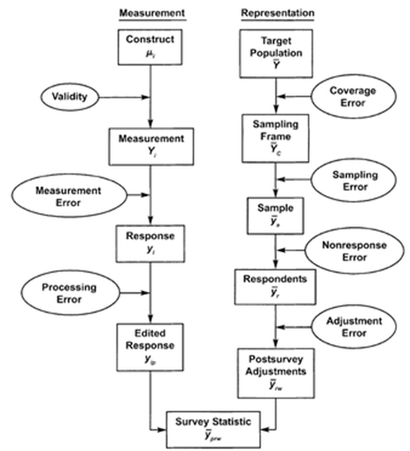
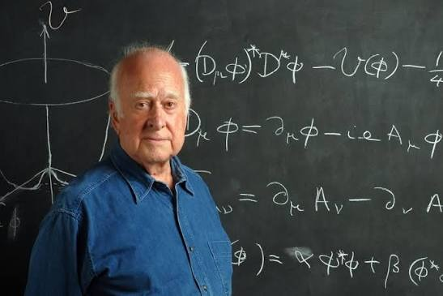
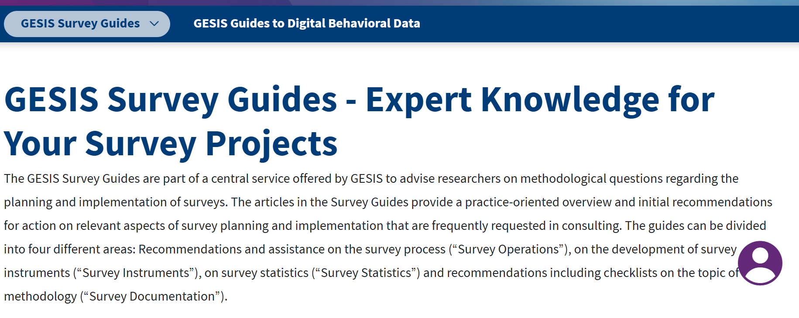

## {.portada}

```{=html}

<script>
window.LAB = {
  randn: function(){ let u=0,v=0; while(!u)u=Math.random(); while(!v)v=Math.random();
    return Math.sqrt(-2*Math.log(u))*Math.cos(2*Math.PI*v); },
  svg: function(tag, attrs){ const e=document.createElementNS('http://www.w3.org/2000/svg',tag);
    for(const k in attrs) e.setAttribute(k, attrs[k]); return e; },
  fmt: function(x,d){ return x.toFixed(d===undefined?1:d).replace('.',','); },
  // evita que las flechas del teclado en un slider cambien de slide
  guard: function(root){ root.querySelectorAll('input').forEach(function(i){
    i.addEventListener('keydown', function(e){ e.stopPropagation(); }); }); }
};
</script>

```


::: {.regla-gruesa}
:::

::: {.titulo}
Encuestas, cuestionarios y medición
:::

::: {.subtitulo}
Del concepto al número: trabajar con el error
:::

::: {.regla-fina}
:::

::: {.pie}
[Alejandro Plaza Reveco · profesor invitado]{.nombre}
Lógica de la Investigación Social · Sociología, Universidad Diego Portales\
6 de octubre de 2026
:::

::: {.notes}
Tiempos sugeridos (80 min): Parte 1, 12 · Parte 2, 18 · Parte 3, 16 · Parte 4, 20 · Parte 5, 12 · cierre, 2.
Teclas: S vista de orador · B pizarra · Esc vista general · F pantalla completa.
:::

## Hoja de ruta

::: {.pasos}
1. **Medir y encuestar: lo básico**
   [variables, niveles de medición, cuestionarios]{.glosa}
2. **Obsesionarse con el error**
   [nos vamos a equivocar: ¿por cuánto?]{.glosa}
3. **Del concepto al número**
   [conceptos latentes y operacionalización]{.glosa}
4. **Tres casos reales: ELSOC**
   [autoeficacia política · autoritarismo · depresión]{.glosa}
5. **Innovaciones**
   [experimentos, modos de aplicación y datos vinculados]{.glosa}
:::

# Parte 1 --- Medir y encuestar {.divisoria}

::: {.bajada}
Lo básico: qué es medir, qué es una variable y qué es un cuestionario
:::

## ¿Qué significa medir?

::: {.cols-60-40}
::: {}
::: {.bloque}
[Definición clásica]{.t}
Medir es [asignar números a objetos o eventos según reglas]{.hl} (Stevens, 1946)
:::

- Medimos la estatura con una regla y la temperatura con un termómetro
- En sociología medimos edad, ingreso, confianza, autoritarismo…
- La pregunta de hoy: ¿con qué **regla** le asignamos un número a la confianza en las instituciones?
:::

::: {.diagrama}
```{=html}
<svg class="dg" viewBox="0 0 420 420" role="img" aria-label="Concepto, regla y número"><defs><marker id="mg1" markerWidth="10" markerHeight="10" refX="9" refY="5" orient="auto" markerUnits="userSpaceOnUse"><path d="M0,0 L10,5 L0,10 Z" fill="#8FA3C0"/></marker><marker id="sg1" markerWidth="10" markerHeight="10" refX="1" refY="5" orient="auto" markerUnits="userSpaceOnUse"><path d="M10,0 L0,5 L10,10 Z" fill="#8FA3C0"/></marker><marker id="ma1" markerWidth="10" markerHeight="10" refX="9" refY="5" orient="auto" markerUnits="userSpaceOnUse"><path d="M0,0 L10,5 L0,10 Z" fill="#D9BC66"/></marker><marker id="sa1" markerWidth="10" markerHeight="10" refX="1" refY="5" orient="auto" markerUnits="userSpaceOnUse"><path d="M10,0 L0,5 L10,10 Z" fill="#D9BC66"/></marker><marker id="mr1" markerWidth="10" markerHeight="10" refX="9" refY="5" orient="auto" markerUnits="userSpaceOnUse"><path d="M0,0 L10,5 L0,10 Z" fill="#E08C81"/></marker><marker id="sr1" markerWidth="10" markerHeight="10" refX="1" refY="5" orient="auto" markerUnits="userSpaceOnUse"><path d="M10,0 L0,5 L10,10 Z" fill="#E08C81"/></marker><marker id="mv1" markerWidth="10" markerHeight="10" refX="9" refY="5" orient="auto" markerUnits="userSpaceOnUse"><path d="M0,0 L10,5 L0,10 Z" fill="#A3BE86"/></marker><marker id="sv1" markerWidth="10" markerHeight="10" refX="1" refY="5" orient="auto" markerUnits="userSpaceOnUse"><path d="M10,0 L0,5 L10,10 Z" fill="#A3BE86"/></marker></defs><g class="nd lat" data-k="c"><rect x="70.0" y="18.0" width="280" height="84" rx="8"/><text font-size="24" font-weight="700"><tspan x="210" y="45.8">Concepto</tspan><tspan x="210" y="74.2">«confianza»</tspan></text></g><g class="nd obs" data-k="r"><rect x="70.0" y="168.0" width="280" height="84" rx="8"/><text font-size="24" font-weight="500"><tspan x="210" y="195.8">Regla</tspan><tspan x="210" y="224.2">pregunta + escala</tspan></text></g><g class="nd err" data-k="n"><rect x="70.0" y="318.0" width="280" height="84" rx="8"/><text font-size="24" font-weight="700"><tspan x="210" y="345.8">Número</tspan><tspan x="210" y="374.2">1 · 2 · 3 · 4 · 5</tspan></text></g><line class="ar g" x1="210.0" y1="106.0" x2="210.0" y2="162.0" marker-end="url(#mg1)"/><line class="ar g" x1="210.0" y1="256.0" x2="210.0" y2="312.0" marker-end="url(#mg1)"/></svg>
```
:::

:::

## ¿Qué es una variable?

::: {.bloque}
[Definición]{.t}
Una [variable]{.hl} es una característica que **toma distintos valores** entre las unidades que estudiamos: personas, hogares, comunas…
:::

| Persona | Comuna | Nivel educacional | Confianza (1–5) | Edad |
|---|---|---|---|---|
| Ana | Maipú | Media completa | 2 | 34 |
| Benito | Ñuñoa | Universitaria | 4 | 51 |
| Carla | Temuco | Básica | 3 | 67 |
| Diego | Antofagasta | Técnica superior | 1 | 22 |
: {.grande}

- Cada fila es una **unidad**; cada columna, una **variable**
- ¿Las cuatro columnas son datos del mismo tipo?

## Niveles de medición

| Nivel | Qué nos dicen los valores | Ejemplos | Operaciones |
|---|---|---|---|
| **Nominal** | Solo categorías distintas, sin orden | Comuna, partido, sexo | Contar |
| **Ordinal** | Categorías con orden, pero distancias desconocidas | Nivel educacional, escala de acuerdo | Contar, ordenar |
| **Continua** | Distancias iguales: un año más es siempre un año más | Edad en años, ingreso, horas de trabajo | Contar, ordenar, sumar, promediar |
: {.grande}

. . .

::: {.alerta}
[Ojo]{.t}
El número que ponemos en la base **no cambia** el nivel de medición: codificar «Norte = 1, Centro = 2, Sur = 3» no convierte la zona en una variable numérica.
:::

## Asignar números a conceptos

::: {.cols-40-60}
::: {.diagrama}
```{=html}
<svg class="dg" viewBox="0 0 460 420" role="img" aria-label="Categorías de respuesta y números"><defs><marker id="mg2" markerWidth="10" markerHeight="10" refX="9" refY="5" orient="auto" markerUnits="userSpaceOnUse"><path d="M0,0 L10,5 L0,10 Z" fill="#8FA3C0"/></marker><marker id="sg2" markerWidth="10" markerHeight="10" refX="1" refY="5" orient="auto" markerUnits="userSpaceOnUse"><path d="M10,0 L0,5 L10,10 Z" fill="#8FA3C0"/></marker><marker id="ma2" markerWidth="10" markerHeight="10" refX="9" refY="5" orient="auto" markerUnits="userSpaceOnUse"><path d="M0,0 L10,5 L0,10 Z" fill="#D9BC66"/></marker><marker id="sa2" markerWidth="10" markerHeight="10" refX="1" refY="5" orient="auto" markerUnits="userSpaceOnUse"><path d="M10,0 L0,5 L10,10 Z" fill="#D9BC66"/></marker><marker id="mr2" markerWidth="10" markerHeight="10" refX="9" refY="5" orient="auto" markerUnits="userSpaceOnUse"><path d="M0,0 L10,5 L0,10 Z" fill="#E08C81"/></marker><marker id="sr2" markerWidth="10" markerHeight="10" refX="1" refY="5" orient="auto" markerUnits="userSpaceOnUse"><path d="M10,0 L0,5 L10,10 Z" fill="#E08C81"/></marker><marker id="mv2" markerWidth="10" markerHeight="10" refX="9" refY="5" orient="auto" markerUnits="userSpaceOnUse"><path d="M0,0 L10,5 L0,10 Z" fill="#A3BE86"/></marker><marker id="sv2" markerWidth="10" markerHeight="10" refX="1" refY="5" orient="auto" markerUnits="userSpaceOnUse"><path d="M10,0 L0,5 L10,10 Z" fill="#A3BE86"/></marker></defs><g class="nd obs" data-k="c0"><rect x="20.0" y="16.0" width="200" height="58" rx="8"/><text font-size="24" font-weight="500"><tspan x="120" y="45.0">Nada</tspan></text></g><g class="nd lat" data-k="n0"><rect x="345.0" y="16.0" width="70" height="58" rx="8"/><text font-size="26" font-weight="700"><tspan x="380" y="45.0">1</tspan></text></g><line class="ar g" x1="224.0" y1="45.0" x2="339.0" y2="45.0" marker-end="url(#mg2)"/><g class="nd obs" data-k="c1"><rect x="20.0" y="98.0" width="200" height="58" rx="8"/><text font-size="24" font-weight="500"><tspan x="120" y="127.0">Poca</tspan></text></g><g class="nd lat" data-k="n1"><rect x="345.0" y="98.0" width="70" height="58" rx="8"/><text font-size="26" font-weight="700"><tspan x="380" y="127.0">2</tspan></text></g><line class="ar g" x1="224.0" y1="127.0" x2="339.0" y2="127.0" marker-end="url(#mg2)"/><g class="nd obs" data-k="c2"><rect x="20.0" y="180.0" width="200" height="58" rx="8"/><text font-size="24" font-weight="500"><tspan x="120" y="209.0">Algo</tspan></text></g><g class="nd lat" data-k="n2"><rect x="345.0" y="180.0" width="70" height="58" rx="8"/><text font-size="26" font-weight="700"><tspan x="380" y="209.0">3</tspan></text></g><line class="ar g" x1="224.0" y1="209.0" x2="339.0" y2="209.0" marker-end="url(#mg2)"/><g class="nd obs" data-k="c3"><rect x="20.0" y="262.0" width="200" height="58" rx="8"/><text font-size="24" font-weight="500"><tspan x="120" y="291.0">Bastante</tspan></text></g><g class="nd lat" data-k="n3"><rect x="345.0" y="262.0" width="70" height="58" rx="8"/><text font-size="26" font-weight="700"><tspan x="380" y="291.0">4</tspan></text></g><line class="ar g" x1="224.0" y1="291.0" x2="339.0" y2="291.0" marker-end="url(#mg2)"/><g class="nd obs" data-k="c4"><rect x="20.0" y="344.0" width="200" height="58" rx="8"/><text font-size="24" font-weight="500"><tspan x="120" y="373.0">Mucha</tspan></text></g><g class="nd lat" data-k="n4"><rect x="345.0" y="344.0" width="70" height="58" rx="8"/><text font-size="26" font-weight="700"><tspan x="380" y="373.0">5</tspan></text></g><line class="ar g" x1="224.0" y1="373.0" x2="339.0" y2="373.0" marker-end="url(#mg2)"/></svg>
```
:::


::: {}
«¿Cuánto confía usted en el Congreso?»

- Los números respetan el **orden**: más número, más confianza
- Pero, ¿la distancia entre «Nada» y «Poca» es igual a la que hay entre «Bastante» y «Mucha»?
- Si lo es, podemos [promediar]{.hl}; si no, es una variable ordinal

::: {.ejemplo}
[Para pensar]{.t}
Un promedio de confianza de 2,4: ¿qué significa exactamente?
:::
:::
:::

## Ejercicio: ¿qué nivel de medición? {.ejercicio}

[Hagan clic en cada tarjeta para ver la respuesta]{.tenue}

```{=html}
<div class="tarjetas"><div class="tarjeta" onclick="this.classList.toggle('abierta')"><span class="num">1</span><div class="q">Edad en años cumplidos</div><div class="resp"><b>Continua</b><span>Un año más es siempre un año más: tiene sentido promediar.</span></div></div><div class="tarjeta" onclick="this.classList.toggle('abierta')"><span class="num">2</span><div class="q">Edad en tramos: 18–29, 30–44, 45–64, 65+</div><div class="resp"><b>Ordinal</b><span>Hay orden, pero los tramos no tienen el mismo ancho.</span></div></div><div class="tarjeta" onclick="this.classList.toggle('abierta')"><span class="num">3</span><div class="q">Comuna de residencia</div><div class="resp"><b>Nominal</b><span>Categorías distintas, sin ningún orden.</span></div></div><div class="tarjeta" onclick="this.classList.toggle('abierta')"><span class="num">4</span><div class="q">Satisfacción con la vida, de 1 a 10</div><div class="resp"><b>Ordinal</b><span>…aunque en la práctica muchas veces se trata como continua.</span></div></div><div class="tarjeta" onclick="this.classList.toggle('abierta')"><span class="num">5</span><div class="q">Número de amigos cercanos</div><div class="resp"><b>Continua</b><span>Es un conteo: numérica (discreta), con distancias iguales.</span></div></div><div class="tarjeta" onclick="this.classList.toggle('abierta')"><span class="num">6</span><div class="q">Candidato por el que votó</div><div class="resp"><b>Nominal</b><span>Ningún candidato es «más» que otro.</span></div></div></div>
```


::: {.nota}
Una decisión de diseño: la **misma** variable puede medirse a distintos niveles. Preguntar la edad en tramos pierde información.
:::

## Un cuestionario, según Asún

::: {.bloque}
[Definición]{.t}
«Un cuestionario es un dispositivo de investigación cuantitativa consistente en un conjunto de preguntas que deben ser aplicadas a un sujeto (usualmente individual) en un orden determinado y frente a las cuales este sujeto puede responder adecuando sus respuestas a un espacio restringido o a una serie de respuestas que el mismo cuestionario ofrece.»
:::

- Objetivo: [«medir» el grado o la forma]{.hl} en que las personas poseen determinadas variables
- Es una **conversación no horizontal**: uno pregunta con opciones preestablecidas, el otro elige

::: {.nota}
Asún (2006, p. 67).
:::

## Encuesta ≠ cuestionario

::: {.diagrama}
```{=html}
<svg class="dg" viewBox="0 0 1200 330" role="img" aria-label="Cuestionario, muestra y modo forman la encuesta"><defs><marker id="mg3" markerWidth="10" markerHeight="10" refX="9" refY="5" orient="auto" markerUnits="userSpaceOnUse"><path d="M0,0 L10,5 L0,10 Z" fill="#8FA3C0"/></marker><marker id="sg3" markerWidth="10" markerHeight="10" refX="1" refY="5" orient="auto" markerUnits="userSpaceOnUse"><path d="M10,0 L0,5 L10,10 Z" fill="#8FA3C0"/></marker><marker id="ma3" markerWidth="10" markerHeight="10" refX="9" refY="5" orient="auto" markerUnits="userSpaceOnUse"><path d="M0,0 L10,5 L0,10 Z" fill="#D9BC66"/></marker><marker id="sa3" markerWidth="10" markerHeight="10" refX="1" refY="5" orient="auto" markerUnits="userSpaceOnUse"><path d="M10,0 L0,5 L10,10 Z" fill="#D9BC66"/></marker><marker id="mr3" markerWidth="10" markerHeight="10" refX="9" refY="5" orient="auto" markerUnits="userSpaceOnUse"><path d="M0,0 L10,5 L0,10 Z" fill="#E08C81"/></marker><marker id="sr3" markerWidth="10" markerHeight="10" refX="1" refY="5" orient="auto" markerUnits="userSpaceOnUse"><path d="M10,0 L0,5 L10,10 Z" fill="#E08C81"/></marker><marker id="mv3" markerWidth="10" markerHeight="10" refX="9" refY="5" orient="auto" markerUnits="userSpaceOnUse"><path d="M0,0 L10,5 L0,10 Z" fill="#A3BE86"/></marker><marker id="sv3" markerWidth="10" markerHeight="10" refX="1" refY="5" orient="auto" markerUnits="userSpaceOnUse"><path d="M10,0 L0,5 L10,10 Z" fill="#A3BE86"/></marker></defs><g class="nd obs" data-k="q"><rect x="40.0" y="15.0" width="320" height="110" rx="8"/><text font-size="23" font-weight="500"><tspan x="200" y="56.4" font-weight="700">Cuestionario</tspan><tspan x="200" y="83.6">¿qué preguntamos y cómo?</tspan></text></g><g class="nd obs" data-k="m"><rect x="440.0" y="15.0" width="320" height="110" rx="8"/><text font-size="23" font-weight="500"><tspan x="600" y="56.4" font-weight="700">Muestra</tspan><tspan x="600" y="83.6">¿a quiénes preguntamos?</tspan></text></g><g class="nd obs" data-k="mo"><rect x="840.0" y="15.0" width="320" height="110" rx="8"/><text font-size="23" font-weight="500"><tspan x="1000" y="56.4" font-weight="700">Modo</tspan><tspan x="1000" y="83.6">¿cómo llega la pregunta?</tspan></text></g><g class="nd err" data-k="e"><rect x="410.0" y="230.0" width="380" height="80" rx="8"/><text font-size="28" font-weight="700"><tspan x="600" y="270.0">Encuesta</tspan></text></g><line class="ar g" x1="313.6" y1="126.8" x2="514.6" y2="227.3" marker-end="url(#mg3)"/><line class="ar g" x1="600.0" y1="129.0" x2="600.0" y2="224.0" marker-end="url(#mg3)"/><line class="ar g" x1="886.4" y1="126.8" x2="685.4" y2="227.3" marker-end="url(#mg3)"/></svg>
```
:::


- Un buen cuestionario aplicado a una mala muestra produce **malos datos**
- Una muestra perfecta con preguntas mal hechas, **también**
- Modos: cara a cara, teléfono, web, autoaplicado… o [mezclas]{.hl}

## ¿Qué se puede preguntar?

::: {.cols3}
::: {.bloque}
[Hechos]{.t}
Conductas o sucesos

[¿Votó en la última elección? ¿Con quién vive?]{.tenue}
:::

::: {.bloque}
[Conocimientos y habilidades]{.t}
Hay respuestas correctas e incorrectas

[Pruebas SIMCE o PAES, preguntas de conocimiento político]{.tenue}
:::

::: {.bloque}
[Opiniones y valores]{.t}
Lo que la persona piensa o siente

[¿Cuánto confía en el Congreso? ¿Qué es más importante: libertad o igualdad?]{.tenue}
:::
:::

. . .

::: {.alerta}
[Incluso los hechos pasan por la persona]{.t}
Lo que recibimos «no es el hecho», sino «la percepción, recuerdo o lo que nos desea transmitir el sujeto» (Asún, 2006, p. 78).
:::

## Síntesis {.sintesis}

- Medir es asignar números a conceptos según una regla explícita
- Las variables pueden ser nominales, ordinales o continuas: el nivel define qué operaciones tienen sentido
- El cuestionario es la regla de medición; la encuesta suma muestra y modo de aplicación

# Parte 2 --- Obsesionarse con el error {.divisoria}

::: {.bajada}
Nos vamos a equivocar. La pregunta es: ¿por cuánto?
:::

## {.portada}

::: {.destacado style="margin-top:1.4em"}
Trabajar con datos cuantitativos significa

[obsesionarse con el error]{.grande}
:::

. . .

::: {.pasos style="max-width:60%; margin:1em auto 0"}
1. ¿De dónde viene el error?
2. ¿Cómo lo evitamos o reducimos?
3. ¿Cómo le ponemos un [número]{.hl}?
:::

## No es si nos equivocamos, sino por cuánto

::: {.cols-60-40}
::: {}
Marzo de 2026: el debate sobre el MEPCO (Mecanismo de Estabilización de Precios de los Combustibles)

::: {.bloque}
[Mirada determinista]{.t}
«El 48% de los chilenos opina que el Gobierno debía endeudarse para mantener el subsidio del MEPCO»
:::

::: {.fragment}
::: {.ejemplo}
[Mirada probabilística]{.t}
«Entre **44% y 52%** lo opina, con 95% de confianza»\
[Ilustrativo: muestra de ≈700 casos, margen de ±3,7 puntos]{.tenue}
:::
:::
:::

{.foto}
:::

::: {.nota}
Dato: Cadem, Plaza Pública (marzo 2026).
:::

## Laboratorio: ¿por cuánto nos equivocamos? {.lab-slide}

```{=html}

<div class="lab lab-ancho" id="lab-mu">
  <svg viewBox="0 0 900 430" id="mu-svg">
    <g id="mu-eje"></g>
    <g id="mu-int"></g>
  </svg>
  <div class="panel">
    <label>Tamaño de muestra: <b id="mu-nv"></b> personas</label>
    <input type="range" id="mu-n" min="100" max="3000" step="100" value="700">
    <label>Sesgo de no respuesta: <b id="mu-bv"></b> puntos</label>
    <input type="range" id="mu-b" min="0" max="8" step="1" value="0">
    <div>
      <button class="btn" id="mu-1">Hacer 1 encuesta</button>
      <button class="btn" id="mu-20">Hacer 20</button>
      <button class="btn sec" id="mu-0">Limpiar</button>
    </div>
    <div class="lectura">
      <div><span class="k">Margen de error (95%)</span><span class="v" id="mu-me">–</span></div>
      <div><span class="k">Intervalos que contienen el 48%</span><span class="v" id="mu-cov">–</span></div>
    </div>
    <p class="glosa">Cada línea es una encuesta distinta. <span class="hld">Verde</span>: el intervalo contiene el valor verdadero. <span class="hlx">Rojo</span>: no lo contiene.</p>
  </div>
</div>
<script>
(function(){
  const $=id=>document.getElementById(id), L=window.LAB;
  const P=0.48, X0=60, X1=870, lo=0.30, hi=0.66, maxRows=24, top=40, rowH=14.5;
  const sx=p=>X0+(p-lo)/(hi-lo)*(X1-X0);
  const surveys=[];
  // eje
  const ej=$('mu-eje');
  ej.appendChild(L.svg('line',{x1:X0,y1:395,x2:X1,y2:395,stroke:'#9BA9BF','stroke-width':2}));
  for(let p=0.30;p<=0.661;p+=0.06){
    ej.appendChild(L.svg('line',{x1:sx(p),y1:395,x2:sx(p),y2:403,stroke:'#9BA9BF','stroke-width':2}));
    const t=L.svg('text',{x:sx(p),y:425,'text-anchor':'middle','font-size':20,fill:'#9BA9BF'}); t.textContent=Math.round(p*100)+'%'; ej.appendChild(t);
  }
  ej.appendChild(L.svg('line',{x1:sx(P),y1:18,x2:sx(P),y2:395,stroke:'#D9BC66','stroke-width':3,'stroke-dasharray':'8 6'}));
  const tv=L.svg('text',{x:sx(P)+8,y:24,'font-size':19,fill:'#F0D588','font-weight':600}); tv.textContent='valor verdadero: 48%'; ej.appendChild(tv);
  function upd(){ $('mu-nv').textContent=$('mu-n').value; $('mu-bv').textContent=$('mu-b').value;
    const n=+$('mu-n').value; $('mu-me').textContent='± '+L.fmt(196*Math.sqrt(P*(1-P)/n),1)+' pts'; }
  function draw(){
    const g=$('mu-int'); g.innerHTML='';
    const vis=surveys.slice(-maxRows);
    vis.forEach((s,i)=>{
      const y=top+i*rowH, ok=(s.l<=P && s.h>=P), c=ok?'#A3BE86':'#E08C81';
      g.appendChild(L.svg('line',{x1:sx(Math.max(lo,s.l)),y1:y,x2:sx(Math.min(hi,s.h)),y2:y,stroke:c,'stroke-width':4,'stroke-linecap':'round'}));
      g.appendChild(L.svg('circle',{cx:sx(s.p),cy:y,r:5,fill:c}));
    });
    if(surveys.length){ const k=surveys.filter(s=>s.l<=P&&s.h>=P).length;
      $('mu-cov').textContent=Math.round(100*k/surveys.length)+'% ('+k+'/'+surveys.length+')'; }
    else $('mu-cov').textContent='–';
  }
  function encuestar(m){
    const n=+$('mu-n').value, b=+$('mu-b').value/100;
    for(let i=0;i<m;i++){
      const pt=P+b; const ph=Math.min(0.99,Math.max(0.01,pt+L.randn()*Math.sqrt(pt*(1-pt)/n)));
      const me=1.96*Math.sqrt(ph*(1-ph)/n); surveys.push({p:ph,l:ph-me,h:ph+me});
    }
    draw();
  }
  $('mu-1').onclick=()=>encuestar(1); $('mu-20').onclick=()=>encuestar(20);
  $('mu-0').onclick=()=>{surveys.length=0; draw();};
  $('mu-n').oninput=upd; $('mu-b').oninput=upd;
  L.guard($('lab-mu')); upd(); encuestar(12);
})();
</script>

```


::: {.notes}
1) Hacer 20 encuestas con n = 700: casi todas verdes (≈95%).
2) Bajar n a 100: intervalos anchos, pero siguen conteniendo el 48%.
3) Subir n a 3000 y agregar 4 puntos de sesgo de no respuesta: intervalos angostos y casi todos rojos.
Mensaje: más casos reducen el error aleatorio, no el sesgo. Y el margen de error publicado solo mide el muestral.
:::

## La pregunta científica

- No asumimos que la realidad social se puede capturar sin falla
- Asumimos que [nos vamos a equivocar siempre]{.hl}: por el muestreo, las preguntas, los encuestadores, el procesamiento
- La pregunta es: **¿por cuánto y en qué dirección?**

::: {.destacado style="margin-top:1em"}
*«Medir conceptos de ciencias sociales siempre incorpora un grado variable, pero frecuentemente importante, de error. Equivale a tratar de comprender una conversación escuchada en una radio con mucha estática y ruido de fondo.»*

[Asún (2006, p. 112)]{.tenue}
:::

## El tiro al blanco

::: {.cols-40-60}
::: {.diagrama}
```{=html}
<svg class="dg" viewBox="0 0 520 380" role="img" aria-label="Diana: el centro es el valor verdadero"><defs><marker id="mg4" markerWidth="10" markerHeight="10" refX="9" refY="5" orient="auto" markerUnits="userSpaceOnUse"><path d="M0,0 L10,5 L0,10 Z" fill="#8FA3C0"/></marker><marker id="sg4" markerWidth="10" markerHeight="10" refX="1" refY="5" orient="auto" markerUnits="userSpaceOnUse"><path d="M10,0 L0,5 L10,10 Z" fill="#8FA3C0"/></marker><marker id="ma4" markerWidth="10" markerHeight="10" refX="9" refY="5" orient="auto" markerUnits="userSpaceOnUse"><path d="M0,0 L10,5 L0,10 Z" fill="#D9BC66"/></marker><marker id="sa4" markerWidth="10" markerHeight="10" refX="1" refY="5" orient="auto" markerUnits="userSpaceOnUse"><path d="M10,0 L0,5 L10,10 Z" fill="#D9BC66"/></marker><marker id="mr4" markerWidth="10" markerHeight="10" refX="9" refY="5" orient="auto" markerUnits="userSpaceOnUse"><path d="M0,0 L10,5 L0,10 Z" fill="#E08C81"/></marker><marker id="sr4" markerWidth="10" markerHeight="10" refX="1" refY="5" orient="auto" markerUnits="userSpaceOnUse"><path d="M10,0 L0,5 L10,10 Z" fill="#E08C81"/></marker><marker id="mv4" markerWidth="10" markerHeight="10" refX="9" refY="5" orient="auto" markerUnits="userSpaceOnUse"><path d="M0,0 L10,5 L0,10 Z" fill="#A3BE86"/></marker><marker id="sv4" markerWidth="10" markerHeight="10" refX="1" refY="5" orient="auto" markerUnits="userSpaceOnUse"><path d="M10,0 L0,5 L10,10 Z" fill="#A3BE86"/></marker></defs><circle cx="190" cy="200" r="150.0" fill="#17243C" stroke="#3E5578" stroke-width="2"/><circle cx="190" cy="200" r="105.0" fill="#1F3152"/><circle cx="190" cy="200" r="60.0" fill="#2B4268"/><circle cx="190" cy="200" r="20.0" fill="#D9BC66"/><path class="ar a" d="M420,70 C380,90 260,140 214,188" marker-end="url(#ma4)"/><text class="lbl oro" font-size="22" text-anchor="middle" font-weight="600"><tspan x="430" y="52.0">centro = valor verdadero</tspan></text></svg>
```
:::


::: {style="padding-top:2.2em"}
- El [centro]{.hl} es lo que queremos conocer: el valor verdadero en la población
- Cada **disparo** es una medición: una encuesta, una muestra, una respuesta
- Nunca vemos el centro directamente: solo vemos dónde caen los disparos
:::
:::

## Dos tipos de error

::: {.diagrama}
```{=html}
<svg class="dg" viewBox="0 0 1400 380" role="img" aria-label="Cuatro dianas: precisión y sesgo"><defs><marker id="mg5" markerWidth="10" markerHeight="10" refX="9" refY="5" orient="auto" markerUnits="userSpaceOnUse"><path d="M0,0 L10,5 L0,10 Z" fill="#8FA3C0"/></marker><marker id="sg5" markerWidth="10" markerHeight="10" refX="1" refY="5" orient="auto" markerUnits="userSpaceOnUse"><path d="M10,0 L0,5 L10,10 Z" fill="#8FA3C0"/></marker><marker id="ma5" markerWidth="10" markerHeight="10" refX="9" refY="5" orient="auto" markerUnits="userSpaceOnUse"><path d="M0,0 L10,5 L0,10 Z" fill="#D9BC66"/></marker><marker id="sa5" markerWidth="10" markerHeight="10" refX="1" refY="5" orient="auto" markerUnits="userSpaceOnUse"><path d="M10,0 L0,5 L10,10 Z" fill="#D9BC66"/></marker><marker id="mr5" markerWidth="10" markerHeight="10" refX="9" refY="5" orient="auto" markerUnits="userSpaceOnUse"><path d="M0,0 L10,5 L0,10 Z" fill="#E08C81"/></marker><marker id="sr5" markerWidth="10" markerHeight="10" refX="1" refY="5" orient="auto" markerUnits="userSpaceOnUse"><path d="M10,0 L0,5 L10,10 Z" fill="#E08C81"/></marker><marker id="mv5" markerWidth="10" markerHeight="10" refX="9" refY="5" orient="auto" markerUnits="userSpaceOnUse"><path d="M0,0 L10,5 L0,10 Z" fill="#A3BE86"/></marker><marker id="sv5" markerWidth="10" markerHeight="10" refX="1" refY="5" orient="auto" markerUnits="userSpaceOnUse"><path d="M10,0 L0,5 L10,10 Z" fill="#A3BE86"/></marker></defs><circle cx="175" cy="165" r="142.5" fill="#17243C" stroke="#3E5578" stroke-width="2"/><circle cx="175" cy="165" r="99.75" fill="#1F3152"/><circle cx="175" cy="165" r="57.0" fill="#2B4268"/><circle cx="175" cy="165" r="19.0" fill="#D9BC66"/><circle cx="175.3" cy="168.7" r="7" fill="#E8E3D9" stroke="#0F1A2E" stroke-width="2"/><circle cx="171.3" cy="167.8" r="7" fill="#E8E3D9" stroke="#0F1A2E" stroke-width="2"/><circle cx="182.4" cy="168.3" r="7" fill="#E8E3D9" stroke="#0F1A2E" stroke-width="2"/><circle cx="187.5" cy="157.9" r="7" fill="#E8E3D9" stroke="#0F1A2E" stroke-width="2"/><circle cx="175.5" cy="159.4" r="7" fill="#E8E3D9" stroke="#0F1A2E" stroke-width="2"/><circle cx="168.7" cy="163.5" r="7" fill="#E8E3D9" stroke="#0F1A2E" stroke-width="2"/><circle cx="176.8" cy="168.4" r="7" fill="#E8E3D9" stroke="#0F1A2E" stroke-width="2"/><text class="lbl claro" font-size="22" text-anchor="middle" font-weight="700"><tspan x="175" y="335.0">Preciso e insesgado</tspan></text><text class="lbl" font-size="19" text-anchor="middle" font-weight="500"><tspan x="175" y="363.0">el ideal</tspan></text><g class="fragment" data-fragment-index="1"><circle cx="525" cy="165" r="142.5" fill="#17243C" stroke="#3E5578" stroke-width="2"/><circle cx="525" cy="165" r="99.75" fill="#1F3152"/><circle cx="525" cy="165" r="57.0" fill="#2B4268"/><circle cx="525" cy="165" r="19.0" fill="#D9BC66"/><circle cx="549.4" cy="272.2" r="7" fill="#E8E3D9" stroke="#0F1A2E" stroke-width="2"/><circle cx="566.4" cy="88.5" r="7" fill="#E8E3D9" stroke="#0F1A2E" stroke-width="2"/><circle cx="534.8" cy="135.1" r="7" fill="#E8E3D9" stroke="#0F1A2E" stroke-width="2"/><circle cx="500.2" cy="227.7" r="7" fill="#E8E3D9" stroke="#0F1A2E" stroke-width="2"/><circle cx="514.3" cy="71.3" r="7" fill="#E8E3D9" stroke="#0F1A2E" stroke-width="2"/><circle cx="539.9" cy="151.0" r="7" fill="#E8E3D9" stroke="#0F1A2E" stroke-width="2"/><circle cx="468.6" cy="120.8" r="7" fill="#E8E3D9" stroke="#0F1A2E" stroke-width="2"/><text class="lbl claro" font-size="22" text-anchor="middle" font-weight="700"><tspan x="525" y="335.0">Impreciso, insesgado</tspan></text><text class="lbl" font-size="19" text-anchor="middle" font-weight="500"><tspan x="525" y="363.0">error aleatorio</tspan></text></g><g class="fragment" data-fragment-index="2"><circle cx="875" cy="165" r="142.5" fill="#17243C" stroke="#3E5578" stroke-width="2"/><circle cx="875" cy="165" r="99.75" fill="#1F3152"/><circle cx="875" cy="165" r="57.0" fill="#2B4268"/><circle cx="875" cy="165" r="19.0" fill="#D9BC66"/><circle cx="929.4" cy="109.8" r="7" fill="#E8E3D9" stroke="#0F1A2E" stroke-width="2"/><circle cx="931.2" cy="110.6" r="7" fill="#E8E3D9" stroke="#0F1A2E" stroke-width="2"/><circle cx="951.5" cy="102.8" r="7" fill="#E8E3D9" stroke="#0F1A2E" stroke-width="2"/><circle cx="927.7" cy="107.8" r="7" fill="#E8E3D9" stroke="#0F1A2E" stroke-width="2"/><circle cx="944.9" cy="103.6" r="7" fill="#E8E3D9" stroke="#0F1A2E" stroke-width="2"/><circle cx="947.9" cy="98.2" r="7" fill="#E8E3D9" stroke="#0F1A2E" stroke-width="2"/><circle cx="925.7" cy="109.5" r="7" fill="#E8E3D9" stroke="#0F1A2E" stroke-width="2"/><text class="lbl claro" font-size="22" text-anchor="middle" font-weight="700"><tspan x="875" y="335.0">Preciso, sesgado</tspan></text><text class="lbl" font-size="19" text-anchor="middle" font-weight="500"><tspan x="875" y="363.0">error sistemático</tspan></text></g><g class="fragment" data-fragment-index="3"><circle cx="1225" cy="165" r="142.5" fill="#17243C" stroke="#3E5578" stroke-width="2"/><circle cx="1225" cy="165" r="99.75" fill="#1F3152"/><circle cx="1225" cy="165" r="57.0" fill="#2B4268"/><circle cx="1225" cy="165" r="19.0" fill="#D9BC66"/><circle cx="1243.7" cy="89.0" r="7" fill="#E8E3D9" stroke="#0F1A2E" stroke-width="2"/><circle cx="1299.0" cy="145.4" r="7" fill="#E8E3D9" stroke="#0F1A2E" stroke-width="2"/><circle cx="1284.8" cy="103.5" r="7" fill="#E8E3D9" stroke="#0F1A2E" stroke-width="2"/><circle cx="1336.5" cy="131.9" r="7" fill="#E8E3D9" stroke="#0F1A2E" stroke-width="2"/><circle cx="1270.1" cy="166.0" r="7" fill="#E8E3D9" stroke="#0F1A2E" stroke-width="2"/><circle cx="1242.1" cy="121.9" r="7" fill="#E8E3D9" stroke="#0F1A2E" stroke-width="2"/><circle cx="1307.7" cy="114.5" r="7" fill="#E8E3D9" stroke="#0F1A2E" stroke-width="2"/><text class="lbl claro" font-size="22" text-anchor="middle" font-weight="700"><tspan x="1225" y="335.0">Impreciso y sesgado</tspan></text><text class="lbl" font-size="19" text-anchor="middle" font-weight="500"><tspan x="1225" y="363.0">lo peor</tspan></text></g></svg>
```
:::


::: {.fragment fragment-index=1}
- **Error aleatorio** (varianza): nos equivocamos para ambos lados; se reduce con más casos o más preguntas
:::
::: {.fragment fragment-index=2}
- [Error sistemático]{.hlr} (sesgo): nos equivocamos siempre hacia el mismo lado; más casos no lo arreglan
:::
::: {.fragment fragment-index=3}
- En la práctica, casi siempre tenemos un poco de ambos
:::

## Laboratorio: el tiro al blanco {.lab-slide}

```{=html}

<div class="lab" id="lab-tiro">
  <svg viewBox="0 0 420 420" id="tiro-svg">
    <circle cx="210" cy="210" r="195" fill="#17243C" stroke="#3E5578" stroke-width="2"/>
    <circle cx="210" cy="210" r="135" fill="#1F3152"/>
    <circle cx="210" cy="210" r="78" fill="#2B4268"/>
    <circle cx="210" cy="210" r="22" fill="#D9BC66"/>
    <g id="tiro-shots"></g>
    <g id="tiro-mean"></g>
  </svg>
  <div class="panel">
    <label>Sesgo (error sistemático): <b id="tiro-bv"></b></label>
    <input type="range" id="tiro-b" min="0" max="140" value="0">
    <label>Dispersión (error aleatorio): <b id="tiro-sv"></b></label>
    <input type="range" id="tiro-s" min="4" max="90" value="20">
    <div>
      <button class="btn" id="tiro-1">Disparar 1</button>
      <button class="btn" id="tiro-10">Disparar 10</button>
      <button class="btn sec" id="tiro-0">Limpiar</button>
    </div>
    <div class="presets">
      <button class="btn sec chico" data-p="0,10">Ideal</button>
      <button class="btn sec chico" data-p="0,70">Aleatorio</button>
      <button class="btn sec chico" data-p="95,10">Sistemático</button>
      <button class="btn sec chico" data-p="90,65">Ambos</button>
    </div>
    <div class="lectura">
      <div><span class="k">Disparos</span><span class="v" id="tiro-n">0</span></div>
      <div><span class="k">Distancia del promedio al centro</span><span class="v" id="tiro-d">–</span></div>
    </div>
    <p class="glosa">La <span class="hl">cruz</span> marca el promedio de los disparos. Con más disparos, el error aleatorio se compensa; el sesgo, no.</p>
  </div>
</div>
<script>
(function(){
  const $=id=>document.getElementById(id), L=window.LAB;
  const shots=[], g=$('tiro-shots'), gm=$('tiro-mean');
  function upd(){ $('tiro-bv').textContent=$('tiro-b').value; $('tiro-sv').textContent=$('tiro-s').value; }
  function draw(){
    g.innerHTML=''; gm.innerHTML='';
    shots.forEach(s=>g.appendChild(L.svg('circle',{cx:s[0],cy:s[1],r:7,fill:'#E8E3D9',stroke:'#0F1A2E','stroke-width':2})));
    $('tiro-n').textContent=shots.length;
    if(!shots.length){ $('tiro-d').textContent='–'; return; }
    const mx=shots.reduce((a,s)=>a+s[0],0)/shots.length, my=shots.reduce((a,s)=>a+s[1],0)/shots.length;
    const st={stroke:'#7FB0DC','stroke-width':5,'stroke-linecap':'round'};
    gm.appendChild(L.svg('line',Object.assign({x1:mx-16,y1:my-16,x2:mx+16,y2:my+16},st)));
    gm.appendChild(L.svg('line',Object.assign({x1:mx-16,y1:my+16,x2:mx+16,y2:my-16},st)));
    $('tiro-d').textContent=Math.round(Math.hypot(mx-210,my-210));
  }
  function shoot(n){
    const b=+$('tiro-b').value, s=+$('tiro-s').value;
    for(let i=0;i<n;i++){
      shots.push([210+b*0.71+L.randn()*s, 210-b*0.71+L.randn()*s]);
    }
    draw();
  }
  $('tiro-1').onclick=()=>shoot(1); $('tiro-10').onclick=()=>shoot(10);
  $('tiro-0').onclick=()=>{shots.length=0; draw();};
  ['tiro-b','tiro-s'].forEach(id=>$(id).oninput=upd);
  document.querySelectorAll('#lab-tiro .presets button').forEach(bt=>bt.onclick=()=>{
    const p=bt.dataset.p.split(','); $('tiro-b').value=p[0]; $('tiro-s').value=p[1]; upd();
    shots.length=0; shoot(10);
  });
  L.guard($('lab-tiro')); upd(); shoot(10);
})();
</script>

```


::: {.notes}
Usar los cuatro botones de casos. Después: sesgo alto + dispersión alta, disparar muchas veces y mostrar que la cruz (el promedio) se queda lejos del centro.
:::

## ¿Qué es un DAG?

::: {.cols2}
::: {}
::: {.bloque}
[Grafo dirigido acíclico]{.t}
Un dibujo de **qué produce qué**

- **Nodos**: variables
- **Flechas**: una variable influye en otra
- **Acíclico**: no hay círculos; nada se causa a sí mismo
:::

La lluvia produce paraguas abiertos y calles mojadas. Paraguas y calles mojadas [andan juntos]{.hl}, aunque uno no cause al otro.
:::

::: {}
::: {.diagrama}
```{=html}
<svg class="dg" viewBox="0 0 560 330" role="img" aria-label="DAG: la lluvia causa paraguas y calle mojada"><defs><marker id="mg6" markerWidth="10" markerHeight="10" refX="9" refY="5" orient="auto" markerUnits="userSpaceOnUse"><path d="M0,0 L10,5 L0,10 Z" fill="#8FA3C0"/></marker><marker id="sg6" markerWidth="10" markerHeight="10" refX="1" refY="5" orient="auto" markerUnits="userSpaceOnUse"><path d="M10,0 L0,5 L10,10 Z" fill="#8FA3C0"/></marker><marker id="ma6" markerWidth="10" markerHeight="10" refX="9" refY="5" orient="auto" markerUnits="userSpaceOnUse"><path d="M0,0 L10,5 L0,10 Z" fill="#D9BC66"/></marker><marker id="sa6" markerWidth="10" markerHeight="10" refX="1" refY="5" orient="auto" markerUnits="userSpaceOnUse"><path d="M10,0 L0,5 L10,10 Z" fill="#D9BC66"/></marker><marker id="mr6" markerWidth="10" markerHeight="10" refX="9" refY="5" orient="auto" markerUnits="userSpaceOnUse"><path d="M0,0 L10,5 L0,10 Z" fill="#E08C81"/></marker><marker id="sr6" markerWidth="10" markerHeight="10" refX="1" refY="5" orient="auto" markerUnits="userSpaceOnUse"><path d="M10,0 L0,5 L10,10 Z" fill="#E08C81"/></marker><marker id="mv6" markerWidth="10" markerHeight="10" refX="9" refY="5" orient="auto" markerUnits="userSpaceOnUse"><path d="M0,0 L10,5 L0,10 Z" fill="#A3BE86"/></marker><marker id="sv6" markerWidth="10" markerHeight="10" refX="1" refY="5" orient="auto" markerUnits="userSpaceOnUse"><path d="M10,0 L0,5 L10,10 Z" fill="#A3BE86"/></marker></defs><g class="nd obs" data-k="ll"><rect x="180.0" y="17.0" width="200" height="66" rx="8"/><text font-size="24" font-weight="500"><tspan x="280" y="50.0">Lluvia</tspan></text></g><g class="nd obs" data-k="pa"><rect x="10.0" y="217.0" width="200" height="66" rx="8"/><text font-size="24" font-weight="500"><tspan x="110" y="250.0">Paraguas</tspan></text></g><g class="nd obs" data-k="ca"><rect x="350.0" y="217.0" width="200" height="66" rx="8"/><text font-size="24" font-weight="500"><tspan x="450" y="250.0">Calle mojada</tspan></text></g><line class="ar g" x1="249.4" y1="86.0" x2="141.9" y2="212.4" marker-end="url(#mg6)"/><line class="ar g" x1="310.6" y1="86.0" x2="418.1" y2="212.4" marker-end="url(#mg6)"/><path d="M212,250 L348,250" fill="none" stroke="#9BA9BF" stroke-width="2.5" stroke-dasharray="8 6"/><text class="lbl" font-size="18" text-anchor="middle" font-weight="500"><tspan x="280" y="290.0">andan juntos</tspan></text></svg>
```
:::


[Convención de colores en esta clase:]{.tenue style="font-size:.6em"}

::: {.diagrama}
```{=html}
<svg class="dg" viewBox="0 0 560 80" role="img" aria-label="Leyenda de colores"><defs><marker id="mg7" markerWidth="10" markerHeight="10" refX="9" refY="5" orient="auto" markerUnits="userSpaceOnUse"><path d="M0,0 L10,5 L0,10 Z" fill="#8FA3C0"/></marker><marker id="sg7" markerWidth="10" markerHeight="10" refX="1" refY="5" orient="auto" markerUnits="userSpaceOnUse"><path d="M10,0 L0,5 L10,10 Z" fill="#8FA3C0"/></marker><marker id="ma7" markerWidth="10" markerHeight="10" refX="9" refY="5" orient="auto" markerUnits="userSpaceOnUse"><path d="M0,0 L10,5 L0,10 Z" fill="#D9BC66"/></marker><marker id="sa7" markerWidth="10" markerHeight="10" refX="1" refY="5" orient="auto" markerUnits="userSpaceOnUse"><path d="M10,0 L0,5 L10,10 Z" fill="#D9BC66"/></marker><marker id="mr7" markerWidth="10" markerHeight="10" refX="9" refY="5" orient="auto" markerUnits="userSpaceOnUse"><path d="M0,0 L10,5 L0,10 Z" fill="#E08C81"/></marker><marker id="sr7" markerWidth="10" markerHeight="10" refX="1" refY="5" orient="auto" markerUnits="userSpaceOnUse"><path d="M10,0 L0,5 L10,10 Z" fill="#E08C81"/></marker><marker id="mv7" markerWidth="10" markerHeight="10" refX="9" refY="5" orient="auto" markerUnits="userSpaceOnUse"><path d="M0,0 L10,5 L0,10 Z" fill="#A3BE86"/></marker><marker id="sv7" markerWidth="10" markerHeight="10" refX="1" refY="5" orient="auto" markerUnits="userSpaceOnUse"><path d="M10,0 L0,5 L10,10 Z" fill="#A3BE86"/></marker></defs><g class="nd lat" data-k="a"><rect x="5.0" y="12.0" width="170" height="56" rx="8"/><text font-size="19" font-weight="700"><tspan x="90" y="40.0">no observada</tspan></text></g><g class="nd obs" data-k="b"><rect x="195.0" y="12.0" width="170" height="56" rx="8"/><text font-size="19" font-weight="500"><tspan x="280" y="40.0">observada</tspan></text></g><g class="nd err" data-k="c"><rect x="385.0" y="12.0" width="170" height="56" rx="8"/><text font-size="19" font-weight="700"><tspan x="470" y="40.0">error</tspan></text></g></svg>
```
:::

:::
:::

::: {.nota}
Pearl y Mackenzie (2018), *The Book of Why*.
:::

## La ecuación más importante de hoy

::: {.ecuacion}
X = V + E
:::

::: {.cols2}
::: {}
- *X*: lo que **observamos** (la respuesta)
- *V*: el [valor verdadero]{.hl} (lo que queremos conocer)
- *E*: el **error** de medición

[Teoría clásica de los tests: toda respuesta es verdad *más* ruido]{.tenue style="font-size:.7em"}
:::

::: {.diagrama}
```{=html}
<svg class="dg" viewBox="0 0 600 300" role="img" aria-label="X igual V más E"><defs><marker id="mg8" markerWidth="10" markerHeight="10" refX="9" refY="5" orient="auto" markerUnits="userSpaceOnUse"><path d="M0,0 L10,5 L0,10 Z" fill="#8FA3C0"/></marker><marker id="sg8" markerWidth="10" markerHeight="10" refX="1" refY="5" orient="auto" markerUnits="userSpaceOnUse"><path d="M10,0 L0,5 L10,10 Z" fill="#8FA3C0"/></marker><marker id="ma8" markerWidth="10" markerHeight="10" refX="9" refY="5" orient="auto" markerUnits="userSpaceOnUse"><path d="M0,0 L10,5 L0,10 Z" fill="#D9BC66"/></marker><marker id="sa8" markerWidth="10" markerHeight="10" refX="1" refY="5" orient="auto" markerUnits="userSpaceOnUse"><path d="M10,0 L0,5 L10,10 Z" fill="#D9BC66"/></marker><marker id="mr8" markerWidth="10" markerHeight="10" refX="9" refY="5" orient="auto" markerUnits="userSpaceOnUse"><path d="M0,0 L10,5 L0,10 Z" fill="#E08C81"/></marker><marker id="sr8" markerWidth="10" markerHeight="10" refX="1" refY="5" orient="auto" markerUnits="userSpaceOnUse"><path d="M10,0 L0,5 L10,10 Z" fill="#E08C81"/></marker><marker id="mv8" markerWidth="10" markerHeight="10" refX="9" refY="5" orient="auto" markerUnits="userSpaceOnUse"><path d="M0,0 L10,5 L0,10 Z" fill="#A3BE86"/></marker><marker id="sv8" markerWidth="10" markerHeight="10" refX="1" refY="5" orient="auto" markerUnits="userSpaceOnUse"><path d="M10,0 L0,5 L10,10 Z" fill="#A3BE86"/></marker></defs><g class="nd lat" data-k="V"><rect x="15.0" y="165.0" width="190" height="90" rx="8"/><text font-size="24" font-weight="700"><tspan x="110" y="195.8">V</tspan><tspan x="110" y="224.2">valor verdadero</tspan></text></g><g class="nd obs" data-k="X"><rect x="385.0" y="165.0" width="190" height="90" rx="8"/><text font-size="24" font-weight="500"><tspan x="480" y="195.8">X</tspan><tspan x="480" y="224.2">respuesta</tspan></text></g><g class="nd err" data-k="E"><rect x="430.0" y="20.0" width="100" height="70" rx="8"/><text font-size="30" font-weight="700"><tspan x="480" y="55.0">E</tspan></text></g><line class="ar g" x1="209.0" y1="210.0" x2="379.0" y2="210.0" marker-end="url(#mg8)"/><line class="ar a" x1="480.0" y1="94.0" x2="480.0" y2="159.0" marker-end="url(#ma8)"/></svg>
```
:::

:::

## Un ejemplo con un hecho, no una opinión

::: {.cols-60-40}
::: {style="padding-top:1.5em"}
- En una encuesta del CIS (España) se preguntó por quién habían votado en la última elección
- Casi el [65%]{.hlr} declaró haber votado por el candidato ganador…
- …que en la realidad obtuvo poco más del [50%]{.hl}
:::

::: {.diagrama .dg-medio}
```{=html}
<svg class="dg" viewBox="0 0 420 400" role="img" aria-label="65 por ciento declarado versus 51 por ciento real"><defs><marker id="mg9" markerWidth="10" markerHeight="10" refX="9" refY="5" orient="auto" markerUnits="userSpaceOnUse"><path d="M0,0 L10,5 L0,10 Z" fill="#8FA3C0"/></marker><marker id="sg9" markerWidth="10" markerHeight="10" refX="1" refY="5" orient="auto" markerUnits="userSpaceOnUse"><path d="M10,0 L0,5 L10,10 Z" fill="#8FA3C0"/></marker><marker id="ma9" markerWidth="10" markerHeight="10" refX="9" refY="5" orient="auto" markerUnits="userSpaceOnUse"><path d="M0,0 L10,5 L0,10 Z" fill="#D9BC66"/></marker><marker id="sa9" markerWidth="10" markerHeight="10" refX="1" refY="5" orient="auto" markerUnits="userSpaceOnUse"><path d="M10,0 L0,5 L10,10 Z" fill="#D9BC66"/></marker><marker id="mr9" markerWidth="10" markerHeight="10" refX="9" refY="5" orient="auto" markerUnits="userSpaceOnUse"><path d="M0,0 L10,5 L0,10 Z" fill="#E08C81"/></marker><marker id="sr9" markerWidth="10" markerHeight="10" refX="1" refY="5" orient="auto" markerUnits="userSpaceOnUse"><path d="M10,0 L0,5 L10,10 Z" fill="#E08C81"/></marker><marker id="mv9" markerWidth="10" markerHeight="10" refX="9" refY="5" orient="auto" markerUnits="userSpaceOnUse"><path d="M0,0 L10,5 L0,10 Z" fill="#A3BE86"/></marker><marker id="sv9" markerWidth="10" markerHeight="10" refX="1" refY="5" orient="auto" markerUnits="userSpaceOnUse"><path d="M10,0 L0,5 L10,10 Z" fill="#A3BE86"/></marker></defs><rect x="60" y="80" width="120" height="260" fill="#4E7FB0" rx="3"/><rect x="240" y="137" width="120" height="203" fill="#C9A84C" rx="3"/><line x1="30" y1="340" x2="390" y2="340" stroke="#9BA9BF" stroke-width="2"/><text class="lbl claro" font-size="30" text-anchor="middle" font-weight="700"><tspan x="120" y="62.0">65%</tspan></text><text class="lbl claro" font-size="30" text-anchor="middle" font-weight="700"><tspan x="300" y="119.0">51%</tspan></text><text class="lbl" font-size="20" text-anchor="middle" font-weight="500"><tspan x="120" y="372.0">declarado</tspan></text><text class="lbl" font-size="20" text-anchor="middle" font-weight="500"><tspan x="300" y="372.0">resultado real</tspan></text></svg>
```
:::

:::

::: {.nota}
Ejemplo en Asún (2006, p. 103).
:::

## Dos historias para el mismo número

::: {.cols2}
::: {}
**Historia 1: la gente no dice la verdad**

::: {.diagrama}
```{=html}
<svg class="dg" viewBox="0 0 560 250" role="img" aria-label="Historia 1: deseabilidad social"><defs><marker id="mg10" markerWidth="10" markerHeight="10" refX="9" refY="5" orient="auto" markerUnits="userSpaceOnUse"><path d="M0,0 L10,5 L0,10 Z" fill="#8FA3C0"/></marker><marker id="sg10" markerWidth="10" markerHeight="10" refX="1" refY="5" orient="auto" markerUnits="userSpaceOnUse"><path d="M10,0 L0,5 L10,10 Z" fill="#8FA3C0"/></marker><marker id="ma10" markerWidth="10" markerHeight="10" refX="9" refY="5" orient="auto" markerUnits="userSpaceOnUse"><path d="M0,0 L10,5 L0,10 Z" fill="#D9BC66"/></marker><marker id="sa10" markerWidth="10" markerHeight="10" refX="1" refY="5" orient="auto" markerUnits="userSpaceOnUse"><path d="M10,0 L0,5 L10,10 Z" fill="#D9BC66"/></marker><marker id="mr10" markerWidth="10" markerHeight="10" refX="9" refY="5" orient="auto" markerUnits="userSpaceOnUse"><path d="M0,0 L10,5 L0,10 Z" fill="#E08C81"/></marker><marker id="sr10" markerWidth="10" markerHeight="10" refX="1" refY="5" orient="auto" markerUnits="userSpaceOnUse"><path d="M10,0 L0,5 L10,10 Z" fill="#E08C81"/></marker><marker id="mv10" markerWidth="10" markerHeight="10" refX="9" refY="5" orient="auto" markerUnits="userSpaceOnUse"><path d="M0,0 L10,5 L0,10 Z" fill="#A3BE86"/></marker><marker id="sv10" markerWidth="10" markerHeight="10" refX="1" refY="5" orient="auto" markerUnits="userSpaceOnUse"><path d="M10,0 L0,5 L10,10 Z" fill="#A3BE86"/></marker></defs><g class="nd lat" data-k="v"><rect x="15.0" y="155.0" width="190" height="70" rx="8"/><text font-size="22" font-weight="700"><tspan x="110" y="190.0">Voto real</tspan></text></g><g class="nd obs" data-k="d"><rect x="345.0" y="155.0" width="190" height="70" rx="8"/><text font-size="22" font-weight="500"><tspan x="440" y="177.0">Voto</tspan><tspan x="440" y="203.0">declarado</tspan></text></g><g class="nd err" data-k="s"><rect x="315.0" y="18.0" width="250" height="64" rx="8"/><text font-size="21" font-weight="700"><tspan x="440" y="50.0">Deseabilidad social</tspan></text></g><line class="ar g" x1="209.0" y1="190.0" x2="339.0" y2="190.0" marker-end="url(#mg10)"/><line class="ar a" x1="440.0" y1="86.0" x2="440.0" y2="149.0" marker-end="url(#ma10)"/></svg>
```
:::


[Declarar haber votado por el ganador «queda bien»: es un **error de medición**]{style="font-size:.7em"}
:::

::: {.fragment}
**Historia 2: responde otra gente**

::: {.diagrama}
```{=html}
<svg class="dg" viewBox="0 0 560 250" role="img" aria-label="Historia 2: quién acepta responder"><defs><marker id="mg11" markerWidth="10" markerHeight="10" refX="9" refY="5" orient="auto" markerUnits="userSpaceOnUse"><path d="M0,0 L10,5 L0,10 Z" fill="#8FA3C0"/></marker><marker id="sg11" markerWidth="10" markerHeight="10" refX="1" refY="5" orient="auto" markerUnits="userSpaceOnUse"><path d="M10,0 L0,5 L10,10 Z" fill="#8FA3C0"/></marker><marker id="ma11" markerWidth="10" markerHeight="10" refX="9" refY="5" orient="auto" markerUnits="userSpaceOnUse"><path d="M0,0 L10,5 L0,10 Z" fill="#D9BC66"/></marker><marker id="sa11" markerWidth="10" markerHeight="10" refX="1" refY="5" orient="auto" markerUnits="userSpaceOnUse"><path d="M10,0 L0,5 L10,10 Z" fill="#D9BC66"/></marker><marker id="mr11" markerWidth="10" markerHeight="10" refX="9" refY="5" orient="auto" markerUnits="userSpaceOnUse"><path d="M0,0 L10,5 L0,10 Z" fill="#E08C81"/></marker><marker id="sr11" markerWidth="10" markerHeight="10" refX="1" refY="5" orient="auto" markerUnits="userSpaceOnUse"><path d="M10,0 L0,5 L10,10 Z" fill="#E08C81"/></marker><marker id="mv11" markerWidth="10" markerHeight="10" refX="9" refY="5" orient="auto" markerUnits="userSpaceOnUse"><path d="M0,0 L10,5 L0,10 Z" fill="#A3BE86"/></marker><marker id="sv11" markerWidth="10" markerHeight="10" refX="1" refY="5" orient="auto" markerUnits="userSpaceOnUse"><path d="M10,0 L0,5 L10,10 Z" fill="#A3BE86"/></marker></defs><g class="nd lat" data-k="v"><rect x="15.0" y="155.0" width="190" height="70" rx="8"/><text font-size="22" font-weight="700"><tspan x="110" y="190.0">Voto real</tspan></text></g><g class="nd obs" data-k="d"><rect x="345.0" y="155.0" width="190" height="70" rx="8"/><text font-size="22" font-weight="500"><tspan x="440" y="177.0">Voto</tspan><tspan x="440" y="203.0">declarado</tspan></text></g><g class="nd err" data-k="r"><rect x="0.0" y="18.0" width="220" height="64" rx="8"/><text font-size="21" font-weight="700"><tspan x="110" y="50.0">Acepta responder</tspan></text></g><line class="ar g" x1="209.0" y1="190.0" x2="339.0" y2="190.0" marker-end="url(#mg11)"/><line class="ar a" x1="110.0" y1="151.0" x2="110.0" y2="88.0" marker-end="url(#ma11)"/></svg>
```
:::


[Quienes votaron (y por el ganador) aceptan más responder: es un **error de representación**]{style="font-size:.7em"}
:::
:::

::: {.fragment}
::: {.bloque}
[La lección]{.t}
El mismo número equivocado puede venir de fuentes distintas. En EE.UU., buena parte de la sobreestimación de la participación se explica por la historia 2 (Jackman y Spahn, 2019).
:::
:::

## El mapa: error total de encuesta

{style="height:650px; width:auto; display:block; margin:0 auto; background:#fff; padding:12px; border-radius:6px"}

::: {.nota}
Groves et al. (2009), *Survey Methodology*, cap. 2.
:::

## Explorar el mapa {.lab-slide}

```{=html}
<div id="lab-tse"><svg class="dg" viewBox="0 0 1700 400" role="img" aria-label="Error total de encuesta, interactivo"><defs><marker id="mg27" markerWidth="10" markerHeight="10" refX="9" refY="5" orient="auto" markerUnits="userSpaceOnUse"><path d="M0,0 L10,5 L0,10 Z" fill="#8FA3C0"/></marker><marker id="sg27" markerWidth="10" markerHeight="10" refX="1" refY="5" orient="auto" markerUnits="userSpaceOnUse"><path d="M10,0 L0,5 L10,10 Z" fill="#8FA3C0"/></marker><marker id="ma27" markerWidth="10" markerHeight="10" refX="9" refY="5" orient="auto" markerUnits="userSpaceOnUse"><path d="M0,0 L10,5 L0,10 Z" fill="#D9BC66"/></marker><marker id="sa27" markerWidth="10" markerHeight="10" refX="1" refY="5" orient="auto" markerUnits="userSpaceOnUse"><path d="M10,0 L0,5 L10,10 Z" fill="#D9BC66"/></marker><marker id="mr27" markerWidth="10" markerHeight="10" refX="9" refY="5" orient="auto" markerUnits="userSpaceOnUse"><path d="M0,0 L10,5 L0,10 Z" fill="#E08C81"/></marker><marker id="sr27" markerWidth="10" markerHeight="10" refX="1" refY="5" orient="auto" markerUnits="userSpaceOnUse"><path d="M10,0 L0,5 L10,10 Z" fill="#E08C81"/></marker><marker id="mv27" markerWidth="10" markerHeight="10" refX="9" refY="5" orient="auto" markerUnits="userSpaceOnUse"><path d="M0,0 L10,5 L0,10 Z" fill="#A3BE86"/></marker><marker id="sv27" markerWidth="10" markerHeight="10" refX="1" refY="5" orient="auto" markerUnits="userSpaceOnUse"><path d="M10,0 L0,5 L10,10 Z" fill="#A3BE86"/></marker></defs><text class="lbl azul" font-size="22" text-anchor="start" font-weight="700"><tspan x="10" y="28.0">MEDICIÓN · ¿qué medimos y qué tan bien?</tspan></text><g class="nd obs" data-k="c1"><rect x="6.0" y="55.0" width="158" height="80" rx="8"/><text font-size="20" font-weight="500"><tspan x="85" y="95.0">Constructo</tspan></text></g><g class="nd err clic" data-k="validez"><rect x="188.0" y="55.0" width="158" height="80" rx="8"/><text font-size="20" font-weight="700"><tspan x="267" y="95.0">Validez</tspan></text></g><g class="nd obs" data-k="c2"><rect x="370.0" y="55.0" width="158" height="80" rx="8"/><text font-size="20" font-weight="500"><tspan x="449" y="95.0">Pregunta</tspan></text></g><g class="nd err clic" data-k="medicion"><rect x="552.0" y="55.0" width="158" height="80" rx="8"/><text font-size="20" font-weight="700"><tspan x="631" y="83.2">Error de</tspan><tspan x="631" y="106.8">medición</tspan></text></g><g class="nd obs" data-k="c3"><rect x="734.0" y="55.0" width="158" height="80" rx="8"/><text font-size="20" font-weight="500"><tspan x="813" y="95.0">Respuesta</tspan></text></g><g class="nd err clic" data-k="proc"><rect x="916.0" y="55.0" width="158" height="80" rx="8"/><text font-size="20" font-weight="700"><tspan x="995" y="83.2">Error de</tspan><tspan x="995" y="106.8">procesamiento</tspan></text></g><g class="nd obs" data-k="c4"><rect x="1098.0" y="55.0" width="158" height="80" rx="8"/><text font-size="20" font-weight="500"><tspan x="1177" y="83.2">Respuesta</tspan><tspan x="1177" y="106.8">editada</tspan></text></g><line class="ar g" x1="168.0" y1="95.0" x2="182.0" y2="95.0" marker-end="url(#mg27)"/><line class="ar g" x1="350.0" y1="95.0" x2="364.0" y2="95.0" marker-end="url(#mg27)"/><line class="ar g" x1="532.0" y1="95.0" x2="546.0" y2="95.0" marker-end="url(#mg27)"/><line class="ar g" x1="714.0" y1="95.0" x2="728.0" y2="95.0" marker-end="url(#mg27)"/><line class="ar g" x1="896.0" y1="95.0" x2="910.0" y2="95.0" marker-end="url(#mg27)"/><line class="ar g" x1="1078.0" y1="95.0" x2="1092.0" y2="95.0" marker-end="url(#mg27)"/><text class="lbl verde" font-size="22" text-anchor="start" font-weight="700"><tspan x="10" y="205.0">REPRESENTACIÓN · ¿a quiénes medimos?</tspan></text><g class="nd obs" data-k="r1"><rect x="6.0" y="232.0" width="158" height="80" rx="8"/><text font-size="20" font-weight="500"><tspan x="85" y="260.2">Población</tspan><tspan x="85" y="283.8">objetivo</tspan></text></g><g class="nd err clic" data-k="cobertura"><rect x="188.0" y="232.0" width="158" height="80" rx="8"/><text font-size="20" font-weight="700"><tspan x="267" y="260.2">Error de</tspan><tspan x="267" y="283.8">cobertura</tspan></text></g><g class="nd obs" data-k="r2"><rect x="370.0" y="232.0" width="158" height="80" rx="8"/><text font-size="20" font-weight="500"><tspan x="449" y="260.2">Marco</tspan><tspan x="449" y="283.8">muestral</tspan></text></g><g class="nd err clic" data-k="muestral"><rect x="552.0" y="232.0" width="158" height="80" rx="8"/><text font-size="20" font-weight="700"><tspan x="631" y="260.2">Error</tspan><tspan x="631" y="283.8">muestral</tspan></text></g><g class="nd obs" data-k="r3"><rect x="734.0" y="232.0" width="158" height="80" rx="8"/><text font-size="20" font-weight="500"><tspan x="813" y="272.0">Muestra</tspan></text></g><g class="nd err clic" data-k="norespuesta"><rect x="916.0" y="232.0" width="158" height="80" rx="8"/><text font-size="20" font-weight="700"><tspan x="995" y="260.2">Error de no</tspan><tspan x="995" y="283.8">respuesta</tspan></text></g><g class="nd obs" data-k="r4"><rect x="1098.0" y="232.0" width="158" height="80" rx="8"/><text font-size="20" font-weight="500"><tspan x="1177" y="260.2">Respon-</tspan><tspan x="1177" y="283.8">dentes</tspan></text></g><g class="nd err clic" data-k="ajuste"><rect x="1280.0" y="232.0" width="158" height="80" rx="8"/><text font-size="20" font-weight="700"><tspan x="1359" y="260.2">Error de</tspan><tspan x="1359" y="283.8">ajuste</tspan></text></g><line class="ar g" x1="168.0" y1="272.0" x2="182.0" y2="272.0" marker-end="url(#mg27)"/><line class="ar g" x1="350.0" y1="272.0" x2="364.0" y2="272.0" marker-end="url(#mg27)"/><line class="ar g" x1="532.0" y1="272.0" x2="546.0" y2="272.0" marker-end="url(#mg27)"/><line class="ar g" x1="714.0" y1="272.0" x2="728.0" y2="272.0" marker-end="url(#mg27)"/><line class="ar g" x1="896.0" y1="272.0" x2="910.0" y2="272.0" marker-end="url(#mg27)"/><line class="ar g" x1="1078.0" y1="272.0" x2="1092.0" y2="272.0" marker-end="url(#mg27)"/><line class="ar g" x1="1260.0" y1="272.0" x2="1274.0" y2="272.0" marker-end="url(#mg27)"/><g class="nd lat" data-k="est"><rect x="1525.0" y="130.0" width="170" height="110" rx="8"/><text font-size="20" font-weight="700"><tspan x="1610" y="161.4">Estadístico</tspan><tspan x="1610" y="185.0">de la</tspan><tspan x="1610" y="208.6">encuesta</tspan></text></g><path class="ar g" d="M1170,95 L1610,95 L1610,124" marker-end="url(#mg27)"/><path class="ar g" d="M1442,272 L1610,272 L1610,246" marker-end="url(#mg27)"/></svg><div id="tse-panel" class="tse-panel"><span class="t">Hagan clic en un recuadro dorado</span><span class="def">Cada uno es un lugar donde podemos perder la verdad.</span></div></div><script>(function(){const I={"validez": ["Validez", "La pregunta no captura el concepto que queremos medir.", "Medir «participación política» solo con el voto deja fuera protestas, organizaciones y redes."], "medicion": ["Error de medición", "La respuesta se aleja del valor verdadero por la pregunta, el encuestador o la situación.", "«¿Ha consumido drogas?» preguntado cara a cara, con la familia en la sala."], "proc": ["Error de procesamiento", "Errores al digitar, codificar o limpiar los datos.", "Una escala codificada 1, 2, 3, 4, <b>6</b>: todos los promedios quedan inflados. O codificar «trabaja en el retail»: ¿cajero o gerente?"], "cobertura": ["Error de cobertura", "El marco muestral no incluye a toda la población objetivo.", "Una encuesta por teléfono fijo deja fuera a los hogares sin línea. En 1936, el <i>Literary Digest</i> encuestó a 2,4 millones de personas y predijo la derrota de Roosevelt."], "muestral": ["Error muestral", "La diferencia por haber estudiado una muestra y no a toda la población.", "El «margen de error ± 3 puntos». Es el único con fórmula, y el único que publica la prensa."], "norespuesta": ["Error de no respuesta", "Quienes no responden son sistemáticamente distintos de quienes sí.", "Personas con jornadas largas nunca están en casa; quienes votan aceptan más responder encuestas políticas."], "ajuste": ["Error de ajuste", "Los ponderadores corrigen mal (o no corrigen) los errores anteriores.", "Ponderar solo por sexo y edad cuando el sesgo es educacional."]};
  const root=document.getElementById('lab-tse'), p=document.getElementById('tse-panel');
  root.querySelectorAll('.clic').forEach(function(g){
    g.addEventListener('click',function(){
      root.querySelectorAll('.clic').forEach(x=>x.classList.remove('activo')); g.classList.add('activo');
      const k=I[g.dataset.k]; p.innerHTML='<span class="t">'+k[0]+'</span><span class="def">'+k[1]+'</span><span class="ej"><b>Ejemplo.</b> '+k[2]+'</span>';
    });
  });
})();</script>
```


::: {.nota}
Los errores se **acumulan**: el estadístico final los hereda todos. El margen de error que publica la prensa mide **solo** el error muestral.
:::

## Un mismo tema, tres encuestas, tres números

¿Qué piensan los chilenos sobre el MEPCO? (marzo–abril de 2026)

| Encuesta | Lo que se preguntó (en síntesis) | Resultado |
|---|---|---|
| Cadem, Plaza Pública | El Gobierno debía endeudarse para mantener el subsidio | 48% de acuerdo |
| Pulso Ciudadano | Rechazo a la decisión de **no** aplicar el mecanismo | 57,2% rechaza |
| Métrica Pública | Rechazo a la eliminación o suspensión del MEPCO | 65,5% rechaza |
: {.grande}

. . .

::: {.alerta}
[Para discutir]{.t}
¿Estas encuestas se contradicen? ¿O cada una mide [una cosa distinta]{.hlr}: el endeudamiento, una decisión del Gobierno, la existencia del mecanismo?
:::

::: {.nota}
Cifras según reportes de prensa; verificar en los informes originales de cada encuesta.
:::

## Síntesis {.sintesis}

- Nos vamos a equivocar: la pregunta científica es por cuánto y en qué dirección
- El error aleatorio se compensa con más casos; el sistemático no
- Toda respuesta es verdad más error: X = V + E
- El error total viene de cómo preguntamos (medición) y de a quiénes (representación)

# Parte 3 --- Del concepto al número {.divisoria}

::: {.bajada}
Conceptos latentes y operacionalización
:::

## ¿Cómo se mide…?

::: {.cajas}
[el amor]{.caja} [la inteligencia]{.caja} [la confianza en los demás]{.caja}
:::

::: {.cajas}
[el autoritarismo]{.caja} [la depresión]{.caja} [la eficacia política]{.caja .acento}
:::

- Son conceptos [latentes]{.hl}: existen (o eso creemos), pero **no se observan directamente**
- No hay una regla para medir el autoritarismo como la hay para medir la estatura
- Solo observamos sus **manifestaciones**: lo que la gente dice, hace o responde

## Operacionalización

::: {.bloque}
[Asún (2006, p. 69)]{.t}
(a) Definir cuidadosamente un concepto no observable; (b) derivar consecuencias observables, los [indicadores]{.hl}; (c) medir los indicadores; (d) deducir de ellos el grado en que el objeto posee el concepto.
:::

::: {.cols-60-40}
::: {}
**Un ejemplo de otras ciencias**

- La **edad de un árbol** (latente) se mide contando los **anillos del tronco** (indicador)
- Funciona porque la relación es **directa y estable**
- En ciencias sociales esa relación casi nunca es tan limpia
:::

::: {.diagrama .dg-chico}
```{=html}
<svg class="dg" viewBox="0 0 320 330" role="img" aria-label="Anillos de un árbol"><defs><marker id="mg12" markerWidth="10" markerHeight="10" refX="9" refY="5" orient="auto" markerUnits="userSpaceOnUse"><path d="M0,0 L10,5 L0,10 Z" fill="#8FA3C0"/></marker><marker id="sg12" markerWidth="10" markerHeight="10" refX="1" refY="5" orient="auto" markerUnits="userSpaceOnUse"><path d="M10,0 L0,5 L10,10 Z" fill="#8FA3C0"/></marker><marker id="ma12" markerWidth="10" markerHeight="10" refX="9" refY="5" orient="auto" markerUnits="userSpaceOnUse"><path d="M0,0 L10,5 L0,10 Z" fill="#D9BC66"/></marker><marker id="sa12" markerWidth="10" markerHeight="10" refX="1" refY="5" orient="auto" markerUnits="userSpaceOnUse"><path d="M10,0 L0,5 L10,10 Z" fill="#D9BC66"/></marker><marker id="mr12" markerWidth="10" markerHeight="10" refX="9" refY="5" orient="auto" markerUnits="userSpaceOnUse"><path d="M0,0 L10,5 L0,10 Z" fill="#E08C81"/></marker><marker id="sr12" markerWidth="10" markerHeight="10" refX="1" refY="5" orient="auto" markerUnits="userSpaceOnUse"><path d="M10,0 L0,5 L10,10 Z" fill="#E08C81"/></marker><marker id="mv12" markerWidth="10" markerHeight="10" refX="9" refY="5" orient="auto" markerUnits="userSpaceOnUse"><path d="M0,0 L10,5 L0,10 Z" fill="#A3BE86"/></marker><marker id="sv12" markerWidth="10" markerHeight="10" refX="1" refY="5" orient="auto" markerUnits="userSpaceOnUse"><path d="M10,0 L0,5 L10,10 Z" fill="#A3BE86"/></marker></defs><circle cx="160" cy="150" r="22" fill="none" stroke="#C9A84C" stroke-width="2.5"/><circle cx="160" cy="150" r="44" fill="none" stroke="#C9A84C" stroke-width="2.5"/><circle cx="160" cy="150" r="66" fill="none" stroke="#C9A84C" stroke-width="2.5"/><circle cx="160" cy="150" r="88" fill="none" stroke="#C9A84C" stroke-width="2.5"/><circle cx="160" cy="150" r="110" fill="none" stroke="#C9A84C" stroke-width="2.5"/><circle cx="160" cy="150" r="132" fill="none" stroke="#C9A84C" stroke-width="2.5"/><circle cx="160" cy="150" r="8" fill="#D9BC66"/><text class="lbl claro" font-size="22" text-anchor="middle" font-weight="500"><tspan x="160" y="315.0">6 anillos ⇒ 6 años</tspan></text></svg>
```
:::

:::

## Dos roles en la ciencia: teoría y medición

::: {.cols2}
::: {}
{.foto style="max-height:290px"}

- **Sheldon**, físico **teórico**: trabaja con conceptos y ecuaciones
- **Leonard**, físico **experimental**: diseña instrumentos para medir
:::

::: {}
::: {.fila-fotos}
{.foto style="max-height:290px"}

{.foto style="max-height:290px"}
:::

- 1964: Higgs propone una partícula **en teoría**
- 2012: el CERN logra **medirla**, 48 años después
:::
:::

. . .

::: {.bloque}
[En sociología]{.t}
Hay una [fase teórica]{.hl} (qué es el concepto) y una **fase empírica** (cómo se traduce en números). La operacionalización es el puente.
:::

## Del concepto al número

::: {.diagrama}
```{=html}
<svg class="dg" viewBox="0 0 1400 470" role="img" aria-label="Del concepto al índice"><defs><marker id="mg13" markerWidth="10" markerHeight="10" refX="9" refY="5" orient="auto" markerUnits="userSpaceOnUse"><path d="M0,0 L10,5 L0,10 Z" fill="#8FA3C0"/></marker><marker id="sg13" markerWidth="10" markerHeight="10" refX="1" refY="5" orient="auto" markerUnits="userSpaceOnUse"><path d="M10,0 L0,5 L10,10 Z" fill="#8FA3C0"/></marker><marker id="ma13" markerWidth="10" markerHeight="10" refX="9" refY="5" orient="auto" markerUnits="userSpaceOnUse"><path d="M0,0 L10,5 L0,10 Z" fill="#D9BC66"/></marker><marker id="sa13" markerWidth="10" markerHeight="10" refX="1" refY="5" orient="auto" markerUnits="userSpaceOnUse"><path d="M10,0 L0,5 L10,10 Z" fill="#D9BC66"/></marker><marker id="mr13" markerWidth="10" markerHeight="10" refX="9" refY="5" orient="auto" markerUnits="userSpaceOnUse"><path d="M0,0 L10,5 L0,10 Z" fill="#E08C81"/></marker><marker id="sr13" markerWidth="10" markerHeight="10" refX="1" refY="5" orient="auto" markerUnits="userSpaceOnUse"><path d="M10,0 L0,5 L10,10 Z" fill="#E08C81"/></marker><marker id="mv13" markerWidth="10" markerHeight="10" refX="9" refY="5" orient="auto" markerUnits="userSpaceOnUse"><path d="M0,0 L10,5 L0,10 Z" fill="#A3BE86"/></marker><marker id="sv13" markerWidth="10" markerHeight="10" refX="1" refY="5" orient="auto" markerUnits="userSpaceOnUse"><path d="M10,0 L0,5 L10,10 Z" fill="#A3BE86"/></marker></defs><g class="nd lat" data-k="c"><rect x="30.0" y="140.0" width="200" height="100" rx="8"/><text font-size="28" font-weight="700"><tspan x="130" y="190.0">Concepto</tspan></text></g><g class="nd lat" data-k="d1"><rect x="355.0" y="32.0" width="230" height="76" rx="8"/><text font-size="23" font-weight="700"><tspan x="470" y="70.0">Dimensión 1</tspan></text></g><line class="ar g" x1="233.8" y1="153.4" x2="356.7" y2="110.0" marker-end="url(#mg13)"/><g class="nd obs" data-k="p10"><rect x="725.0" y="26.0" width="190" height="40" rx="8"/><text font-size="18" font-weight="500"><tspan x="820" y="46.0">Pregunta</tspan></text></g><line class="ar g" x1="589.0" y1="61.8" x2="719.0" y2="52.9" marker-end="url(#mg13)"/><g class="nd obs" data-k="p11"><rect x="725.0" y="74.0" width="190" height="40" rx="8"/><text font-size="18" font-weight="500"><tspan x="820" y="94.0">Pregunta</tspan></text></g><line class="ar g" x1="589.0" y1="78.2" x2="719.0" y2="87.1" marker-end="url(#mg13)"/><g class="nd lat" data-k="d2"><rect x="355.0" y="152.0" width="230" height="76" rx="8"/><text font-size="23" font-weight="700"><tspan x="470" y="190.0">Dimensión 2</tspan></text></g><line class="ar g" x1="234.0" y1="190.0" x2="349.0" y2="190.0" marker-end="url(#mg13)"/><g class="nd obs" data-k="p20"><rect x="725.0" y="146.0" width="190" height="40" rx="8"/><text font-size="18" font-weight="500"><tspan x="820" y="166.0">Pregunta</tspan></text></g><line class="ar g" x1="589.0" y1="181.8" x2="719.0" y2="172.9" marker-end="url(#mg13)"/><g class="nd obs" data-k="p21"><rect x="725.0" y="194.0" width="190" height="40" rx="8"/><text font-size="18" font-weight="500"><tspan x="820" y="214.0">Pregunta</tspan></text></g><line class="ar g" x1="589.0" y1="198.2" x2="719.0" y2="207.1" marker-end="url(#mg13)"/><g class="nd lat" data-k="d3"><rect x="355.0" y="272.0" width="230" height="76" rx="8"/><text font-size="23" font-weight="700"><tspan x="470" y="310.0">Dimensión 3</tspan></text></g><line class="ar g" x1="233.8" y1="226.6" x2="356.7" y2="270.0" marker-end="url(#mg13)"/><g class="nd obs" data-k="p30"><rect x="725.0" y="266.0" width="190" height="40" rx="8"/><text font-size="18" font-weight="500"><tspan x="820" y="286.0">Pregunta</tspan></text></g><line class="ar g" x1="589.0" y1="301.8" x2="719.0" y2="292.9" marker-end="url(#mg13)"/><g class="nd obs" data-k="p31"><rect x="725.0" y="314.0" width="190" height="40" rx="8"/><text font-size="18" font-weight="500"><tspan x="820" y="334.0">Pregunta</tspan></text></g><line class="ar g" x1="589.0" y1="318.2" x2="719.0" y2="327.1" marker-end="url(#mg13)"/><g class="nd err" data-k="i"><rect x="1115.0" y="130.0" width="170" height="120" rx="8"/><text font-size="28" font-weight="700"><tspan x="1200" y="173.5">Índice</tspan><tspan x="1200" y="206.5">45</tspan></text></g><line class="ar g" x1="876.5" y1="67.4" x2="1109.4" y2="155.7" marker-end="url(#mg13)"/><line class="ar g" x1="903.0" y1="115.0" x2="1109.2" y2="167.1" marker-end="url(#mg13)"/><line class="ar g" x1="919.0" y1="172.3" x2="1109.0" y2="184.3" marker-end="url(#mg13)"/><line class="ar g" x1="919.0" y1="207.7" x2="1109.0" y2="195.7" marker-end="url(#mg13)"/><line class="ar g" x1="903.0" y1="265.0" x2="1109.2" y2="212.9" marker-end="url(#mg13)"/><line class="ar g" x1="876.5" y1="312.6" x2="1109.4" y2="224.3" marker-end="url(#mg13)"/><path d="M30,400 L30,415 L590,415 L590,400" fill="none" stroke="#C9A84C" stroke-width="2.5"/><path d="M700,400 L700,415 L1300,415 L1300,400" fill="none" stroke="#C9A84C" stroke-width="2.5"/><text class="lbl oro" font-size="24" text-anchor="middle" font-weight="700"><tspan x="310" y="450.0">Fase teórica</tspan></text><text class="lbl oro" font-size="24" text-anchor="middle" font-weight="700"><tspan x="1000" y="450.0">Fase empírica</tspan></text></svg>
```
:::


Concepto → dimensiones → preguntas → categorías de respuesta → índice o escala

::: {.nota}
Adaptado de Asún (2006, p. 75).
:::

## Conceptos simples y conceptos complejos

::: {.cols2}
::: {.bloque}
[Concepto simple]{.t}
Las personas lo usan en su vida cotidiana **igual que el investigador**

[«¿Cuántos años tiene?» · «¿Se siente enamorado de su pareja actual?»]{.tenue}
:::

::: {.bloque}
[Concepto complejo]{.t}
El habla cotidiana **no lo usa**, o lo usa distinto

[No podemos preguntar «¿cuán individuado está usted?»]{.tenue}
:::
:::

- Operacionalizar un concepto complejo es un proceso de [traducción]{.hl}: del lenguaje del investigador al habla de las personas
- Hay que **desagregarlo** en dimensiones hasta llegar a algo que la gente pueda responder

::: {.nota}
Asún (2006, pp. 71–73).
:::

## Un ejemplo chileno: individuación (PNUD, 2002)

| Dimensión | Pregunta |
|---|---|
| Disposición a romper normas sociales | ¿Seguiría adelante con una idea aunque vaya en contra de la opinión de sus padres? ¿De su pareja? ¿De la Iglesia? |
| Deberes morales que restringen la conducta | ¿Cómo le gustaría ser recordado? (a) alguien que se entregó a los demás; (b) alguien que salió adelante contra viento y marea; (c) **alguien fiel a sus sueños**; (d) alguien que cumplió su deber |
| Biografía como decisión personal | ¿Cuál frase lo representa mejor? (a) **Yo analizo mi vida y veo qué hacer**; (b) En la vida uno tiene que hacer lo que hay que hacer |

Un punto por cada respuesta «individualizada» ⇒ [índice de 0 a 5]{.hl}

::: {.nota}
Ejemplo desarrollado en Asún (2006, pp. 73–75).
:::

## Operacionalizar siempre tiene un costo

::: {.destacado style="margin-top:1em"}
*«El proceso de operacionalización siempre implica un grado de distorsión o mutilación del sentido teórico de un concepto. […] Nunca logramos medir totalmente el concepto que buscamos, sólo obtenemos mejores o peores interpretaciones empíricas.»*

[Asún (2006, p. 77)]{.tenue}
:::

. . .

::: {.bloque}
[Pregunta al curso]{.t}
¿Las cinco preguntas del PNUD capturan todo lo que un sociólogo entiende por «individuación»? ¿Qué quedó fuera?
:::

## Por qué usamos varias preguntas

::: {.cols-60-40}
::: {}
- Cada pregunta trae su propio error: el fraseo, las palabras, el orden de las alternativas
- Si una pregunta empuja hacia arriba y otra hacia abajo, [el promedio se acerca a la verdad]{.hl}
- Es la lógica de «más casos», aplicada a **más ítems**

::: {.ejemplo}
[Asún (2006, p. 91)]{.t}
Si en una prueba de 60 preguntas un alumno capaz se confunde con una, su puntaje total igual reflejará su conocimiento.
:::
:::

::: {.diagrama}
```{=html}
<svg class="dg" viewBox="0 0 560 360" role="img" aria-label="Varios ítems con errores propios"><defs><marker id="mg14" markerWidth="10" markerHeight="10" refX="9" refY="5" orient="auto" markerUnits="userSpaceOnUse"><path d="M0,0 L10,5 L0,10 Z" fill="#8FA3C0"/></marker><marker id="sg14" markerWidth="10" markerHeight="10" refX="1" refY="5" orient="auto" markerUnits="userSpaceOnUse"><path d="M10,0 L0,5 L10,10 Z" fill="#8FA3C0"/></marker><marker id="ma14" markerWidth="10" markerHeight="10" refX="9" refY="5" orient="auto" markerUnits="userSpaceOnUse"><path d="M0,0 L10,5 L0,10 Z" fill="#D9BC66"/></marker><marker id="sa14" markerWidth="10" markerHeight="10" refX="1" refY="5" orient="auto" markerUnits="userSpaceOnUse"><path d="M10,0 L0,5 L10,10 Z" fill="#D9BC66"/></marker><marker id="mr14" markerWidth="10" markerHeight="10" refX="9" refY="5" orient="auto" markerUnits="userSpaceOnUse"><path d="M0,0 L10,5 L0,10 Z" fill="#E08C81"/></marker><marker id="sr14" markerWidth="10" markerHeight="10" refX="1" refY="5" orient="auto" markerUnits="userSpaceOnUse"><path d="M10,0 L0,5 L10,10 Z" fill="#E08C81"/></marker><marker id="mv14" markerWidth="10" markerHeight="10" refX="9" refY="5" orient="auto" markerUnits="userSpaceOnUse"><path d="M0,0 L10,5 L0,10 Z" fill="#A3BE86"/></marker><marker id="sv14" markerWidth="10" markerHeight="10" refX="1" refY="5" orient="auto" markerUnits="userSpaceOnUse"><path d="M10,0 L0,5 L10,10 Z" fill="#A3BE86"/></marker></defs><g class="nd lat" data-k="V"><rect x="170.0" y="12.0" width="220" height="66" rx="8"/><text font-size="24" font-weight="700"><tspan x="280" y="45.0">Concepto</tspan></text></g><g class="nd obs" data-k="x1"><rect x="15.0" y="147.0" width="110" height="56" rx="8"/><text font-size="20" font-weight="500"><tspan x="70" y="175.0">ítem 1</tspan></text></g><g class="nd err" data-k="e1"><rect x="30.0" y="269.0" width="80" height="52" rx="8"/><text font-size="20" font-weight="700"><tspan x="70" y="295.0">e1</tspan></text></g><line class="ar g" x1="223.3" y1="80.1" x2="120.3" y2="143.8" marker-end="url(#mg14)"/><line class="ar a" x1="70.0" y1="265.0" x2="70.0" y2="209.0" marker-end="url(#ma14)"/><g class="nd obs" data-k="x2"><rect x="155.0" y="147.0" width="110" height="56" rx="8"/><text font-size="20" font-weight="500"><tspan x="210" y="175.0">ítem 2</tspan></text></g><g class="nd err" data-k="e2"><rect x="170.0" y="269.0" width="80" height="52" rx="8"/><text font-size="20" font-weight="700"><tspan x="210" y="295.0">e2</tspan></text></g><line class="ar g" x1="260.3" y1="81.5" x2="227.9" y2="141.7" marker-end="url(#mg14)"/><line class="ar a" x1="210.0" y1="265.0" x2="210.0" y2="209.0" marker-end="url(#ma14)"/><g class="nd obs" data-k="x3"><rect x="295.0" y="147.0" width="110" height="56" rx="8"/><text font-size="20" font-weight="500"><tspan x="350" y="175.0">ítem 3</tspan></text></g><g class="nd err" data-k="e3"><rect x="310.0" y="269.0" width="80" height="52" rx="8"/><text font-size="20" font-weight="700"><tspan x="350" y="295.0">e3</tspan></text></g><line class="ar g" x1="299.7" y1="81.5" x2="332.1" y2="141.7" marker-end="url(#mg14)"/><line class="ar a" x1="350.0" y1="265.0" x2="350.0" y2="209.0" marker-end="url(#ma14)"/><g class="nd obs" data-k="x4"><rect x="435.0" y="147.0" width="110" height="56" rx="8"/><text font-size="20" font-weight="500"><tspan x="490" y="175.0">ítem 4</tspan></text></g><g class="nd err" data-k="e4"><rect x="450.0" y="269.0" width="80" height="52" rx="8"/><text font-size="20" font-weight="700"><tspan x="490" y="295.0">e4</tspan></text></g><line class="ar g" x1="336.7" y1="80.1" x2="439.7" y2="143.8" marker-end="url(#mg14)"/><line class="ar a" x1="490.0" y1="265.0" x2="490.0" y2="209.0" marker-end="url(#ma14)"/></svg>
```
:::

:::

## Laboratorio: ¿cuántas preguntas? {.lab-slide}

```{=html}

<div class="lab" id="lab-it">
  <svg viewBox="0 0 520 470" id="it-svg">
    <g id="it-ejes"></g><g id="it-pts"></g>
  </svg>
  <div class="panel">
    <label>Número de preguntas en la escala: <b id="it-kv"></b></label>
    <input type="range" id="it-k" min="1" max="12" value="1">
    <div><button class="btn sec" id="it-new">Nuevas personas</button></div>
    <div class="lectura">
      <div><span class="k">Correlación entre puntaje y valor verdadero</span><span class="v" id="it-r">–</span></div>
      <div><span class="k">Confiabilidad aproximada (r²)</span><span class="v" id="it-r2">–</span></div>
    </div>
    <p class="glosa">Cada punto es una persona. Eje horizontal: su <span class="hlr">valor verdadero</span> (que en la realidad nunca vemos). Eje vertical: el <span class="hl">promedio de sus respuestas</span>. Cada pregunta trae su propio error; al promediar varias, los errores se compensan.</p>
  </div>
</div>
<script>
(function(){
  const $=id=>document.getElementById(id), L=window.LAB, N=220, K=12, SD=1.4;
  let V=[], E=[];
  const sx=v=>60+(v+3)/6*440, sy=v=>420-(v+3)/6*400;
  const ej=$('it-ejes');
  ej.appendChild(L.svg('line',{x1:60,y1:420,x2:500,y2:420,stroke:'#9BA9BF','stroke-width':2}));
  ej.appendChild(L.svg('line',{x1:60,y1:20,x2:60,y2:420,stroke:'#9BA9BF','stroke-width':2}));
  ej.appendChild(L.svg('line',{x1:sx(-3),y1:sy(-3),x2:sx(3),y2:sy(3),stroke:'#D9BC66','stroke-width':2,'stroke-dasharray':'6 6'}));
  let t=L.svg('text',{x:280,y:458,'text-anchor':'middle','font-size':19,fill:'#9BA9BF'}); t.textContent='valor verdadero'; ej.appendChild(t);
  t=L.svg('text',{x:22,y:220,'text-anchor':'middle','font-size':19,fill:'#9BA9BF',transform:'rotate(-90 22 220)'}); t.textContent='puntaje en la escala'; ej.appendChild(t);
  function gen(){ V=[];E=[]; for(let i=0;i<N;i++){ V.push(L.randn()); const e=[]; for(let k=0;k<K;k++) e.push(L.randn()*SD); E.push(e);} }
  function draw(){
    const k=+$('it-k').value; $('it-kv').textContent=k;
    const S=V.map((v,i)=>v+E[i].slice(0,k).reduce((a,b)=>a+b,0)/k);
    const g=$('it-pts'); g.innerHTML='';
    S.forEach((s,i)=>g.appendChild(L.svg('circle',{cx:sx(V[i]),cy:sy(Math.max(-3,Math.min(3,s))),r:4.5,fill:'#7FB0DC','fill-opacity':.75})));
    const mv=V.reduce((a,b)=>a+b)/N, ms=S.reduce((a,b)=>a+b)/N;
    let c=0,a=0,b=0; for(let i=0;i<N;i++){c+=(V[i]-mv)*(S[i]-ms);a+=(V[i]-mv)**2;b+=(S[i]-ms)**2;}
    const r=c/Math.sqrt(a*b); $('it-r').textContent=L.fmt(r,2); $('it-r2').textContent=L.fmt(r*r,2);
  }
  $('it-k').oninput=draw; $('it-new').onclick=()=>{gen();draw();};
  L.guard($('lab-it')); gen(); draw();
})();
</script>

```


::: {.notes}
Partir con 1 pregunta (r ≈ 0,6). Subir a 4 y a 12. La nube se alinea con la diagonal dorada.
Conectar con X = V + E: al promediar, el E de cada ítem se compensa.
:::

## Validez y confiabilidad

::: {.cols2}
::: {.bloque}
[Confiabilidad]{.t}
¿El instrumento entrega **el mismo resultado** si lo aplicamos dos veces a alguien que no ha cambiado?

[Una regla que hoy dice 15 cm y en cinco minutos dice 20 cm no sirve]{.tenue}
:::

::: {.bloque}
[Validez]{.t}
¿El instrumento mide **lo que dice medir**?

[Si digo que mido autoritarismo, que sea autoritarismo y no otra cosa]{.tenue}
:::
:::

::: {.destacado}
Vuelvan al tiro al blanco: un instrumento [preciso pero sesgado]{.hl} es **confiable pero no válido**. Siempre mide lo mismo… pero no lo que queríamos.
:::

::: {.nota}
Asún (2006, pp. 101–102).
:::

## Dos maneras de relacionar concepto e indicadores

::: {.cols2}
::: {}
**Reflectivo**

::: {.diagrama}
```{=html}
<svg class="dg" viewBox="0 0 560 280" role="img" aria-label="Modelo reflectivo"><defs><marker id="mg15" markerWidth="10" markerHeight="10" refX="9" refY="5" orient="auto" markerUnits="userSpaceOnUse"><path d="M0,0 L10,5 L0,10 Z" fill="#8FA3C0"/></marker><marker id="sg15" markerWidth="10" markerHeight="10" refX="1" refY="5" orient="auto" markerUnits="userSpaceOnUse"><path d="M10,0 L0,5 L10,10 Z" fill="#8FA3C0"/></marker><marker id="ma15" markerWidth="10" markerHeight="10" refX="9" refY="5" orient="auto" markerUnits="userSpaceOnUse"><path d="M0,0 L10,5 L0,10 Z" fill="#D9BC66"/></marker><marker id="sa15" markerWidth="10" markerHeight="10" refX="1" refY="5" orient="auto" markerUnits="userSpaceOnUse"><path d="M10,0 L0,5 L10,10 Z" fill="#D9BC66"/></marker><marker id="mr15" markerWidth="10" markerHeight="10" refX="9" refY="5" orient="auto" markerUnits="userSpaceOnUse"><path d="M0,0 L10,5 L0,10 Z" fill="#E08C81"/></marker><marker id="sr15" markerWidth="10" markerHeight="10" refX="1" refY="5" orient="auto" markerUnits="userSpaceOnUse"><path d="M10,0 L0,5 L10,10 Z" fill="#E08C81"/></marker><marker id="mv15" markerWidth="10" markerHeight="10" refX="9" refY="5" orient="auto" markerUnits="userSpaceOnUse"><path d="M0,0 L10,5 L0,10 Z" fill="#A3BE86"/></marker><marker id="sv15" markerWidth="10" markerHeight="10" refX="1" refY="5" orient="auto" markerUnits="userSpaceOnUse"><path d="M10,0 L0,5 L10,10 Z" fill="#A3BE86"/></marker></defs><g class="nd lat" data-k="A"><rect x="150.0" y="15.0" width="260" height="70" rx="8"/><text font-size="23" font-weight="700"><tspan x="280" y="50.0">Autoritarismo</tspan></text></g><g class="nd obs" data-k="a1"><rect x="30.0" y="192.0" width="140" height="56" rx="8"/><text font-size="20" font-weight="500"><tspan x="100" y="220.0">ítem 1</tspan></text></g><line class="ar g" x1="240.0" y1="87.7" x2="134.0" y2="187.9" marker-end="url(#mg15)"/><g class="nd obs" data-k="a2"><rect x="210.0" y="192.0" width="140" height="56" rx="8"/><text font-size="20" font-weight="500"><tspan x="280" y="220.0">ítem 2</tspan></text></g><line class="ar g" x1="280.0" y1="89.0" x2="280.0" y2="186.0" marker-end="url(#mg15)"/><g class="nd obs" data-k="a3"><rect x="390.0" y="192.0" width="140" height="56" rx="8"/><text font-size="20" font-weight="500"><tspan x="460" y="220.0">ítem 3</tspan></text></g><line class="ar g" x1="320.0" y1="87.7" x2="426.0" y2="187.9" marker-end="url(#mg15)"/></svg>
```
:::


[El concepto **causa** las respuestas: si alguien es autoritario, tenderá a estar de acuerdo con todos los ítems. Los ítems **deben correlacionar**.]{style="font-size:.68em"}
:::

::: {}
**Formativo**

::: {.diagrama}
```{=html}
<svg class="dg" viewBox="0 0 560 280" role="img" aria-label="Modelo formativo"><defs><marker id="mg16" markerWidth="10" markerHeight="10" refX="9" refY="5" orient="auto" markerUnits="userSpaceOnUse"><path d="M0,0 L10,5 L0,10 Z" fill="#8FA3C0"/></marker><marker id="sg16" markerWidth="10" markerHeight="10" refX="1" refY="5" orient="auto" markerUnits="userSpaceOnUse"><path d="M10,0 L0,5 L10,10 Z" fill="#8FA3C0"/></marker><marker id="ma16" markerWidth="10" markerHeight="10" refX="9" refY="5" orient="auto" markerUnits="userSpaceOnUse"><path d="M0,0 L10,5 L0,10 Z" fill="#D9BC66"/></marker><marker id="sa16" markerWidth="10" markerHeight="10" refX="1" refY="5" orient="auto" markerUnits="userSpaceOnUse"><path d="M10,0 L0,5 L10,10 Z" fill="#D9BC66"/></marker><marker id="mr16" markerWidth="10" markerHeight="10" refX="9" refY="5" orient="auto" markerUnits="userSpaceOnUse"><path d="M0,0 L10,5 L0,10 Z" fill="#E08C81"/></marker><marker id="sr16" markerWidth="10" markerHeight="10" refX="1" refY="5" orient="auto" markerUnits="userSpaceOnUse"><path d="M10,0 L0,5 L10,10 Z" fill="#E08C81"/></marker><marker id="mv16" markerWidth="10" markerHeight="10" refX="9" refY="5" orient="auto" markerUnits="userSpaceOnUse"><path d="M0,0 L10,5 L0,10 Z" fill="#A3BE86"/></marker><marker id="sv16" markerWidth="10" markerHeight="10" refX="1" refY="5" orient="auto" markerUnits="userSpaceOnUse"><path d="M10,0 L0,5 L10,10 Z" fill="#A3BE86"/></marker></defs><g class="nd lat" data-k="C"><rect x="135.0" y="15.0" width="290" height="70" rx="8"/><text font-size="23" font-weight="700"><tspan x="280" y="50.0">Calidad vivienda</tspan></text></g><g class="nd obs" data-k="m1"><rect x="25.0" y="192.0" width="150" height="56" rx="8"/><text font-size="20" font-weight="500"><tspan x="100" y="220.0">material</tspan></text></g><line class="ar g" x1="132.6" y1="189.3" x2="238.6" y2="89.1" marker-end="url(#mg16)"/><g class="nd obs" data-k="m2"><rect x="205.0" y="192.0" width="150" height="56" rx="8"/><text font-size="20" font-weight="500"><tspan x="280" y="220.0">servicios</tspan></text></g><line class="ar g" x1="280.0" y1="188.0" x2="280.0" y2="91.0" marker-end="url(#mg16)"/><g class="nd obs" data-k="m3"><rect x="385.0" y="192.0" width="150" height="56" rx="8"/><text font-size="20" font-weight="500"><tspan x="460" y="220.0">entorno</tspan></text></g><line class="ar g" x1="427.4" y1="189.3" x2="321.4" y2="89.1" marker-end="url(#mg16)"/></svg>
```
:::


[Los indicadores **componen** el concepto: una casa puede tener buen material y mal entorno. **No tienen por qué correlacionar**.]{style="font-size:.68em"}
:::
:::

::: {.alerta}
[¿Por qué importa?]{.t}
En un modelo formativo, eliminar el indicador «que no correlaciona» significa [amputar una parte del concepto]{.hlr}.
:::

## ¿Qué hace una persona cuando responde?

::: {.diagrama}
```{=html}
<svg class="dg" viewBox="0 0 1400 300" role="img" aria-label="Cuatro etapas de la respuesta"><defs><marker id="mg17" markerWidth="10" markerHeight="10" refX="9" refY="5" orient="auto" markerUnits="userSpaceOnUse"><path d="M0,0 L10,5 L0,10 Z" fill="#8FA3C0"/></marker><marker id="sg17" markerWidth="10" markerHeight="10" refX="1" refY="5" orient="auto" markerUnits="userSpaceOnUse"><path d="M10,0 L0,5 L10,10 Z" fill="#8FA3C0"/></marker><marker id="ma17" markerWidth="10" markerHeight="10" refX="9" refY="5" orient="auto" markerUnits="userSpaceOnUse"><path d="M0,0 L10,5 L0,10 Z" fill="#D9BC66"/></marker><marker id="sa17" markerWidth="10" markerHeight="10" refX="1" refY="5" orient="auto" markerUnits="userSpaceOnUse"><path d="M10,0 L0,5 L10,10 Z" fill="#D9BC66"/></marker><marker id="mr17" markerWidth="10" markerHeight="10" refX="9" refY="5" orient="auto" markerUnits="userSpaceOnUse"><path d="M0,0 L10,5 L0,10 Z" fill="#E08C81"/></marker><marker id="sr17" markerWidth="10" markerHeight="10" refX="1" refY="5" orient="auto" markerUnits="userSpaceOnUse"><path d="M10,0 L0,5 L10,10 Z" fill="#E08C81"/></marker><marker id="mv17" markerWidth="10" markerHeight="10" refX="9" refY="5" orient="auto" markerUnits="userSpaceOnUse"><path d="M0,0 L10,5 L0,10 Z" fill="#A3BE86"/></marker><marker id="sv17" markerWidth="10" markerHeight="10" refX="1" refY="5" orient="auto" markerUnits="userSpaceOnUse"><path d="M10,0 L0,5 L10,10 Z" fill="#A3BE86"/></marker></defs><g class="nd lat" data-k="p0"><rect x="30.0" y="25.0" width="290" height="110" rx="8"/><text font-size="23" font-weight="700"><tspan x="175" y="66.4">1. Comprensión</tspan><tspan x="175" y="93.6">¿qué me preguntan?</tspan></text></g><g class="fragment" data-fragment-index="1"><text class="lbl oro" font-size="21" text-anchor="middle" font-weight="500"><tspan x="175" y="207.4">palabras difíciles</tspan><tspan x="175" y="232.6">dobles negaciones</tspan></text></g><g class="nd lat" data-k="p1"><rect x="380.0" y="25.0" width="290" height="110" rx="8"/><text font-size="23" font-weight="700"><tspan x="525" y="66.4">2. Recuperación</tspan><tspan x="525" y="93.6">¿qué recuerdo?</tspan></text></g><g class="fragment" data-fragment-index="2"><text class="lbl oro" font-size="21" text-anchor="middle" font-weight="500"><tspan x="525" y="207.4">periodos vagos</tspan><tspan x="525" y="232.6">«últimamente»</tspan></text></g><g class="nd lat" data-k="p2"><rect x="730.0" y="25.0" width="290" height="110" rx="8"/><text font-size="23" font-weight="700"><tspan x="875" y="66.4">3. Juicio</tspan><tspan x="875" y="93.6">¿qué pienso?</tspan></text></g><g class="fragment" data-fragment-index="3"><text class="lbl oro" font-size="21" text-anchor="middle" font-weight="500"><tspan x="875" y="207.4">cansancio</tspan><tspan x="875" y="232.6">«cualquier cosa»</tspan></text></g><g class="nd lat" data-k="p3"><rect x="1080.0" y="25.0" width="290" height="110" rx="8"/><text font-size="23" font-weight="700"><tspan x="1225" y="66.4">4. Respuesta</tspan><tspan x="1225" y="93.6">¿qué alternativa elijo?</tspan></text></g><g class="fragment" data-fragment-index="4"><text class="lbl oro" font-size="21" text-anchor="middle" font-weight="500"><tspan x="1225" y="207.4">deseabilidad social</tspan><tspan x="1225" y="232.6">aquiescencia</tspan></text></g><line class="ar g" x1="324.0" y1="80.0" x2="374.0" y2="80.0" marker-end="url(#mg17)"/><line class="ar g" x1="674.0" y1="80.0" x2="724.0" y2="80.0" marker-end="url(#mg17)"/><line class="ar g" x1="1024.0" y1="80.0" x2="1074.0" y2="80.0" marker-end="url(#mg17)"/></svg>
```
:::


::: {.fragment fragment-index=5}
- En **cada etapa** algo puede salir mal (en dorado)
- Las reglas de redacción no son manías: cada una protege una etapa
- Si la tarea es difícil y la motivación baja, la gente responde «lo suficiente» (*satisficing*, Krosnick, 1991)
:::

::: {.nota}
Tourangeau, Rips y Rasinski (2000).
:::

## Ejercicio: ¿qué tienen de malo estas preguntas? {.ejercicio}

[En parejas, 2 minutos. Después, clic en cada tarjeta para ver el problema y una mejor versión]{.tenue}

```{=html}
<div class="tarjetas"><div class="tarjeta larga" onclick="this.classList.toggle('abierta')"><span class="num">1</span><div class="q">¿Está de acuerdo con que el gobierno aumente el sueldo mínimo y reduzca la jornada laboral?</div><div class="resp"><b>Pregunta doble</b><span>Separar en dos preguntas: ¿y si apoyo el sueldo pero no la jornada?</span></div></div><div class="tarjeta larga" onclick="this.classList.toggle('abierta')"><span class="num">2</span><div class="q">¿No está usted en contra de que no se prohíba fumar en los parques?</div><div class="resp"><b>Doble negación</b><span>«¿Está de acuerdo con que se prohíba fumar en los parques?»</span></div></div><div class="tarjeta larga" onclick="this.classList.toggle('abierta')"><span class="num">3</span><div class="q">¿Con qué frecuencia lee el diario? (Nunca / A veces / Frecuentemente)</div><div class="resp"><b>Términos vagos</b><span>«En la última semana, ¿cuántos días leyó el diario?» (0 a 7)</span></div></div><div class="tarjeta larga" onclick="this.classList.toggle('abierta')"><span class="num">4</span><div class="q">¿Cuánto se ha visto perjudicado por la delincuencia desatada que vive el país?</div><div class="resp"><b>Sesgada y con presupuesto</b><span>«En los últimos 12 meses, ¿usted o alguien de su hogar fue víctima de un delito?»</span></div></div><div class="tarjeta larga" onclick="this.classList.toggle('abierta')"><span class="num">5</span><div class="q">¿Cuál es su ingreso? (Menos de $500 mil / $500 mil a $1 millón / $1 a $2 millones)</div><div class="resp"><b>Categorías no exhaustivas ni excluyentes</b><span>Agregar «Más de $2 millones» y límites que no se toquen: $500.001 a $1.000.000…</span></div></div><div class="tarjeta larga" onclick="this.classList.toggle('abierta')"><span class="num">6</span><div class="q">¿Cuántas veces fue al médico el año pasado?</div><div class="resp"><b>Periodo ambiguo</b><span>«En los últimos 12 meses, ¿cuántas veces consultó a un médico?»</span></div></div></div>
```


::: {.nota}
Lenzner y Menold (2016), *GESIS Survey Guidelines: Question Wording*; Asún (2006, pp. 80–90).
:::

## Preguntar también produce la opinión

::: {.cols-60-40}
::: {}
- Asún lo llama [cristalización]{.hl}: preguntar hace que la persona se sitúe donde antes no se había situado
- «Cuando aplicamos un cuestionario estamos *produciendo* información y no sólo *recogiendo* información» (p. 72)

::: {.fragment}
::: {.ejemplo}
[Una ley que no existía]{.t}
En EE.UU. se preguntó si había que derogar la *Public Affairs Act of 1975*, una ley **inventada**. Cerca de **un tercio** dio su opinión igual.
:::
:::
:::

::: {.bloque}
[Implicancias]{.t}

- Ofrecer la opción «no sabe»
- Preguntar primero si conoce el tema
- Desconfiar de opiniones sobre temas poco conocidos
:::
:::

::: {.nota}
Bishop, Oldendick, Tuchfarber y Bennett (1980), *Public Opinion Quarterly*, 44(2).
:::

::: {.notes}
Cincinnati, fines de los 70. Sin filtro, ~1/3 opinó sobre la ley ficticia; con un filtro («¿o no ha pensado mucho en este tema?») cayó a un dígito. La gente no responde al azar: infiere de qué se trata y responde a esa interpretación.
:::

## Síntesis {.sintesis}

- Los conceptos sociológicos son latentes: solo vemos sus manifestaciones
- Operacionalizar es traducir: concepto, dimensiones, preguntas, categorías, índice
- Varias preguntas por concepto reducen el error aleatorio
- Cada etapa de la respuesta puede fallar: las reglas de redacción la protegen

# Parte 4 --- Tres casos reales: ELSOC {.divisoria}

::: {.bajada}
Autoeficacia política · autoritarismo · depresión
:::

## ELSOC: Estudio Longitudinal Social de Chile

::: {.cols-60-40}
::: {}
- Encuesta [panel]{.hl} del Centro de Estudios de Conflicto y Cohesión Social (COES)
- Sigue a **las mismas personas** año a año desde 2016
- Población urbana adulta de Chile
- Módulos: ciudadanía, desigualdad, redes, salud y bienestar, territorio, conflicto
- Cuestionarios, bases y documentación son **públicos**
- Sitio del estudio: [ELSOC – COES](https://coes.cl/elsoc/)
:::

{.foto}
:::

## La operacionalización, en una planilla

El *Listado de Variables* de ELSOC documenta, para cada ítem, su concepto y su pregunta:

| Código | Concepto general | Concepto específico | Fraseo del ítem | Tipo |
|---|---|---|---|---|
| `c10_02` | Autoeficacia política | Autoeficacia política | Mi voto influye en el resultado de la elección | Ordinal |
| `c18_06` | Autoritarismo | Autoritarismo 1 | La obediencia y el respeto por la autoridad son los valores más importantes que los niños debieran aprender | Ordinal |
| `s11_02` | Estado de ánimo | Sintomatología depresiva | Decaimiento, pesadez o desesperanza | Ordinal |

Concepto → dimensión → pregunta → categorías: el diagrama de Asún, [hecho planilla]{.hl}

::: {.nota}
ELSOC, Listado de Variables Global v2023.
:::

## Caso 1. Autoeficacia política: la teoría

::: {.cols-60-40}
::: {}
- **Eficacia política**: la sensación de que uno **puede** influir en la política (Campbell et al., 1954)
- Dos dimensiones clásicas:
  - [Interna]{.hl}: «entiendo la política y puedo participar»
  - **Externa**: «el sistema responde a gente como yo»
- Un concepto vecino: el **deber cívico**, la sensación de que *hay que* participar
:::

::: {.diagrama}
```{=html}
<svg class="dg" viewBox="0 0 500 400" role="img" aria-label="Eficacia política interna y externa"><defs><marker id="mg18" markerWidth="10" markerHeight="10" refX="9" refY="5" orient="auto" markerUnits="userSpaceOnUse"><path d="M0,0 L10,5 L0,10 Z" fill="#8FA3C0"/></marker><marker id="sg18" markerWidth="10" markerHeight="10" refX="1" refY="5" orient="auto" markerUnits="userSpaceOnUse"><path d="M10,0 L0,5 L10,10 Z" fill="#8FA3C0"/></marker><marker id="ma18" markerWidth="10" markerHeight="10" refX="9" refY="5" orient="auto" markerUnits="userSpaceOnUse"><path d="M0,0 L10,5 L0,10 Z" fill="#D9BC66"/></marker><marker id="sa18" markerWidth="10" markerHeight="10" refX="1" refY="5" orient="auto" markerUnits="userSpaceOnUse"><path d="M10,0 L0,5 L10,10 Z" fill="#D9BC66"/></marker><marker id="mr18" markerWidth="10" markerHeight="10" refX="9" refY="5" orient="auto" markerUnits="userSpaceOnUse"><path d="M0,0 L10,5 L0,10 Z" fill="#E08C81"/></marker><marker id="sr18" markerWidth="10" markerHeight="10" refX="1" refY="5" orient="auto" markerUnits="userSpaceOnUse"><path d="M10,0 L0,5 L10,10 Z" fill="#E08C81"/></marker><marker id="mv18" markerWidth="10" markerHeight="10" refX="9" refY="5" orient="auto" markerUnits="userSpaceOnUse"><path d="M0,0 L10,5 L0,10 Z" fill="#A3BE86"/></marker><marker id="sv18" markerWidth="10" markerHeight="10" refX="1" refY="5" orient="auto" markerUnits="userSpaceOnUse"><path d="M10,0 L0,5 L10,10 Z" fill="#A3BE86"/></marker></defs><g class="nd lat" data-k="E"><rect x="100.0" y="15.0" width="300" height="70" rx="8"/><text font-size="24" font-weight="700"><tspan x="250" y="50.0">Eficacia política</tspan></text></g><g class="nd lat" data-k="I"><rect x="30.0" y="159.0" width="180" height="62" rx="8"/><text font-size="21" font-weight="700"><tspan x="120" y="190.0">Interna</tspan></text></g><g class="nd lat" data-k="X"><rect x="290.0" y="159.0" width="180" height="62" rx="8"/><text font-size="21" font-weight="700"><tspan x="380" y="190.0">Externa</tspan></text></g><line class="ar g" x1="214.8" y1="87.9" x2="152.9" y2="154.6" marker-end="url(#mg18)"/><line class="ar g" x1="285.2" y1="87.9" x2="347.1" y2="154.6" marker-end="url(#mg18)"/><g class="nd obs" data-k="D"><rect x="135.0" y="289.0" width="230" height="62" rx="8"/><text font-size="21" font-weight="500"><tspan x="250" y="320.0">Deber cívico</tspan></text></g><text class="lbl" font-size="18" text-anchor="middle" font-weight="500"><tspan x="250" y="375.0">(concepto vecino)</tspan></text></svg>
```
:::

:::

::: {.nota}
Campbell, Gurin y Miller (1954); Niemi, Craig y Mattei (1991).
:::

## Caso 1. Autoeficacia política en ELSOC

«¿En qué medida se encuentra usted de acuerdo o en desacuerdo con cada una de las siguientes afirmaciones?»

| Código | Ítem |
|---|---|
| `c10_01` | Votar es mi deber como ciudadano |
| `c10_02` | Mi voto influye en el resultado de la elección |
| `c10_03` | Votar permite expresar mis ideas |
: {.grande}

[Totalmente en desacuerdo — En desacuerdo — Ni de acuerdo ni en desacuerdo — De acuerdo — Totalmente de acuerdo]{.tenue style="font-size:.6em"}

::: {.bloque}
[Pregunta al curso]{.t}
¿Qué **faceta** de la relación con el voto captura cada ítem?
:::

## Caso 1. Una escala corta, varias facetas

::: {.diagrama}
```{=html}
<svg class="dg" viewBox="0 0 1400 400" role="img" aria-label="Una escala corta con tres facetas"><defs><marker id="mg19" markerWidth="10" markerHeight="10" refX="9" refY="5" orient="auto" markerUnits="userSpaceOnUse"><path d="M0,0 L10,5 L0,10 Z" fill="#8FA3C0"/></marker><marker id="sg19" markerWidth="10" markerHeight="10" refX="1" refY="5" orient="auto" markerUnits="userSpaceOnUse"><path d="M10,0 L0,5 L10,10 Z" fill="#8FA3C0"/></marker><marker id="ma19" markerWidth="10" markerHeight="10" refX="9" refY="5" orient="auto" markerUnits="userSpaceOnUse"><path d="M0,0 L10,5 L0,10 Z" fill="#D9BC66"/></marker><marker id="sa19" markerWidth="10" markerHeight="10" refX="1" refY="5" orient="auto" markerUnits="userSpaceOnUse"><path d="M10,0 L0,5 L10,10 Z" fill="#D9BC66"/></marker><marker id="mr19" markerWidth="10" markerHeight="10" refX="9" refY="5" orient="auto" markerUnits="userSpaceOnUse"><path d="M0,0 L10,5 L0,10 Z" fill="#E08C81"/></marker><marker id="sr19" markerWidth="10" markerHeight="10" refX="1" refY="5" orient="auto" markerUnits="userSpaceOnUse"><path d="M10,0 L0,5 L10,10 Z" fill="#E08C81"/></marker><marker id="mv19" markerWidth="10" markerHeight="10" refX="9" refY="5" orient="auto" markerUnits="userSpaceOnUse"><path d="M0,0 L10,5 L0,10 Z" fill="#A3BE86"/></marker><marker id="sv19" markerWidth="10" markerHeight="10" refX="1" refY="5" orient="auto" markerUnits="userSpaceOnUse"><path d="M10,0 L0,5 L10,10 Z" fill="#A3BE86"/></marker></defs><g class="nd lat" data-k="A"><rect x="480.0" y="15.0" width="440" height="70" rx="8"/><text font-size="25" font-weight="700"><tspan x="700" y="50.0">Relación con el voto</tspan></text></g><g class="nd lat" data-k="DC"><rect x="70.0" y="152.0" width="320" height="66" rx="8"/><text font-size="22" font-weight="700"><tspan x="230" y="185.0">Deber cívico</tspan></text></g><g class="nd obs" data-k="iDC"><rect x="50.0" y="280.0" width="360" height="90" rx="8"/><text font-size="21" font-weight="500"><tspan x="230" y="312.6">c10_01</tspan><tspan x="230" y="337.4">Votar es mi deber</tspan></text></g><line class="ar g" x1="574.3" y1="86.1" x2="350.7" y2="150.3" marker-end="url(#mg19)"/><line class="ar g" x1="230.0" y1="222.0" x2="230.0" y2="274.0" marker-end="url(#mg19)"/><g class="nd lat" data-k="EF"><rect x="540.0" y="152.0" width="320" height="66" rx="8"/><text font-size="22" font-weight="700"><tspan x="700" y="185.0">Eficacia del voto</tspan></text></g><g class="nd obs" data-k="iEF"><rect x="520.0" y="280.0" width="360" height="90" rx="8"/><text font-size="21" font-weight="500"><tspan x="700" y="312.6">c10_02</tspan><tspan x="700" y="337.4">Mi voto influye</tspan></text></g><line class="ar g" x1="700.0" y1="89.0" x2="700.0" y2="146.0" marker-end="url(#mg19)"/><line class="ar g" x1="700.0" y1="222.0" x2="700.0" y2="274.0" marker-end="url(#mg19)"/><g class="nd lat" data-k="EX"><rect x="1010.0" y="152.0" width="320" height="66" rx="8"/><text font-size="22" font-weight="700"><tspan x="1170" y="185.0">Valor expresivo</tspan></text></g><g class="nd obs" data-k="iEX"><rect x="990.0" y="280.0" width="360" height="90" rx="8"/><text font-size="21" font-weight="500"><tspan x="1170" y="312.6">c10_03</tspan><tspan x="1170" y="337.4">Votar expresa mis ideas</tspan></text></g><line class="ar g" x1="825.7" y1="86.1" x2="1049.3" y2="150.3" marker-end="url(#mg19)"/><line class="ar g" x1="1170.0" y1="222.0" x2="1170.0" y2="274.0" marker-end="url(#mg19)"/></svg>
```
:::


- Una encuesta panel cubre **muchos** temas: cada concepto recibe pocas preguntas
- Asún: el mínimo es una o dos preguntas por subconcepto; el resto se «invierte» en los conceptos centrales del estudio (p. 92)
- Cada ítem aporta [una faceta]{.hl}: quien analiza los datos decide cuáles usar según su pregunta

## Caso 1. Leer la documentación antes de analizar

::: {.cols2}
::: {}
::: {.ejemplo}
[Lo que permite una buena documentación]{.t}

- Ver el fraseo exacto de cada ítem
- Elegir los ítems que calzan con **mi** concepto
- Saber en qué olas se preguntó cada uno
:::

::: {.bloque}
[Ejemplo]{.t}
Si me interesa la eficacia **externa**, `c10_02` es mi mejor candidato; si me interesa la cultura cívica, `c10_01`.
:::
:::

::: {}
::: {.alerta}
[La lección]{.t}
La [etiqueta]{.hlr} de una variable es un punto de partida, no una garantía. La validez se juzga **en relación con la pregunta de investigación** de quien usa los datos.
:::

Que ELSOC publique el concepto, el fraseo y las olas de cada ítem es justamente lo que hace posible esta discusión.
:::
:::

## Caso 1. ¿Por qué importa medirlo bien?

::: {.cols-60-40}
::: {}
- Verba, Schlozman y Brady (1995): no todos tienen la misma [voz política]{.hl}
- Participar requiere **recursos** (tiempo, dinero, habilidades), **compromiso** (interés, eficacia) y **redes** que te recluten
- La eficacia es parte del mecanismo por el cual la **desigualdad social se vuelve desigualdad política**
:::

::: {.diagrama}
```{=html}
<svg class="dg" viewBox="0 0 560 430" role="img" aria-label="Desigualdad social y participación"><defs><marker id="mg20" markerWidth="10" markerHeight="10" refX="9" refY="5" orient="auto" markerUnits="userSpaceOnUse"><path d="M0,0 L10,5 L0,10 Z" fill="#8FA3C0"/></marker><marker id="sg20" markerWidth="10" markerHeight="10" refX="1" refY="5" orient="auto" markerUnits="userSpaceOnUse"><path d="M10,0 L0,5 L10,10 Z" fill="#8FA3C0"/></marker><marker id="ma20" markerWidth="10" markerHeight="10" refX="9" refY="5" orient="auto" markerUnits="userSpaceOnUse"><path d="M0,0 L10,5 L0,10 Z" fill="#D9BC66"/></marker><marker id="sa20" markerWidth="10" markerHeight="10" refX="1" refY="5" orient="auto" markerUnits="userSpaceOnUse"><path d="M10,0 L0,5 L10,10 Z" fill="#D9BC66"/></marker><marker id="mr20" markerWidth="10" markerHeight="10" refX="9" refY="5" orient="auto" markerUnits="userSpaceOnUse"><path d="M0,0 L10,5 L0,10 Z" fill="#E08C81"/></marker><marker id="sr20" markerWidth="10" markerHeight="10" refX="1" refY="5" orient="auto" markerUnits="userSpaceOnUse"><path d="M10,0 L0,5 L10,10 Z" fill="#E08C81"/></marker><marker id="mv20" markerWidth="10" markerHeight="10" refX="9" refY="5" orient="auto" markerUnits="userSpaceOnUse"><path d="M0,0 L10,5 L0,10 Z" fill="#A3BE86"/></marker><marker id="sv20" markerWidth="10" markerHeight="10" refX="1" refY="5" orient="auto" markerUnits="userSpaceOnUse"><path d="M10,0 L0,5 L10,10 Z" fill="#A3BE86"/></marker></defs><g class="nd obs" data-k="N"><rect x="120.0" y="12.0" width="320" height="76" rx="8"/><text font-size="21" font-weight="500"><tspan x="280" y="37.6">Nivel socioeconómico</tspan><tspan x="280" y="62.4">y educación</tspan></text></g><g class="nd lat" data-k="E"><rect x="25.0" y="183.0" width="190" height="64" rx="8"/><text font-size="22" font-weight="700"><tspan x="120" y="215.0">Eficacia</tspan></text></g><g class="nd obs" data-k="R"><rect x="335.0" y="177.0" width="210" height="76" rx="8"/><text font-size="21" font-weight="500"><tspan x="440" y="202.6">Recursos</tspan><tspan x="440" y="227.4">(tiempo, dinero)</tspan></text></g><g class="nd err" data-k="P"><rect x="160.0" y="343.0" width="240" height="64" rx="8"/><text font-size="22" font-weight="700"><tspan x="280" y="375.0">Participación</tspan></text></g><line class="ar g" x1="240.4" y1="90.9" x2="155.2" y2="178.7" marker-end="url(#mg20)"/><line class="ar g" x1="319.6" y1="90.9" x2="399.0" y2="172.7" marker-end="url(#mg20)"/><line class="ar g" x1="154.8" y1="249.8" x2="243.8" y2="338.8" marker-end="url(#mg20)"/><line class="ar g" x1="399.2" y1="255.8" x2="316.2" y2="338.8" marker-end="url(#mg20)"/></svg>
```
:::

:::

::: {.alerta}
[Medir no es solo un problema técnico]{.t}
Cómo medimos la eficacia define qué podemos decir sobre **un mecanismo de la desigualdad**.
:::

## Caso 2. Autoritarismo: una larga historia

::: {.cols-60-40}
::: {}
- Adorno, Frenkel-Brunswik, Levinson y Sanford (1950), *The Authoritarian Personality*
- La pregunta tras el nazismo: ¿por qué personas comunes apoyan regímenes autoritarios?
- Construyeron la [escala F]{.hl} (de «fascismo»): obediencia, convencionalismo, agresión hacia los desviados
- Incluía preguntas sobre la relación con los padres, justificadas desde la **teoría psicoanalítica** (Asún, 2006, p. 112)
:::

{.foto}
:::

## Caso 2. Autoritarismo en ELSOC

«¿En qué medida se encuentra usted de acuerdo o en desacuerdo con cada una de las siguientes afirmaciones?»

| Código | Ítem |
|---|---|
| `c18_04` | En vez de tanta preocupación por los derechos de las personas, lo que este país necesita es un gobierno firme |
| `c18_05` | Lo que nuestro país necesita es un mandatario/a fuerte con la determinación para llevarnos por el camino correcto |
| `c18_06` | La obediencia y el respeto por la autoridad son los valores más importantes que los niños debieran aprender |
| `c18_07` | Las verdaderas claves para tener una buena vida son la obediencia y la disciplina |

::: {.bloque}
[Miren con atención]{.t}
¿Qué significa responder «de acuerdo» en **las cuatro** afirmaciones?
:::

## Caso 2. Un desafío de toda escala de acuerdo / desacuerdo

- En los cuatro ítems, **estar de acuerdo = más autoritario**
- Es el formato estándar de muchas escalas, desde la escala F hasta encuestas internacionales actuales
- Su riesgo: la [aquiescencia]{.hl}, la tendencia a responder «de acuerdo» **independientemente del contenido**

::: {.cols2}
::: {.bloque}
[¿Por qué ocurre?]{.t}

- Cortesía con el encuestador
- Deferencia hacia quien pregunta
- Menor esfuerzo: es más fácil buscar razones para estar de acuerdo (Krosnick, 1991)
:::

::: {.alerta}
[Consecuencia]{.t}
Una persona aquiescente puede aparecer como **más autoritaria** de lo que es: un [error sistemático]{.hlr}.
:::
:::

::: {.nota}
Bogner y Landrock (2016), *GESIS Survey Guidelines: Response Biases in Standardised Surveys*, sección 2.2.
:::

## Caso 2. El DAG del problema

::: {.diagrama}
```{=html}
<svg class="dg" viewBox="0 0 1100 330" role="img" aria-label="La aquiescencia puede fabricar una relación"><defs><marker id="mg21" markerWidth="10" markerHeight="10" refX="9" refY="5" orient="auto" markerUnits="userSpaceOnUse"><path d="M0,0 L10,5 L0,10 Z" fill="#8FA3C0"/></marker><marker id="sg21" markerWidth="10" markerHeight="10" refX="1" refY="5" orient="auto" markerUnits="userSpaceOnUse"><path d="M10,0 L0,5 L10,10 Z" fill="#8FA3C0"/></marker><marker id="ma21" markerWidth="10" markerHeight="10" refX="9" refY="5" orient="auto" markerUnits="userSpaceOnUse"><path d="M0,0 L10,5 L0,10 Z" fill="#D9BC66"/></marker><marker id="sa21" markerWidth="10" markerHeight="10" refX="1" refY="5" orient="auto" markerUnits="userSpaceOnUse"><path d="M10,0 L0,5 L10,10 Z" fill="#D9BC66"/></marker><marker id="mr21" markerWidth="10" markerHeight="10" refX="9" refY="5" orient="auto" markerUnits="userSpaceOnUse"><path d="M0,0 L10,5 L0,10 Z" fill="#E08C81"/></marker><marker id="sr21" markerWidth="10" markerHeight="10" refX="1" refY="5" orient="auto" markerUnits="userSpaceOnUse"><path d="M10,0 L0,5 L10,10 Z" fill="#E08C81"/></marker><marker id="mv21" markerWidth="10" markerHeight="10" refX="9" refY="5" orient="auto" markerUnits="userSpaceOnUse"><path d="M0,0 L10,5 L0,10 Z" fill="#A3BE86"/></marker><marker id="sv21" markerWidth="10" markerHeight="10" refX="1" refY="5" orient="auto" markerUnits="userSpaceOnUse"><path d="M10,0 L0,5 L10,10 Z" fill="#A3BE86"/></marker></defs><g class="nd obs" data-k="Ed"><rect x="35.0" y="25.0" width="250" height="70" rx="8"/><text font-size="23" font-weight="500"><tspan x="160" y="60.0">Educación</tspan></text></g><g class="nd err" data-k="Q"><rect x="765.0" y="25.0" width="270" height="70" rx="8"/><text font-size="23" font-weight="700"><tspan x="900" y="60.0">Aquiescencia</tspan></text></g><g class="nd lat" data-k="A"><rect x="35.0" y="225.0" width="250" height="70" rx="8"/><text font-size="23" font-weight="700"><tspan x="160" y="260.0">Autoritarismo</tspan></text></g><g class="nd obs" data-k="R"><rect x="765.0" y="220.0" width="270" height="80" rx="8"/><text font-size="22" font-weight="500"><tspan x="900" y="247.0">Puntaje en</tspan><tspan x="900" y="273.0">la escala</tspan></text></g><line class="ar g" x1="289.0" y1="260.0" x2="759.0" y2="260.0" marker-end="url(#mg21)"/><line class="ar a" x1="900.0" y1="99.0" x2="900.0" y2="214.0" marker-end="url(#ma21)"/><line class="ar a dash" x1="289.0" y1="60.0" x2="759.0" y2="60.0" marker-end="url(#ma21)"/><text class="lbl" font-size="19" text-anchor="middle" font-weight="500"><tspan x="524.0" y="88.0">menos educación, más aquiescencia</tspan></text><line class="ar g" x1="160.0" y1="99.0" x2="160.0" y2="219.0" marker-end="url(#mg21)"/><text class="lbl" font-size="26" text-anchor="middle" font-weight="500"><tspan x="138.0" y="159.0">?</tspan></text></svg>
```
:::


- Si las personas con menos educación aparecen «más autoritarias», ¿cuánto es autoritarismo y cuánto es **forma de responder**?
- El error de medición puede [fabricar o inflar relaciones]{.hl} entre variables

## Laboratorio: una relación fabricada {.lab-slide}

```{=html}

<div class="lab" id="lab-aq">
  <svg viewBox="0 0 520 440" id="aq-svg"><g id="aq-g"></g></svg>
  <div class="panel">
    <label>Fuerza de la aquiescencia: <b id="aq-sv"></b></label>
    <input type="range" id="aq-s" min="0" max="10" value="6">
    <label>Formato de la escala</label>
    <div>
      <button class="btn" id="aq-mismo">4 ítems en la misma dirección</button>
      <button class="btn sec" id="aq-bal">Escala balanceada (2 + 2 invertidos)</button>
    </div>
    <div class="lectura">
      <div><span class="k">Diferencia observada (educación baja − alta)</span><span class="v" id="aq-dif">–</span></div>
      <div><span class="k">Diferencia verdadera</span><span class="v">0,00</span></div>
    </div>
    <p class="glosa">Simulación: 600 personas, con el <b>mismo</b> autoritarismo promedio en ambos grupos. Las personas con menos educación tienden a decir «de acuerdo» un poco más. La línea dorada es el promedio verdadero.</p>
  </div>
</div>
<script>
(function(){
  const $=id=>document.getElementById(id), L=window.LAB, N=600;
  let bal=false; const A=[],Z=[],ED=[],NZ=[];
  for(let i=0;i<N;i++){A.push(L.randn()); Z.push(Math.abs(L.randn())); ED.push(i%2); const nz=[]; for(let j=0;j<4;j++) nz.push(L.randn()*0.6); NZ.push(nz);}
  function puntaje(i,s){
    const q=s*(ED[i]===0?1:0.3)*Z[i]; let tot=0;
    for(let j=0;j<4;j++){
      const inv = bal && j>=2;
      // respuesta en escala 1-5 (continua), "acuerdo" sube con la aquiescencia
      const r = inv ? 3 - 0.8*A[i] + q + NZ[i][j] : 3 + 0.8*A[i] + q + NZ[i][j];
      tot += inv ? 6 - r : r;
    }
    return tot/4;
  }
  function draw(){
    const s=+$('aq-s').value/10*0.9; $('aq-sv').textContent=$('aq-s').value;
    let m=[0,0], n=[0,0]; for(let i=0;i<N;i++){ m[ED[i]]+=puntaje(i,s); n[ED[i]]++; }
    m=[m[0]/n[0], m[1]/n[1]];
    const g=$('aq-g'); g.innerHTML='';
    const y=v=>390-(v-2)/2*330;
    g.appendChild(L.svg('line',{x1:50,y1:390,x2:500,y2:390,stroke:'#9BA9BF','stroke-width':2}));
    [2,2.5,3,3.5,4].forEach(v=>{ const t=L.svg('text',{x:40,y:y(v)+6,'text-anchor':'end','font-size':17,fill:'#9BA9BF'}); t.textContent=L.fmt(v,1); g.appendChild(t);
      g.appendChild(L.svg('line',{x1:50,y1:y(v),x2:500,y2:y(v),stroke:'#2B3D5C','stroke-width':1})); });
    [['Educación baja',m[0],120,'#C9A84C'],['Educación alta',m[1],330,'#4E7FB0']].forEach(b=>{
      g.appendChild(L.svg('rect',{x:b[2],y:y(b[1]),width:120,height:390-y(b[1]),fill:b[3],rx:3}));
      let t=L.svg('text',{x:b[2]+60,y:y(b[1])-10,'text-anchor':'middle','font-size':22,'font-weight':700,fill:'#E8E3D9'}); t.textContent=L.fmt(b[1],2); g.appendChild(t);
      t=L.svg('text',{x:b[2]+60,y:420,'text-anchor':'middle','font-size':19,fill:'#9BA9BF'}); t.textContent=b[0]; g.appendChild(t);
    });
    g.appendChild(L.svg('line',{x1:50,y1:y(3),x2:500,y2:y(3),stroke:'#D9BC66','stroke-width':3,'stroke-dasharray':'9 6'}));
    $('aq-dif').textContent=L.fmt(m[0]-m[1],2);
  }
  $('aq-s').oninput=draw;
  $('aq-mismo').onclick=()=>{bal=false; $('aq-mismo').classList.remove('sec'); $('aq-bal').classList.add('sec'); draw();};
  $('aq-bal').onclick=()=>{bal=true; $('aq-bal').classList.remove('sec'); $('aq-mismo').classList.add('sec'); draw();};
  L.guard($('lab-aq')); draw();
})();
</script>

```


::: {.notes}
Con aquiescencia 6 y la escala en una sola dirección: aparece una diferencia de ~0,2–0,3 puntos que NO existe. Subir a 10: crece. Cambiar a escala balanceada: la diferencia vuelve a ≈ 0.
:::

## Caso 2. ¿Cómo se enfrenta?

::: {.cols3}
::: {.bloque}
[1. Escalas balanceadas]{.t}
Mitad de los ítems en un sentido y mitad en el otro: la aquiescencia se cancela

[Ej.: escala RWA de Altemeyer]{.tenue}
:::

::: {.bloque}
[2. Categorías propias]{.t}
Reemplazar «de acuerdo / en desacuerdo» por alternativas del ítem

[«¿Cuánto influye su voto?» Nada — Poco — Algo — Mucho]{.tenue}
:::

::: {.bloque}
[3. Medición indirecta]{.t}
Preguntar por otra cosa que revela el concepto

[¿Qué es más importante que aprenda un niño: **obediencia** o **independencia**? (Feldman y Stenner, 1997)]{.tenue}
:::
:::

- La opción 3 elige entre dos cosas **deseables**: no hay un «de acuerdo» fácil
- Medir bien exige [creatividad conceptual]{.hl}, no solo técnica

## Caso 3. Depresión: un instrumento clínico en una encuesta

«¿Cuántas veces durante las **últimas dos semanas** ha sentido alguna de las siguientes molestias?»

::: {.cols-60-40}
| Código | Síntoma |
|---|---|
| `s11_01` | Poco interés o alegría para realizar sus actividades |
| `s11_02` | Decaimiento, pesadez o desesperanza |
| `s11_03` | Dificultad para dormir, o exceso de sueño |
| `s11_04` | Cansancio o falta de energía |
| `s11_05` | Apetito disminuido o aumentado |
| `s11_06` | Dificultad para concentrarse |
| `s11_07` | Mala opinión de sí mismo |
| `s11_08` | Movimientos o lenguaje enlentecidos |
| `s11_09` | Pensamientos de muerte o de hacerse daño |

::: {.bloque}
[PHQ-9]{.t}

- *Patient Health Questionnaire*: instrumento clínico validado
- Nueve síntomas, periodo de referencia preciso
- Asún: [no inventar todo]{.hl}, usar instrumentos probados (p. 108)
:::
:::

## Caso 3. Adaptar tiene costos

::: {.cols2}
::: {.bloque}
[PHQ-9 original · 4 categorías]{.t}
0 Nunca · 1 Varios días · 2 Más de la mitad de los días · 3 Casi todos los días
:::

::: {.bloque}
[ELSOC · 5 categorías]{.t}
1 Nunca · 2 Algunos días · 3 Más de la mitad de los días · 4 Casi todos los días · [5 Todos los días]{.hl}
:::
:::

- El PHQ-9 tiene **puntajes de corte** (5, 10, 15, 20) para la escala 0–27
- Con otra escala de respuesta, esos cortes no se aplican directamente
- Toda adaptación es una decisión con costos y beneficios de [comparabilidad]{.hl}

## Caso 3. El problema de tener a alguien enfrente

::: {.cols-60-40}
::: {}
- Responder sobre el propio ánimo frente a un **desconocido** no es neutral
- [Deseabilidad social]{.hl}: responder lo que «queda bien»
- **Efecto encuestador**: las respuestas cambian según quién pregunta
- **Presencia de terceros**: la pareja o los hijos en la sala
:::

::: {}
::: {.diagrama}
```{=html}
<svg class="dg" viewBox="0 0 560 330" role="img" aria-label="Presencia del encuestador y de terceros"><defs><marker id="mg22" markerWidth="10" markerHeight="10" refX="9" refY="5" orient="auto" markerUnits="userSpaceOnUse"><path d="M0,0 L10,5 L0,10 Z" fill="#8FA3C0"/></marker><marker id="sg22" markerWidth="10" markerHeight="10" refX="1" refY="5" orient="auto" markerUnits="userSpaceOnUse"><path d="M10,0 L0,5 L10,10 Z" fill="#8FA3C0"/></marker><marker id="ma22" markerWidth="10" markerHeight="10" refX="9" refY="5" orient="auto" markerUnits="userSpaceOnUse"><path d="M0,0 L10,5 L0,10 Z" fill="#D9BC66"/></marker><marker id="sa22" markerWidth="10" markerHeight="10" refX="1" refY="5" orient="auto" markerUnits="userSpaceOnUse"><path d="M10,0 L0,5 L10,10 Z" fill="#D9BC66"/></marker><marker id="mr22" markerWidth="10" markerHeight="10" refX="9" refY="5" orient="auto" markerUnits="userSpaceOnUse"><path d="M0,0 L10,5 L0,10 Z" fill="#E08C81"/></marker><marker id="sr22" markerWidth="10" markerHeight="10" refX="1" refY="5" orient="auto" markerUnits="userSpaceOnUse"><path d="M10,0 L0,5 L10,10 Z" fill="#E08C81"/></marker><marker id="mv22" markerWidth="10" markerHeight="10" refX="9" refY="5" orient="auto" markerUnits="userSpaceOnUse"><path d="M0,0 L10,5 L0,10 Z" fill="#A3BE86"/></marker><marker id="sv22" markerWidth="10" markerHeight="10" refX="1" refY="5" orient="auto" markerUnits="userSpaceOnUse"><path d="M10,0 L0,5 L10,10 Z" fill="#A3BE86"/></marker></defs><g class="nd lat" data-k="D"><rect x="15.0" y="220.0" width="190" height="80" rx="8"/><text font-size="21" font-weight="700"><tspan x="110" y="247.6">Síntomas</tspan><tspan x="110" y="272.4">reales</tspan></text></g><g class="nd obs" data-k="R"><rect x="350.0" y="220.0" width="200" height="80" rx="8"/><text font-size="21" font-weight="500"><tspan x="450" y="247.6">Síntomas</tspan><tspan x="450" y="272.4">declarados</tspan></text></g><g class="nd err" data-k="Enc"><rect x="350.0" y="22.0" width="200" height="76" rx="8"/><text font-size="20" font-weight="700"><tspan x="450" y="48.2">Encuestador</tspan><tspan x="450" y="71.8">presente</tspan></text></g><g class="nd err" data-k="Ter"><rect x="40.0" y="22.0" width="200" height="76" rx="8"/><text font-size="20" font-weight="700"><tspan x="140" y="48.2">Terceros</tspan><tspan x="140" y="71.8">presentes</tspan></text></g><line class="ar g" x1="209.0" y1="260.0" x2="344.0" y2="260.0" marker-end="url(#mg22)"/><line class="ar a" x1="450.0" y1="102.0" x2="450.0" y2="214.0" marker-end="url(#ma22)"/><line class="ar a" x1="202.3" y1="100.2" x2="383.0" y2="216.7" marker-end="url(#ma22)"/></svg>
```
:::


[Ambos empujan **hacia abajo**: subreporte]{.tenue style="font-size:.66em"}
:::
:::

::: {.nota}
Bogner y Landrock (2016), secciones 2.1, 3.1 y 3.2.
:::

## Caso 3. La solución de ELSOC: pasar la tablet

::: {.cols-60-40}
::: {}
- En este módulo el encuestador **entrega la tablet** y la persona responde sola
- ELSOC lo registra: `s11_10` indica si la persona contestó directamente en la tablet
- Lo mismo con el **voto**: «PREGUNTA AUTOADMINISTRADA. ENTREVISTADO DEBE RESPONDER DIRECTAMENTE EN LA TABLET»

::: {.ejemplo}
[Asún ya lo anticipaba (p. 108)]{.t}
Aumentar la confidencialidad «dejando que parte del instrumento lo responda secretamente (sin mediación del encuestador)».
:::
:::

{.foto}
:::

## Caso 3. Una pregunta abierta: ¿qué es la depresión?

::: {.cols2}
::: {}
**Causa común**

::: {.diagrama}
```{=html}
<svg class="dg" viewBox="0 0 560 270" role="img" aria-label="Modelo de causa común"><defs><marker id="mg23" markerWidth="10" markerHeight="10" refX="9" refY="5" orient="auto" markerUnits="userSpaceOnUse"><path d="M0,0 L10,5 L0,10 Z" fill="#8FA3C0"/></marker><marker id="sg23" markerWidth="10" markerHeight="10" refX="1" refY="5" orient="auto" markerUnits="userSpaceOnUse"><path d="M10,0 L0,5 L10,10 Z" fill="#8FA3C0"/></marker><marker id="ma23" markerWidth="10" markerHeight="10" refX="9" refY="5" orient="auto" markerUnits="userSpaceOnUse"><path d="M0,0 L10,5 L0,10 Z" fill="#D9BC66"/></marker><marker id="sa23" markerWidth="10" markerHeight="10" refX="1" refY="5" orient="auto" markerUnits="userSpaceOnUse"><path d="M10,0 L0,5 L10,10 Z" fill="#D9BC66"/></marker><marker id="mr23" markerWidth="10" markerHeight="10" refX="9" refY="5" orient="auto" markerUnits="userSpaceOnUse"><path d="M0,0 L10,5 L0,10 Z" fill="#E08C81"/></marker><marker id="sr23" markerWidth="10" markerHeight="10" refX="1" refY="5" orient="auto" markerUnits="userSpaceOnUse"><path d="M10,0 L0,5 L10,10 Z" fill="#E08C81"/></marker><marker id="mv23" markerWidth="10" markerHeight="10" refX="9" refY="5" orient="auto" markerUnits="userSpaceOnUse"><path d="M0,0 L10,5 L0,10 Z" fill="#A3BE86"/></marker><marker id="sv23" markerWidth="10" markerHeight="10" refX="1" refY="5" orient="auto" markerUnits="userSpaceOnUse"><path d="M10,0 L0,5 L10,10 Z" fill="#A3BE86"/></marker></defs><g class="nd lat" data-k="D"><rect x="170.0" y="13.0" width="220" height="64" rx="8"/><text font-size="23" font-weight="700"><tspan x="280" y="45.0">Depresión</tspan></text></g><g class="nd obs" data-k="s1"><rect x="10.0" y="183.0" width="120" height="54" rx="8"/><text font-size="18" font-weight="500"><tspan x="70" y="210.0">ánimo</tspan></text></g><line class="ar g" x1="236.1" y1="79.5" x2="109.1" y2="179.3" marker-end="url(#mg23)"/><g class="nd obs" data-k="s2"><rect x="150.0" y="183.0" width="120" height="54" rx="8"/><text font-size="18" font-weight="500"><tspan x="210" y="210.0">sueño</tspan></text></g><line class="ar g" x1="264.9" y1="80.7" x2="223.8" y2="177.5" marker-end="url(#mg23)"/><g class="nd obs" data-k="s3"><rect x="290.0" y="183.0" width="120" height="54" rx="8"/><text font-size="18" font-weight="500"><tspan x="350" y="210.0">energía</tspan></text></g><line class="ar g" x1="295.1" y1="80.7" x2="336.2" y2="177.5" marker-end="url(#mg23)"/><g class="nd obs" data-k="s4"><rect x="430.0" y="183.0" width="120" height="54" rx="8"/><text font-size="18" font-weight="500"><tspan x="490" y="210.0">concentr.</tspan></text></g><line class="ar g" x1="323.9" y1="79.5" x2="450.9" y2="179.3" marker-end="url(#mg23)"/></svg>
```
:::


[La depresión es una condición latente que **produce** los síntomas: sumarlos tiene sentido]{style="font-size:.68em"}
:::

::: {.fragment}
**Red de síntomas**

::: {.diagrama}
```{=html}
<svg class="dg" viewBox="0 0 560 270" role="img" aria-label="Red de síntomas"><defs><marker id="mg24" markerWidth="10" markerHeight="10" refX="9" refY="5" orient="auto" markerUnits="userSpaceOnUse"><path d="M0,0 L10,5 L0,10 Z" fill="#8FA3C0"/></marker><marker id="sg24" markerWidth="10" markerHeight="10" refX="1" refY="5" orient="auto" markerUnits="userSpaceOnUse"><path d="M10,0 L0,5 L10,10 Z" fill="#8FA3C0"/></marker><marker id="ma24" markerWidth="10" markerHeight="10" refX="9" refY="5" orient="auto" markerUnits="userSpaceOnUse"><path d="M0,0 L10,5 L0,10 Z" fill="#D9BC66"/></marker><marker id="sa24" markerWidth="10" markerHeight="10" refX="1" refY="5" orient="auto" markerUnits="userSpaceOnUse"><path d="M10,0 L0,5 L10,10 Z" fill="#D9BC66"/></marker><marker id="mr24" markerWidth="10" markerHeight="10" refX="9" refY="5" orient="auto" markerUnits="userSpaceOnUse"><path d="M0,0 L10,5 L0,10 Z" fill="#E08C81"/></marker><marker id="sr24" markerWidth="10" markerHeight="10" refX="1" refY="5" orient="auto" markerUnits="userSpaceOnUse"><path d="M10,0 L0,5 L10,10 Z" fill="#E08C81"/></marker><marker id="mv24" markerWidth="10" markerHeight="10" refX="9" refY="5" orient="auto" markerUnits="userSpaceOnUse"><path d="M0,0 L10,5 L0,10 Z" fill="#A3BE86"/></marker><marker id="sv24" markerWidth="10" markerHeight="10" refX="1" refY="5" orient="auto" markerUnits="userSpaceOnUse"><path d="M10,0 L0,5 L10,10 Z" fill="#A3BE86"/></marker></defs><g class="nd obs" data-k="s"><rect x="45.0" y="22.0" width="150" height="56" rx="8"/><text font-size="20" font-weight="500"><tspan x="120" y="50.0">sueño</tspan></text></g><g class="nd obs" data-k="e"><rect x="365.0" y="22.0" width="150" height="56" rx="8"/><text font-size="20" font-weight="500"><tspan x="440" y="50.0">energía</tspan></text></g><g class="nd obs" data-k="c"><rect x="365.0" y="187.0" width="150" height="56" rx="8"/><text font-size="20" font-weight="500"><tspan x="440" y="215.0">concentr.</tspan></text></g><g class="nd obs" data-k="a"><rect x="45.0" y="187.0" width="150" height="56" rx="8"/><text font-size="20" font-weight="500"><tspan x="120" y="215.0">ánimo</tspan></text></g><line class="ar g" x1="199.0" y1="50.0" x2="359.0" y2="50.0" marker-end="url(#mg24)"/><line class="ar g" x1="440.0" y1="82.0" x2="440.0" y2="181.0" marker-end="url(#mg24)"/><line class="ar g" x1="361.0" y1="215.0" x2="201.0" y2="215.0" marker-end="url(#mg24)"/><line class="ar g" x1="120.0" y1="183.0" x2="120.0" y2="84.0" marker-end="url(#mg24)"/></svg>
```
:::


[Los síntomas **se causan entre sí**: la depresión *es* la red. Ojo: este dibujo **no es un DAG**, porque tiene un ciclo]{style="font-size:.68em"}
:::
:::

::: {.bloque}
[La lección]{.t}
Incluso en instrumentos clínicos, [¿qué es el concepto?]{.hl} sigue siendo una pregunta abierta. Operacionalizar es tomar posición teórica.
:::

::: {.nota}
Borsboom y Cramer (2013); Fried y Nesse (2015).
:::

## Caso 3. Medir también tiene consecuencias éticas

- El ítem `s11_09` pregunta por **pensamientos de muerte o de hacerse daño**
- Una encuesta que pregunta esto debe estar preparada para lo que puede escuchar: protocolos de [derivación]{.hl} a apoyo profesional, encuestadores capacitados y aprobación de un **comité de ética**

| Caso | Pregunta | Fuente de error |
|---|---|---|
| Autoeficacia | ¿qué faceta mide cada ítem? | validez |
| Autoritarismo | ¿el formato empuja? | sesgo de respuesta |
| Depresión | ¿la situación empuja? | efecto encuestador y modo |
: {.grande}

## Síntesis {.sintesis}

- Una buena documentación permite discutir la validez de cada ítem
- El formato de acuerdo / desacuerdo puede introducir error sistemático
- La situación de entrevista cambia las respuestas: la autoaplicación protege los temas sensibles
- Toda medición es también una posición teórica y una responsabilidad ética

# Parte 5 --- Innovaciones {.divisoria}

::: {.bajada}
Experimentos, modos de aplicación y datos vinculados
:::

## Experimentos dentro de encuestas

::: {.cols-60-40}
::: {}
- Se asigna [al azar]{.hl} a cada persona una versión distinta del cuestionario
- Como el azar decide, los grupos son **comparables en todo lo demás**
- Cualquier diferencia en las respuestas se debe a **la versión**
- Combina **muestras representativas** con **inferencia causal**
:::

::: {}
::: {.diagrama}
```{=html}
<svg class="dg" viewBox="0 0 560 330" role="img" aria-label="El azar corta la confusión"><defs><marker id="mg25" markerWidth="10" markerHeight="10" refX="9" refY="5" orient="auto" markerUnits="userSpaceOnUse"><path d="M0,0 L10,5 L0,10 Z" fill="#8FA3C0"/></marker><marker id="sg25" markerWidth="10" markerHeight="10" refX="1" refY="5" orient="auto" markerUnits="userSpaceOnUse"><path d="M10,0 L0,5 L10,10 Z" fill="#8FA3C0"/></marker><marker id="ma25" markerWidth="10" markerHeight="10" refX="9" refY="5" orient="auto" markerUnits="userSpaceOnUse"><path d="M0,0 L10,5 L0,10 Z" fill="#D9BC66"/></marker><marker id="sa25" markerWidth="10" markerHeight="10" refX="1" refY="5" orient="auto" markerUnits="userSpaceOnUse"><path d="M10,0 L0,5 L10,10 Z" fill="#D9BC66"/></marker><marker id="mr25" markerWidth="10" markerHeight="10" refX="9" refY="5" orient="auto" markerUnits="userSpaceOnUse"><path d="M0,0 L10,5 L0,10 Z" fill="#E08C81"/></marker><marker id="sr25" markerWidth="10" markerHeight="10" refX="1" refY="5" orient="auto" markerUnits="userSpaceOnUse"><path d="M10,0 L0,5 L10,10 Z" fill="#E08C81"/></marker><marker id="mv25" markerWidth="10" markerHeight="10" refX="9" refY="5" orient="auto" markerUnits="userSpaceOnUse"><path d="M0,0 L10,5 L0,10 Z" fill="#A3BE86"/></marker><marker id="sv25" markerWidth="10" markerHeight="10" refX="1" refY="5" orient="auto" markerUnits="userSpaceOnUse"><path d="M10,0 L0,5 L10,10 Z" fill="#A3BE86"/></marker></defs><g class="nd err" data-k="Z"><rect x="25.0" y="18.0" width="170" height="64" rx="8"/><text font-size="23" font-weight="700"><tspan x="110" y="50.0">Azar</tspan></text></g><g class="nd obs" data-k="V"><rect x="25.0" y="215.0" width="170" height="80" rx="8"/><text font-size="21" font-weight="500"><tspan x="110" y="242.6">Versión</tspan><tspan x="110" y="267.4">A / B</tspan></text></g><g class="nd obs" data-k="Y"><rect x="345.0" y="220.0" width="190" height="70" rx="8"/><text font-size="21" font-weight="500"><tspan x="440" y="255.0">Respuesta</tspan></text></g><g class="nd obs" data-k="U"><rect x="335.0" y="15.0" width="210" height="80" rx="8"/><text font-size="18" font-weight="500"><tspan x="440" y="44.4">Edad, educación,</tspan><tspan x="440" y="65.6">ideología…</tspan></text></g><line class="ar a" x1="110.0" y1="86.0" x2="110.0" y2="209.0" marker-end="url(#ma25)"/><line class="ar g" x1="199.0" y1="255.0" x2="339.0" y2="255.0" marker-end="url(#mg25)"/><line class="ar g" x1="440.0" y1="99.0" x2="440.0" y2="214.0" marker-end="url(#mg25)"/><line class="ar r dash" x1="370.6" y1="97.1" x2="181.1" y2="211.9" marker-end="url(#mr25)"/><text class="lbl rojo" font-size="44" text-anchor="middle" font-weight="700"><tspan x="268" y="160.0">✕</tspan></text></svg>
```
:::


[El azar **corta** la flecha entre las características de las personas y la versión que reciben]{.tenue style="font-size:.64em"}
:::
:::

::: {.nota}
Mutz (2011), *Population-Based Survey Experiments*.
:::

## Dos experimentos clásicos de fraseo

::: {.cols2}
::: {.ejemplo}
[Prohibir vs. permitir (Rugg, 1941)]{.t}
«¿Debería EE.UU. **prohibir** los discursos públicos contra la democracia?» → 54% sí

«¿Debería **permitir**…?» → 75% no

Misma idea, **21 puntos** de diferencia
:::

::: {.ejemplo}
[Rangos de respuesta (Schwarz et al., 1985)]{.t}
Horas diarias de televisión:

Rangos **bajos** → 16% dice más de 2½ horas\
Rangos **altos** → 38% dice más de 2½ horas

Las alternativas sugieren qué es «normal»
:::
:::

- Ambos son *split-ballot*: dos versiones asignadas al azar
- El primero muestra error en una **opinión**; el segundo, en un [hecho]{.hl}

## Tipos de experimentos en encuestas

| Diseño | En qué consiste | Sirve para |
|---|---|---|
| *Split-ballot* | Dos redacciones de la misma pregunta | Efectos de fraseo, orden, escalas |
| Viñetas | Historias breves con atributos que varían (sexo, clase, nacionalidad…) | Juicios de justicia, discriminación, merecimiento |
| *Conjoint* | Elegir entre perfiles que combinan varios atributos | Preferencias por candidatos, políticas, inmigrantes |
| Lista | Contar cuántas afirmaciones de una lista son ciertas; un grupo tiene una extra, sensible | Temas sensibles: compra de votos, discriminación |
: {.grande}

::: {.nota}
Auspurg y Hinz (2015); Hainmueller, Hopkins y Yamamoto (2014); Blair e Imai (2012).
:::

## Conjoint en vivo: el curso vota {.lab-slide}

```{=html}

<div class="lab lab-cj" id="lab-cj">
  <div class="cj-pantalla">
    <div class="cj-top"><b>Ronda <span id="cj-r">1</span>.</b> Si tuviera que elegir alcalde/sa, ¿por quién votaría?</div>
    <table class="cj-tabla"><thead><tr><th></th><th>Candidatura A</th><th>Candidatura B</th></tr></thead><tbody id="cj-body"></tbody>
      <tfoot><tr><td>Manos alzadas</td>
        <td><input type="number" id="cj-va" class="cj-voto" min="0" max="200" value="0"></td>
        <td><input type="number" id="cj-vb" class="cj-voto" min="0" max="200" value="0"></td></tr></tfoot></table>
    <div class="cj-botones">
      <button class="btn" id="cj-ok">Registrar ronda y sortear otra</button>
      <button class="btn sec" id="cj-0">Reiniciar</button>
    </div>
    <div class="cj-hist" id="cj-hist"></div>
  </div>
  <div class="panel">
    <div class="cj-res-t">Porcentaje de votos que obtuvo la candidatura con cada característica</div>
    <div id="cj-res" class="cj-res"><p class="glosa">Después de 3 rondas aparecen los resultados.</p></div>
  </div>
</div>
<script>
(function(){
  const $=id=>document.getElementById(id), L=window.LAB;
  const ATR={'Edad':['32 años','47 años','63 años'],'Género':['Mujer','Hombre'],
    'Profesión':['Profesora','Empresario/a','Dirigente vecinal'],'Experiencia':['Ninguna','Concejal/a 8 años'],
    'Prioridad':['Seguridad','Vivienda','Salud']};
  let A,B,ronda=1,total=0; const st={};
  const reset=()=>{ Object.keys(ATR).forEach(k=>ATR[k].forEach(v=>st[k+'|'+v]={g:0,n:0})); };
  const pick=a=>a[Math.floor(Math.random()*a.length)];
  function nuevo(){ A={};B={}; Object.keys(ATR).forEach(k=>{A[k]=pick(ATR[k]); B[k]=pick(ATR[k]);});
    $('cj-body').innerHTML=Object.keys(ATR).map(k=>'<tr><td>'+k+'</td><td>'+A[k]+'</td><td>'+B[k]+'</td></tr>').join('');
    $('cj-r').textContent=ronda; $('cj-va').value=0; $('cj-vb').value=0; }
  function registrar(){
    const va=Math.max(0,parseInt($('cj-va').value)||0), vb=Math.max(0,parseInt($('cj-vb').value)||0), n=va+vb;
    if(!n){ $('cj-va').focus(); return; }
    // cada característica suma los votos de su candidatura sobre los votos totales de la ronda
    Object.keys(ATR).forEach(k=>{ st[k+'|'+A[k]].g+=va; st[k+'|'+A[k]].n+=n; st[k+'|'+B[k]].g+=vb; st[k+'|'+B[k]].n+=n; });
    total+=n; $('cj-hist').textContent='Ronda '+ronda+': A '+va+' · B '+vb+'  —  votos acumulados: '+total;
    ronda++; res(); nuevo();
  }
  function res(){
    if(ronda<=3){ $('cj-res').innerHTML='<p class="glosa">Después de 3 rondas aparecen los resultados.</p>'; return; }
    let h='';
    Object.keys(ATR).forEach(k=>{ h+='<div class="cj-k">'+k+'</div>';
      ATR[k].forEach(v=>{ const s=st[k+'|'+v], p=s.n?s.g/s.n:0;
        h+='<div class="cj-fila"><span class="cj-l">'+v+'</span><span class="cj-barra"><span style="width:'+Math.round(p*100)+'%"></span><i></i></span><span class="cj-p">'+(s.n?Math.round(p*100)+'%':'–')+'</span></div>'; }); });
    $('cj-res').innerHTML=h+'<p class="glosa">La línea marca 50%: lo esperable si la característica no importara. Con pocas rondas, los porcentajes son muy ruidosos (¡error aleatorio!).</p>';
  }
  $('cj-ok').onclick=registrar;
  $('cj-0').onclick=()=>{ reset(); ronda=1; total=0; $('cj-hist').textContent=''; res(); nuevo(); };
  document.querySelectorAll('#lab-cj .cj-voto').forEach(i=>{
    i.addEventListener('keydown',e=>{ e.stopPropagation(); if(e.key==='Enter') registrar(); });
    i.addEventListener('focus',()=>i.select());
  });
  reset(); nuevo();
})();
</script>

```


::: {.notes}
Hacer 6 a 8 rondas. En cada una: «¿quiénes votarían por A?», contar manos y anotar; lo mismo con B; Enter o «Registrar ronda». Los atributos se sortean de nuevo. Después preguntar: ¿alguien diría en voz alta que vota por género o por edad? El conjoint lo detecta sin preguntarlo directamente.
:::

## Modos de aplicación y *mixed-mode*

::: {.cols-60-40}
::: {}
- El **mismo cuestionario no mide igual** cara a cara, por teléfono o por web
- Teléfono: preguntas cortas, pocas alternativas, sin tarjetas
- Web o autoaplicado: más reporte de temas sensibles, pero nadie aclara dudas
- [Mixed-mode]{.hl}: combinar modos para reducir costos o no respuesta, a riesgo de mezclar **efectos de modo**
:::

::: {}
::: {.ejemplo}
[Caso chileno: CASEN 2020]{.t}
Por la pandemia, se aplicó mayoritariamente por **teléfono**, con un cuestionario reducido. El Ministerio advirtió cautela al comparar con años anteriores.
:::

[La tablet de ELSOC es un **cambio de modo dentro de la misma entrevista**]{style="font-size:.7em"}
:::
:::

::: {.nota}
de Leeuw (2005); Kreuter, Presser y Tourangeau (2008).
:::

## Más allá del cuestionario: vincular datos

::: {.diagrama}
```{=html}
<svg class="dg" viewBox="0 0 1400 430" role="img" aria-label="La encuesta conectada con otras fuentes"><defs><marker id="mg26" markerWidth="10" markerHeight="10" refX="9" refY="5" orient="auto" markerUnits="userSpaceOnUse"><path d="M0,0 L10,5 L0,10 Z" fill="#8FA3C0"/></marker><marker id="sg26" markerWidth="10" markerHeight="10" refX="1" refY="5" orient="auto" markerUnits="userSpaceOnUse"><path d="M10,0 L0,5 L10,10 Z" fill="#8FA3C0"/></marker><marker id="ma26" markerWidth="10" markerHeight="10" refX="9" refY="5" orient="auto" markerUnits="userSpaceOnUse"><path d="M0,0 L10,5 L0,10 Z" fill="#D9BC66"/></marker><marker id="sa26" markerWidth="10" markerHeight="10" refX="1" refY="5" orient="auto" markerUnits="userSpaceOnUse"><path d="M10,0 L0,5 L10,10 Z" fill="#D9BC66"/></marker><marker id="mr26" markerWidth="10" markerHeight="10" refX="9" refY="5" orient="auto" markerUnits="userSpaceOnUse"><path d="M0,0 L10,5 L0,10 Z" fill="#E08C81"/></marker><marker id="sr26" markerWidth="10" markerHeight="10" refX="1" refY="5" orient="auto" markerUnits="userSpaceOnUse"><path d="M10,0 L0,5 L10,10 Z" fill="#E08C81"/></marker><marker id="mv26" markerWidth="10" markerHeight="10" refX="9" refY="5" orient="auto" markerUnits="userSpaceOnUse"><path d="M0,0 L10,5 L0,10 Z" fill="#A3BE86"/></marker><marker id="sv26" markerWidth="10" markerHeight="10" refX="1" refY="5" orient="auto" markerUnits="userSpaceOnUse"><path d="M10,0 L0,5 L10,10 Z" fill="#A3BE86"/></marker></defs><g class="nd err" data-k="E"><rect x="550.0" y="160.0" width="300" height="110" rx="8"/><text font-size="25" font-weight="700"><tspan x="700" y="200.2">Respuestas de</tspan><tspan x="700" y="229.8">la encuesta</tspan></text></g><g class="nd obs" data-k="A"><rect x="15.0" y="30.0" width="430" height="100" rx="8"/><text font-size="21" font-weight="500"><tspan x="230" y="67.6" font-weight="700">Registros administrativos</tspan><tspan x="230" y="92.4">MINEDUC · Registro Social de Hogares</tspan></text></g><line class="ar g" x1="407.9" y1="131.1" x2="544.2" y2="170.3" marker-end="url(#mg26)" marker-start="url(#sg26)"/><g class="nd obs" data-k="Q"><rect x="955.0" y="30.0" width="430" height="100" rx="8"/><text font-size="21" font-weight="500"><tspan x="1170" y="67.6" font-weight="700">Seguimiento cualitativo</tspan><tspan x="1170" y="92.4">¿acepta una entrevista en profundidad?</tspan></text></g><line class="ar g" x1="992.1" y1="131.1" x2="855.8" y2="170.3" marker-end="url(#mg26)" marker-start="url(#sg26)"/><g class="nd obs" data-k="Dn"><rect x="15.0" y="300.0" width="430" height="100" rx="8"/><text font-size="21" font-weight="500"><tspan x="230" y="337.6" font-weight="700">Donación de datos</tspan><tspan x="230" y="362.4">historial de Instagram o LinkedIn</tspan></text></g><line class="ar g" x1="407.9" y1="298.9" x2="544.2" y2="259.7" marker-end="url(#mg26)" marker-start="url(#sg26)"/><g class="nd obs" data-k="P"><rect x="955.0" y="300.0" width="430" height="100" rx="8"/><text font-size="21" font-weight="500"><tspan x="1170" y="337.6" font-weight="700">Paradatos</tspan><tspan x="1170" y="362.4">tiempos de respuesta, dispositivo</tspan></text></g><line class="ar g" x1="992.1" y1="298.9" x2="855.8" y2="259.7" marker-end="url(#mg26)" marker-start="url(#sg26)"/></svg>
```
:::


- La encuesta deja de ser la única fuente: se [conecta]{.hl} con otros datos sobre la misma persona
- Permite medir hechos sin depender del recuerdo y combinar métodos cuantitativos y cualitativos

## Un ejemplo real: ELSOC pide el RUT

::: {.cols-60-40}
::: {}
::: {.ejemplo}
[Pregunta m66_01 (cuestionario 2022)]{.t}
«Con el objetivo de potenciar el desarrollo de estudios y políticas públicas basadas en evidencia […] queremos consultarle sobre la posibilidad de contar con su RUT, de manera de poder **vincular sus respuestas** en esta encuesta con datos administrativos […] ¿Compartiría usted su RUT para fines de este estudio?»
:::

La pregunta recuerda los protocolos de confidencialidad y la aprobación del **comité de ética**.
:::

::: {}
::: {.alerta}
[Condiciones éticas]{.t}

- Consentimiento [específico]{.hlr} para cada vínculo
- Derecho a decir que no, sin consecuencias
- Datos seudonimizados y resguardados
- Aprobación de un comité de ética
:::

[Quienes aceptan vincular sus datos pueden ser distintos de quienes no: otra fuente de error de representación]{.tenue style="font-size:.64em"}
:::
:::

::: {.nota}
ELSOC, cuestionario maestro 2022; Sakshaug y Kreuter (2012); Boeschoten et al. (2022).
:::

## Síntesis {.sintesis}

- Los experimentos en encuestas combinan muestras representativas con inferencia causal
- *Split-ballot*, viñetas, *conjoint* y listas permiten estudiar el fraseo y los temas sensibles
- El modo de aplicación también es parte de la medición
- Vincular encuestas con registros, entrevistas y datos digitales exige consentimiento y resguardo ético

## Recomendaciones para construir un cuestionario

::: {.cols2}
::: {.pasos}
1. **No inventar todo**: revisar instrumentos existentes (ELSOC, CEP, CASEN, ISSP)
2. **Varias preguntas** por concepto importante
3. Seguir las **reglas de redacción**
4. Pensar el **orden**: de lo simple a lo complejo, lo sensible al final
:::

::: {.pasos}
5. Temas sensibles: **autoaplicación** y confidencialidad
6. **Pretest**: probar con personas reales y preguntar cómo entendieron
7. Trabajar en **equipo**
8. [No esperar perfección]{.hl}: «en toda encuesta siempre hay preguntas que no funcionan» (Asún, p. 67)
:::
:::

::: {.nota}
Asún (2006, pp. 66–67, 98–100, 108–109).
:::

## Un recurso para seguir: GESIS Survey Guidelines

::: {.cols-60-40}
{.foto}

::: {}
- Guías breves del instituto alemán GESIS, con **revisión de pares**
- De [acceso libre]{.hl} (licencia CC BY-NC)
- Una guía para cada decisión: redacción de preguntas, diseño de escalas, sesgos de respuesta, pretest cognitivo, modos de aplicación
:::
:::

## Para llevarse {.sintesis}

- Trabajar con datos es obsesionarse con el error: nos vamos a equivocar, la pregunta es por cuánto
- El error viene de a quiénes preguntamos y de cómo preguntamos
- Los conceptos sociológicos son latentes: medirlos exige traducirlos con cuidado
- Operacionalizar es una decisión teórica, no solo técnica
- El fraseo, el formato y la situación de entrevista cambian las respuestas, y podemos estudiarlo

## Referencias

::: {.refs}
Adorno, T. W., Frenkel-Brunswik, E., Levinson, D. y Sanford, N. (1950). *The Authoritarian Personality*. Harper.

Asún, R. (2006). Construcción de cuestionarios y escalas: el proceso de la producción de información cuantitativa. En M. Canales (Ed.), *Metodologías de investigación social* (pp. 63–114). LOM.

Auspurg, K. y Hinz, T. (2015). *Factorial Survey Experiments*. Sage.

Bishop, G., Oldendick, R., Tuchfarber, A. y Bennett, S. (1980). Pseudo-opinions on public affairs. *Public Opinion Quarterly*, 44(2), 198–209.

Blair, G. e Imai, K. (2012). Statistical analysis of list experiments. *Political Analysis*, 20(1), 47–77.

Boeschoten, L., Ausloos, J., Möller, J., Araujo, T. y Oberski, D. (2022). A framework for privacy preserving digital trace data collection through data donation. *Computational Communication Research*, 4(2), 388–423.

Bogner, K. y Landrock, U. (2016). *Response Biases in Standardised Surveys*. GESIS Survey Guidelines.

Bollen, K. y Lennox, R. (1991). Conventional wisdom on measurement: A structural equation perspective. *Psychological Bulletin*, 110(2), 305–314.

Borsboom, D. y Cramer, A. (2013). Network analysis: An integrative approach to the structure of psychopathology. *Annual Review of Clinical Psychology*, 9, 91–121.

Campbell, A., Gurin, G. y Miller, W. (1954). *The Voter Decides*. Row, Peterson.

de Leeuw, E. (2005). To mix or not to mix data collection modes in surveys. *Journal of Official Statistics*, 21(2), 233–255.

Feldman, S. y Stenner, K. (1997). Perceived threat and authoritarianism. *Political Psychology*, 18(4), 741–770.

Fried, E. y Nesse, R. (2015). Depression sum-scores don't add up. *BMC Medicine*, 13, 72.

Groves, R., Fowler, F., Couper, M., Lepkowski, J., Singer, E. y Tourangeau, R. (2009). *Survey Methodology* (2.ª ed.). Wiley.

Hainmueller, J., Hopkins, D. y Yamamoto, T. (2014). Causal inference in conjoint analysis. *Political Analysis*, 22(1), 1–30.
:::

## Referencias (continuación)

::: {.refs}
Jackman, S. y Spahn, B. (2019). Why does the ANES overestimate voter turnout? *Political Analysis*, 27(2), 193–207.

Kreuter, F., Presser, S. y Tourangeau, R. (2008). Social desirability bias in CATI, IVR, and Web surveys. *Public Opinion Quarterly*, 72(5), 847–865.

Krosnick, J. (1991). Response strategies for coping with the cognitive demands of attitude measures in surveys. *Applied Cognitive Psychology*, 5(3), 213–236.

Lenzner, T. y Menold, N. (2016). *Question Wording*. GESIS Survey Guidelines.

Mutz, D. (2011). *Population-Based Survey Experiments*. Princeton University Press.

Niemi, R., Craig, S. y Mattei, F. (1991). Measuring internal political efficacy in the 1988 National Election Study. *American Political Science Review*, 85(4), 1407–1413.

Pearl, J. y Mackenzie, D. (2018). *The Book of Why*. Basic Books.

Rugg, D. (1941). Experiments in wording questions: II. *Public Opinion Quarterly*, 5(1), 91–92.

Sakshaug, J. y Kreuter, F. (2012). Assessing the magnitude of non-consent biases in linked survey and administrative data. *Survey Research Methods*, 6(2), 113–122.

Saris, W., Revilla, M., Krosnick, J. y Shaeffer, E. (2010). Comparing questions with agree/disagree response options to questions with item-specific response options. *Survey Research Methods*, 4(1), 61–79.

Schwarz, N., Hippler, H.-J., Deutsch, B. y Strack, F. (1985). Response scales: Effects of category range on reported behavior and comparative judgments. *Public Opinion Quarterly*, 49(3), 388–395.

Stevens, S. S. (1946). On the theory of scales of measurement. *Science*, 103(2684), 677–680.

Tourangeau, R., Rips, L. y Rasinski, K. (2000). *The Psychology of Survey Response*. Cambridge University Press.

Verba, S., Schlozman, K. y Brady, H. (1995). *Voice and Equality: Civic Voluntarism in American Politics*. Harvard University Press.
:::

## {.portada}

::: {.regla-gruesa}
:::

::: {.titulo}
¡Gracias!
:::

::: {.subtitulo}
Encuestas, cuestionarios y medición
:::

::: {.regla-fina}
:::

::: {.pie}
[Alejandro Plaza Reveco]{.nombre}
aplazareveco@gmail.com\
[alejandroplazareveco.github.io](https://alejandroplazareveco.github.io/)
:::
